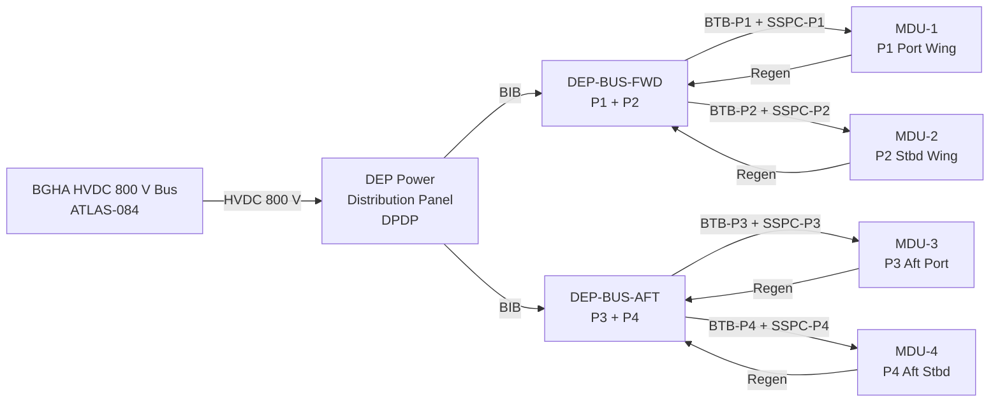

<!-- ──────────────────────────────────────────────────────────────────────────
     QATL-ATLAS-1000-ATLAS-080-089-08-085-040-POWER-DISTRIBUTION-AND-ENERGY-MANAGEMENT-INTERFACES
     ATLAS-085 (Distributed Electric Propulsion Architecture) · Power Distribution and Energy Management Interfaces
     AMPEL360E eWTW — ATLAS Register 1000
────────────────────────────────────────────────────────────────────────────── -->

# Power Distribution and Energy Management Interfaces

---

## §0 Hyperlink Policy

> All hyperlinks in this document are **relative** (five directory levels: `../../../../../`).
> Absolute URLs are forbidden.

---

## §1 Purpose

ATLAS subsubject 085-040 defines the HVDC 800 V power distribution architecture from the BGHA primary bus (ATLAS-084) to each of the four DEP propulsor stations. It specifies the DEP power bus segment topology, bus tie breaker (BTB) architecture, cable routing and sizing, solid-state power controller (SSPC) protection scheme, insulation monitoring, regenerative power return path, and the energy management interfaces between the DEPCU and the BGSCU (ATLAS-084).

---

## §2 Applicability

| Parameter | Value |
|---|---|
| Aircraft Program | AMPEL360E eWTW |
| ATA Reference | ATLAS-085 — 085-040 Power Distribution and Energy Management Interfaces |
| Certification Basis | CS-25.1353; CS-25.1357; DO-160G; IEC 60479-1 |
| S1000D SNS | 085-040-00 |

---

## §3 DEP Power Bus Topology

The BGHA HVDC 800 V primary bus (ATLAS-084) feeds a dedicated DEP Power Distribution Panel (DPDP) located in the forward avionics bay. The DPDP provides four independent feeder circuits — one per propulsor — each protected by a dedicated BTB and a downstream SSPC. A common DEP Bus Segment (DBS) links all four feeders from the BGHA tie point; the DBS can be segmented by the Bus Isolation Breaker (BIB) into a forward half (DEP-BUS-FWD, serving P1+P2) and an aft half (DEP-BUS-AFT, serving P3+P4) to isolate faults.

---

## §4 Bus Tie Breakers (BTBs)

| Device | Location | Rating | Trip Time | Normal State | DEPCU Control |
|---|---|---|---|---|---|
| BIB (Bus Isolation Breaker) | DPDP | HVDC 800 V / 3 000 A | < 5 ms | Closed | Opens on bus fault or dual-segment isolation command |
| BTB-P1 | DPDP — P1 feeder | HVDC 800 V / 700 A | < 5 ms | Closed (propulsor active) | Opens on MDU-1 fault, maintenance LOTO, or DM isolation |
| BTB-P2 | DPDP — P2 feeder | HVDC 800 V / 700 A | < 5 ms | Closed | Same as BTB-P1 |
| BTB-P3 | DPDP — P3 feeder | HVDC 800 V / 700 A | < 5 ms | Closed | Same as BTB-P1 |
| BTB-P4 | DPDP — P4 feeder | HVDC 800 V / 700 A | < 5 ms | Closed | Same as BTB-P1 |

---

## §5 Solid-State Power Controllers (SSPCs)

| SSPC | Protected Load | Rating | Overcurrent Trip | Notes |
|---|---|---|---|---|
| SSPC-P1 | MDU-1 (P1) | 700 A / HVDC 800 V | 850 A in < 10 ms | Current-limiting SSPC; soft-start ramp 500 ms |
| SSPC-P2 | MDU-2 (P2) | 700 A / HVDC 800 V | 850 A in < 10 ms | Same |
| SSPC-P3 | MDU-3 (P3) | 700 A / HVDC 800 V | 850 A in < 10 ms | Same |
| SSPC-P4 | MDU-4 (P4) | 700 A / HVDC 800 V | 850 A in < 10 ms | Same |

---

## §6 Cable Routing and Sizing

| Cable Run | From → To | Length | Cross-Section | Insulation | Max Current | Voltage Drop |
|---|---|---|---|---|---|---|
| BGHA Bus → DPDP | Forward BGHA panel → Forward avionics bay DPDP | 3.5 m | 2 × 240 mm² (pos + neg) | XLPE 1 000 V rated; shielded | 3 000 A peak | < 1.5 V |
| DPDP → P1 nacelle | DPDP → P1 over-wing root | 12 m | 2 × 95 mm² | XLPE; conduit through wing spar | 700 A | < 3.5 V |
| DPDP → P2 nacelle | DPDP → P2 over-wing root | 12 m | 2 × 95 mm² | Same as P1 | 700 A | < 3.5 V |
| DPDP → P3 nacelle | DPDP → P3 aft-fuselage | 28 m | 2 × 120 mm² | XLPE; conduit through fuselage keel | 700 A | < 6.0 V |
| DPDP → P4 nacelle | DPDP → P4 aft-fuselage | 28 m | 2 × 120 mm² | Same as P3 | 700 A | < 6.0 V |

---

## §7 Insulation Monitoring Unit (IMU)

A dedicated DEP Insulation Monitoring Unit (DEP-IMU) is installed in the DPDP and continuously measures insulation resistance between each HVDC 800 V rail and the aircraft ground. The IMU operates per IEC 61557-8 and provides:

- Continuous online insulation monitoring at ≥ 1 measurement/second per rail.
- Fault threshold: insulation resistance < 100 kΩ triggers CREW ADVISORY and DEPCU fault log.
- Isolation threshold: insulation resistance < 50 kΩ triggers automatic BTB open and DEPCU degraded-mode entry.
- Ground fault location: the IMU can identify which cable segment is faulted (P1/P2/P3/P4 or main DBS) using AC-injection location algorithm.

---

## §8 Regenerative Power Return Path

During descent-regen mode, each MDU operates as a four-quadrant inverter, returning power from fan windmilling to the DEP Bus at HVDC 800 V. The BGSCU (ATLAS-084) directs this energy to the SSBP (ATLAS-084 BDCC-A/B). The regenerative return path uses the same HVDC cables (reverse current). Maximum regenerative current per MDU: 90 A (≈ 72 kW per propulsor). DEPCU sets the MDU regen setpoints via CAN. BGSCU monitors bus voltage stability and limits aggregate regen power to prevent bus over-voltage (≥ 840 V trip level).

---

## §9 Energy Management Interfaces with BGSCU

| Signal | Direction | Medium | Description |
|---|---|---|---|
| DEP Total Power Demand | DEPCU → BGSCU | AFDX ARINC 664 P7 VL-085-06 | Total kW demand for next 100 ms MPC horizon |
| Per-Propulsor Power Actual | DEPCU → BGSCU | AFDX VL-085-06 | P1…P4 actual power consumption at 10 Hz |
| Regen Power Available | DEPCU → BGSCU | AFDX VL-085-06 | Predicted regen kW available for descent |
| Bus Voltage | BGSCU → DEPCU | AFDX VL-085-07 | BGHA bus voltage for MDU pre-charge sync |
| Power Curtailment Command | BGSCU → DEPCU | AFDX VL-085-07 | BGSCU curtails DEP load for energy source protection |
| Emergency Load Shed | BGSCU → DEPCU | Discrete (hardwired) | Immediate all-BTB-open command on BGHA bus emergency |

---

## §10 Open Issues

| ID | Description | Owner | Target |
|---|---|---|---|
| OI-085-040-001 | HVDC 800 V cable insulation XLPE qualification to DO-160G vibration and altitude | Q-INDUSTRY | PDR |
| OI-085-040-002 | BTB-P3/P4 cable run (28 m) voltage drop budget — acceptability with SSPC | Q-INDUSTRY | CDR |
| OI-085-040-003 | DEP-IMU ground fault location accuracy requirement — test plan | Q-INDUSTRY | CDR |
| OI-085-040-004 | BGSCU–DEPCU AFDX VL definition and message format (ARINC 664 allocation) | Q-HPC | PDR |
| OI-085-040-005 | Regen bus back-feed protection — over-voltage clamp relay sizing | Q-INDUSTRY | CDR |
