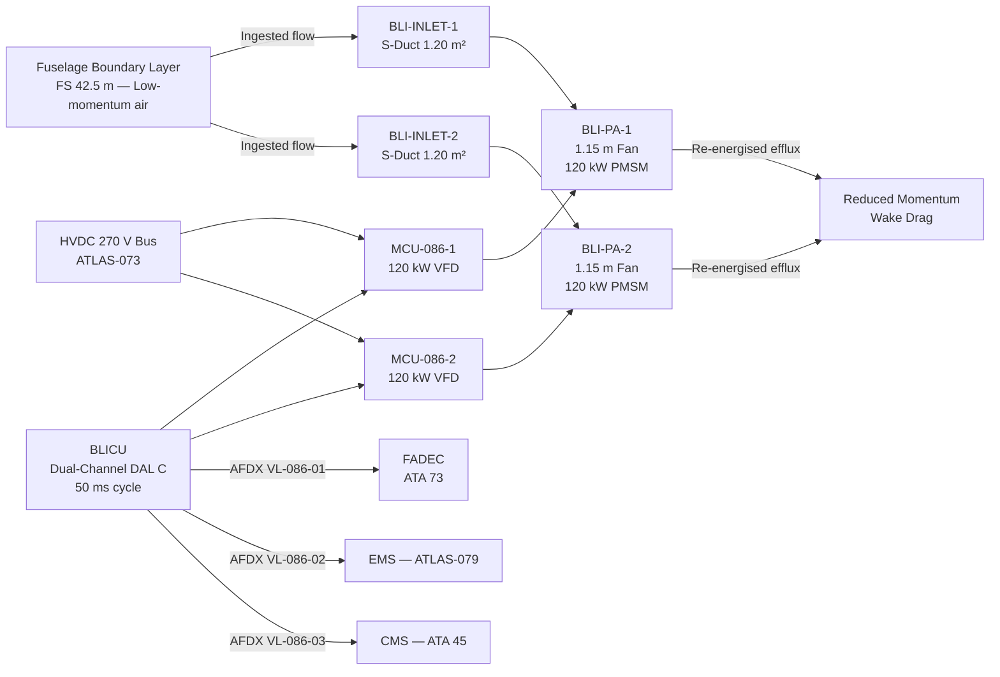
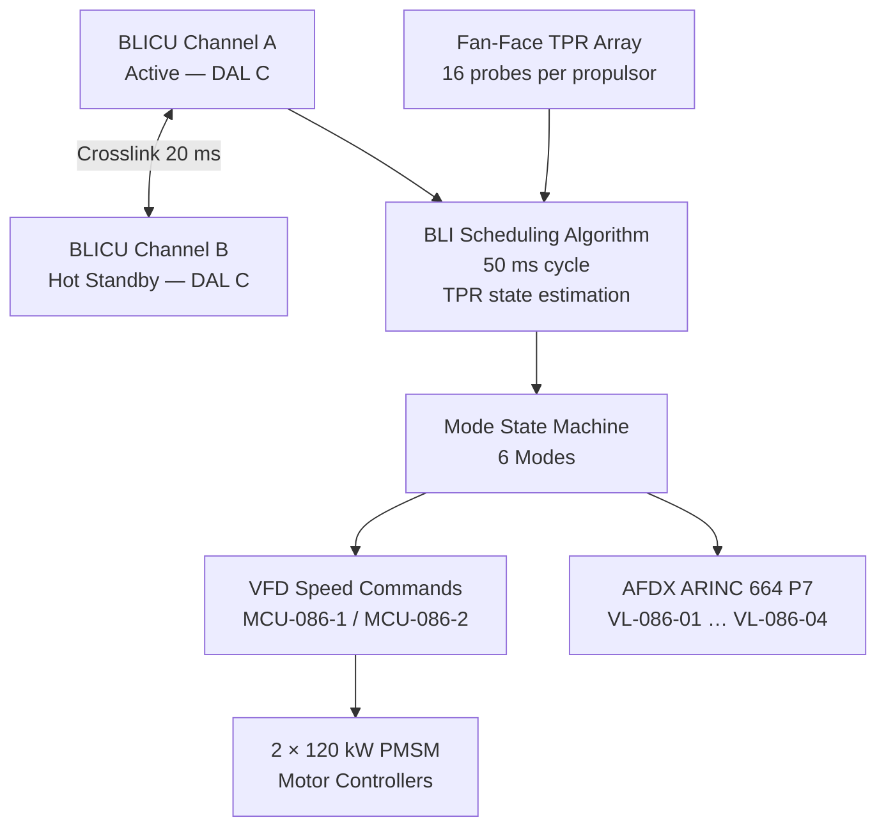

<!-- ──────────────────────────────────────────────────────────────────────────
     QATL-ATLAS-1000-ATLAS-080-089-08-086-000-BOUNDARY-LAYER-INGESTION-PROPULSION-GENERAL
     ATLAS-086 (Boundary Layer Ingestion Propulsion) · General
     programme-defined aircraft type — ATLAS Register 1000
────────────────────────────────────────────────────────────────────────────── -->

# Boundary Layer Ingestion Propulsion — General

---

## §0 Hyperlink Policy

> All hyperlinks in this document are **relative** (five directory levels: `../../../../../`).
> Absolute URLs are forbidden. Every linked document must exist in the Q+ATLANTIDE repository
> before the link is activated. Broken links are treated as open issues and must be resolved
> before the document is promoted from `DRAFT` to `APPROVED`.

---

## §1 Purpose

This document defines the agnostic ATLAS standard-level architecture context for `Boundary Layer Ingestion Propulsion — General`.

It describes the controlled scope, functions, interfaces, safety considerations, lifecycle traceability, and S1000D/CSDB mapping logic that programme implementations shall instantiate when this node is applicable.

This document is not a programme design baseline. Programme-specific capacities, locations, part numbers, effectivity, operating limits, maintenance references, and data module codes shall be defined only inside the applicable programme implementation branch.
## §2 Applicability

| Applicability Level | Rule |
|---|---|
| Standard taxonomy | Applies to the ATLAS node `086` |
| Programme implementation | Conditional; determined by programme architecture, trade studies, certification basis, and applicability model |
| Product configuration | Defined in the programme-specific configuration baseline |
| Effectivity | Defined in the programme CSDB / applicability layer |
| Non-applicability | Must be explicitly stated in the programme impact-study branch when excluded |
## §3 Functional Description

The programme-defined aircraft type **BLI Propulsion System** consists of two aft-fuselage propulsor assemblies that ingest the aircraft boundary layer through shaped S-duct inlets and re-accelerate the ingested flow via distortion-tolerant variable-speed fans:

1. **BLI Propulsor Assemblies (BLI-PA-1, BLI-PA-2):** Each propulsor assembly integrates a 1.15 m diameter distortion-tolerant fan stage driven by a 120 kW PMSM through a gearless direct-drive arrangement. The fan operating speed range is 3 000–6 500 RPM; variable-frequency drive (VFD) enables continuous speed modulation to match boundary layer ingestion demand. Fan blades are designed to tolerate inlet distortion indices (DC60) up to 0.35 without stall.

2. **S-Duct Boundary Layer Capture Inlets (BLI-INLET-1, BLI-INLET-2):** Each inlet features a D-shaped aperture of 1.20 m² capture area positioned flush with the aft fuselage upper surface at FS 42.5 m. The S-duct geometry transitions from the fuselage-contoured capture plane to the circular fan-face within 1.8 m. Total Pressure Recovery (TPR) targets ≥ 0.97 at cruise.

3. **BLI Control Unit (BLICU):** The BLICU is a dual-channel (active/standby) controller qualified to DO-178C DAL C and DO-254 DAL C. It executes the BLI scheduling algorithm at a 50 ms cycle, receives boundary layer state estimates from flush-mounted Total Pressure Rake (TPR) arrays at the fan face, and commands VFD speed setpoints to optimise drag reduction and avoid fan stall. The BLICU interfaces with the FADEC (ATA 73) and the Energy Management System (ATLAS-079) via AFDX ARINC 664 P7.

4. **PMSM Drive and Power Electronics:** Each 120 kW PMSM is supplied through a dedicated Motor Controller Unit (MCU-086-1, MCU-086-2) fed from the HVDC 270 V bus. The MCU implements field-oriented control (FOC) with torque ripple suppression to limit structural excitation of the aft fuselage frame.

---

## §4 Functional Breakdown

| ID | Name | Description | Lead Division |
|---|---|---|---|
| F-001 | BLI General / Overview | System scope, architecture baseline, DMRL, governing standards | Q-GREENTECH |
| F-002 | BLI Baseline and Scope | BLI technology readiness, mission trade space, drag budget | Q-GREENTECH |
| F-003 | Boundary Layer Capture and Inlet Architecture | S-duct inlet geometry, TPR, BL capture area, distortion indices | Q-HORIZON |
| F-004 | Fan-Propulsor and Distortion Tolerance | Fan aerodynamic design, DC60 tolerance, VFD speed range | Q-HORIZON |
| F-005 | Aero-Propulsive Coupling and Airframe Integration | Fuselage drag offset, thrust–drag bookkeeping, structural attach | Q-STRUCTURES |
| F-006 | Inlet Distortion Stability and Control Logic | BLICU algorithm, TPR arrays, stall margin management, mode logic | Q-GREENTECH |
| F-007 | Noise, Vibration and Aeroelastic Constraints | Fan-tone noise, tonal vibration, aeroelastic stability limits | Q-STRUCTURES |
| F-008 | Thermal, Structural and Maintenance Integration | PMSM cooling, duct thermal management, access and LRU intervals | Q-INDUSTRY |

---

## §5 System Context — Mermaid Diagram

---

## §6 Internal BLICU Architecture — Mermaid Diagram

---

## §7 Components and LRUs

| Component | Part Number | Qty | Location | Maint. Interval | Notes |
|---|---|---|---|---|---|
| BLICU (Dual-Channel) | BLICU-PN-TBD | 1 | Aft avionics bay (3-MCU) | Software update per SB; C-check BITE | DO-178C DAL C; DO-254 DAL C |
| BLI Propulsor Assembly — Fan Stage | BLI-PA-PN-TBD | 2 | Aft fuselage FS 42.5 m (port/stbd) | B-check blade visual; 4 000 h balance check | Distortion-tolerant; DC60 ≤ 0.35 |
| PMSM Motor (120 kW) | PMSM-086-PN-TBD | 2 | Integrated in BLI-PA | C-check winding resistance; 6 000 h bearing replace | Gearless direct-drive; IP65 |
| Motor Controller Unit (MCU-086) | MCU-086-PN-TBD | 2 | Aft avionics bay | B-check BITE; 4 000 h thermal inspection | 120 kW VFD; FOC; HVDC 270 V |
| S-Duct Inlet Assembly | BLI-INLET-PN-TBD | 2 | Fuselage upper aft FS 40–43 m | A-check visual; C-check NDT | CFRP; D-shaped aperture 1.20 m² |
| Fan-Face TPR Rake Assembly | TPR-086-PN-TBD | 2 | Fan face (FS 43.2 m) | A-check probe condition; B-check calibration | 16 probes per propulsor; pitot-static |
| BLICU-GSE Interface Unit | BLICU-GSE-PN-TBD | 1 | Ground support | Per GSE calibration cycle | USB-C 3.2 + AFDX tap |

---

## §8 Interfaces

| Interface Type | Connected System | Protocol / Medium | Data / Function |
|---|---|---|---|
| Primary Power — MCU-086-1/2 | HVDC 270 V Bus (ATLAS-073) | HVDC 270 V | 2 × 120 kW continuous; peak 2 × 135 kW (30 s) |
| FADEC Advisory | FADEC — ATA 73 | AFDX ARINC 664 P7 VL-086-01 | BLI power demand advisory; fan speed status |
| Energy Management | EMS — ATLAS-079 | AFDX ARINC 664 P7 VL-086-02 | BLI power allocation request; mode status |
| CMS / Maintenance | CMS — ATA 45 | AFDX ARINC 664 P7 VL-086-03 | BLICU BITE faults; LRU health; TPR data logs |
| Research Monitor | EPMS | AFDX ARINC 664 P7 VL-086-04 | Full 50 Hz telemetry; BL state vector |
| Structural Monitoring | SHM — ATA 53/55 | ARINC 429 | Aft fuselage frame vibration loads |
| Thermal Monitoring | TMS — ATLAS-074 | AFDX VL-086-05 | PMSM winding temperatures; MCU coolant flow |
| Ground Support | BLICU-GSE-1 | USB-C 3.2 + HV tap | BLICU programming; diagnostic download; MCU calibration |

---

## §9 Operating Modes

| Mode | Trigger | BLI Fan Speed | BLICU State | Drag Reduction |
|---|---|---|---|---|
| Standby (GND) | Aircraft powered; main engines off | 0 RPM | BITE running; self-test | 0 % |
| Ground Idle | Taxi; FMS ground phase | 1 500 RPM (duct purge) | TPR monitoring; calibration | ~0 % |
| Climb BLI | Gear up; climb power set | 4 500–5 500 RPM | BLI scheduling active; stall margin monitor | 3–5 % drag reduction |
| Cruise BLI | FL 350, M 0.78 steady state | 5 500–6 200 RPM | Full BLI optimisation; TPR feedback loop | 5–8 % drag reduction |
| Reduced BLI | EMS power reduction command | 3 000–4 500 RPM | Partial BLI; power conserve mode | 2–4 % drag reduction |
| BLI Off / Bypass | Fan fault or BLICU failure | 0 RPM; bypass doors open | Degraded mode — bypass open | 0 % |

---

## §10 Performance and Budgets

| Parameter | Requirement | Target / Design Value | Status |
|---|---|---|---|
| Net drag reduction (cruise) | ≥ 4 % fuselage parasitic drag | 5–8 % at M 0.78 FL350 | TBD |
| BLI propulsor power (each) | ≤ 130 kW continuous | 120 kW nominal; 135 kW peak 30 s | TBD |
| Fan total pressure recovery (TPR) | ≥ 0.97 at cruise | 0.97–0.98 (S-duct optimised) | TBD |
| Distortion tolerance (DC60) | ≤ 0.35 fan-face | 0.30 design; 0.35 limit | TBD |
| Fan stall margin (working line) | ≥ 15 % | 18 % at cruise point | TBD |
| BLICU control cycle | ≤ 50 ms | 50 ms (dual-channel) | TBD |
| PMSM efficiency (peak) | ≥ 96 % | 96.5 % at 120 kW | TBD |
| MCU ripple current (DC bus) | ≤ 5 % THD | 3.2 % (FOC with active filter) | TBD |
| Fan-tone noise margin (cabin) | ≤ 65 dB(A) cabin BPF tone | 62 dB(A) (TBD validation) | TBD |
| BLICU availability | ≥ 99.9 % (DAL C) | Dual-channel hot standby | TBD |

---

## §11 Safety and Certification Constraints

| Constraint | Requirement Source | Description |
|---|---|---|
| HVDC 270 V Personnel Safety | IEC 60479-1; CS-25 AMC 1309 | MCU-086 HV rails isolated by double-pole SSPC; LOTO mandatory before access; HiPot test 600 V DC at each C-check |
| Fan Blade-Off Containment | CS-25.904; AC 20-128A | BLI fan casing must contain blade-off event with no penetration of fuselage pressure vessel; containment ring certified to IBR 2 scenario |
| BLI Bypass Door Fail-Safe | CS-25.1309 | BLI bypass doors spring-loaded open on loss of BLICU power; loss of BLI does not increase net drag beyond clean-fuselage reference |
| BLICU Partitioning | DO-178C DAL C; DO-254 DAL C | Dual-channel; channel crosslink ≤ 20 ms; single-channel failure must not command unsafe fan speed excursion |
| Aeroelastic Clearance | CS-25.629 | BLI propulsor and inlet structure must demonstrate flutter clearance to VD+15 % across all fuel/load states |
| FOD Ingestion | CS-25.571; AC 33.76 | Inlet screens not required; fan must sustain 1-bird ingestion (1.8 kg) per CS-25.775 without uncontained failure |

---

## §12 Document Lineage

| Predecessor | Document ID | Notes |
|---|---|---|
| ATLAS-086 README | QATL-ATLAS-1000-ATLAS-080-089-08-086-README | Subsection index; status updated to active |
| ATLAS-073 Power Distribution | QATL-...-073-000-... | HVDC 270 V bus feeding MCU-086 |
| ATLAS-074 Thermal Management | QATL-...-074-000-... | Thermal management — PMSM cooling loop |
| ATLAS-079 EMS | QATL-...-079-000-... | Energy Management System — BLI power dispatch |
| ATLAS-084 BGHA | QATL-...-084-000-... | Beyond-Gen-2 architecture — BLI fan sets reference |
| ATLAS-085 DEP | QATL-...-085-000-... | Distributed Electric Propulsion — BLI coordination |

---

## §13 Open Issues

| ID | Description | Owner | Target |
|---|---|---|---|
| OI-086-001 | BLI drag reduction coefficient validation — wind-tunnel test plan required | Q-HORIZON | PDR |
| OI-086-002 | S-duct inlet distortion map — CFD convergence study pending | Q-HORIZON | CDR |
| OI-086-003 | Fan blade-off containment casing material qualification (CFRP vs. Ti-6Al-4V) | Q-STRUCTURES | Phase 2 |
| OI-086-004 | BLICU DAL C classification confirmation — safety analysis to confirm not DAL B | Q-GREENTECH | PDR |
| OI-086-005 | BLI bypass door actuation and passive fail-safe mechanism selection | Q-INDUSTRY | CDR |

---

## §14 References

| Ref | Title | Source |
|---|---|---|
| [R-001] | EASA CS-25 Amendment 27+ | EASA |
| [R-002] | DO-178C Software Considerations in Airborne Systems | RTCA |
| [R-003] | DO-254 Design Assurance Guidance for Airborne Electronic Hardware | RTCA |
| [R-004] | DO-160G Environmental Conditions and Test Procedures | RTCA |
| [R-005] | S1000D Issue 5.0 Technical Publications Specification | ASD/AIA |
| [R-006] | IEC 60479-1 Effects of Current on Human Beings | IEC |
| [R-007] | CS-25.904 Engine Rotor Burst Containment | EASA |
| [R-008] | ATLAS-073 Power Distribution MV-HV (QATL-073-000) | Q+ATLANTIDE |
| [R-009] | ATLAS-074 Thermal Management Hybrid (QATL-074-000) | Q+ATLANTIDE |
| [R-010] | ATLAS-079 Energy Management System (QATL-079-000) | Q+ATLANTIDE |
| [R-011] | ATLAS-085 Distributed Electric Propulsion Architecture (QATL-085-000) | Q+ATLANTIDE |
