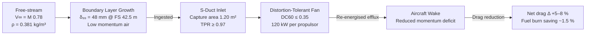

<!-- ──────────────────────────────────────────────────────────────────────────
     QATL-ATLAS-1000-ATLAS-080-089-08-086-010-BLI-BASELINE-AND-SCOPE
     ATLAS-086 (Boundary Layer Ingestion Propulsion) · BLI Baseline and Scope
     programme-defined aircraft type — ATLAS Register 1000
────────────────────────────────────────────────────────────────────────────── -->

# BLI Baseline and Scope

---

## §0 Hyperlink Policy

> All hyperlinks in this document are **relative** (five directory levels: `../../../../../`).
> Absolute URLs are forbidden. Every linked document must exist in the Q+ATLANTIDE repository
> before the link is activated.

---

## §1 Purpose

This document defines the agnostic ATLAS standard-level architecture context for `BLI Baseline and Scope`.

It describes the controlled scope, functions, interfaces, safety considerations, lifecycle traceability, and S1000D/CSDB mapping logic that programme implementations shall instantiate when this node is applicable.

This document is not a programme design baseline. Programme-specific capacities, locations, part numbers, effectivity, operating limits, maintenance references, and data module codes shall be defined only inside the applicable programme implementation branch.
## §2 BLI Technology Readiness

| Item | Description | TRL (Entry) | TRL Target (CDR) |
|---|---|---|---|
| Distortion-tolerant fan aerodynamics | Variable-pitch fan blades tolerating DC60 ≤ 0.35 | 5 | 6 |
| S-duct BLI inlet geometry | CFD-validated S-duct with TPR ≥ 0.97 | 5 | 6 |
| BLICU dual-channel controller | DAL C dual-channel; 50 ms BLI scheduling | 4 | 6 |
| PMSM 120 kW gearless direct-drive | Gearless PMSM for BLI fan; IP65 aft-fuselage rated | 6 | 7 |
| Fan-face TPR rake sensing | 16-probe TPR rake; real-time distortion index | 5 | 6 |
| BLI bypass fail-safe door | Spring-loaded bypass; BLICU-independent | 4 | 6 |

---

## §3 Mission Trade Space

### 3.1 BLI Design Points

| Flight Phase | Altitude (ft) | Mach | BL Thickness (mm) | Target Fan Power (kW each) | Expected Drag Δ (%) |
|---|---|---|---|---|---|
| Takeoff roll | 0 | 0.25 | 18 | 80 | +1.2 (fan installation drag net) |
| Climb (15 000 ft) | 15 000 | 0.55 | 32 | 110 | +3.8 |
| Top of Climb (35 000 ft) | 35 000 | 0.78 | 45 | 120 | +5.5 |
| Cruise (FL350 steady) | 35 000 | 0.78 | 48 | 120 | +6.1 |
| Descent (idle) | 20 000 | 0.65 | 36 | 40 (reduced) | +2.2 |

> Positive drag Δ values denote drag reduction (BLI benefit). Negative values would indicate a parasitic penalty net of BLI benefit.

### 3.2 Energy Budget Attribution

| Source | Power Consumption | Notes |
|---|---|---|
| BLI-PA-1 PMSM + MCU | 120 kW nominal; 135 kW peak | HVDC 270 V from ATLAS-073 |
| BLI-PA-2 PMSM + MCU | 120 kW nominal; 135 kW peak | HVDC 270 V from ATLAS-073 |
| BLICU electronics | < 0.5 kW | Aft avionics bay |
| TPR rake heaters (anti-ice) | 0.8 kW per assembly | Enabled at T < −30 °C |
| Total BLI electrical draw | ≤ 242 kW nominal; ≤ 272 kW peak | Allocated in ATLAS-079 EMS budget |

---

## §4 Scope Boundaries

### In Scope (ATLAS-086)

- BLI propulsor assembly design, performance, and maintenance (BLI-PA-1, BLI-PA-2)
- S-duct boundary layer capture inlets (BLI-INLET-1, BLI-INLET-2)
- Fan stage aerodynamics and distortion tolerance
- BLICU control unit, scheduling algorithm, and interface logic
- MCU-086 motor controller units and HVDC 270 V power feed breakout
- Fan-face TPR rake assemblies and signal conditioning
- BLI bypass doors and actuation mechanism
- Aero-propulsive performance model and drag bookkeeping
- BLI-specific noise, vibration, and aeroelastic constraints
- Thermal and structural integration of BLI components into aft fuselage

### Out of Scope (owner)

- HVDC 270 V generation and primary bus management → ATLAS-073
- Thermal management loop (EGW coolant) → ATLAS-074
- Energy Management System power allocation → ATLAS-079
- Distributed Electric Propulsion fan sets (forward/wing) → ATLAS-085
- Quantum sensing for propulsor condition monitoring → ATLAS-080

---

## §5 BLI Aerodynamic Principle

---

## §6 Key Performance Indicators

| KPI | Threshold (Minimum) | Objective | Verification Method |
|---|---|---|---|
| Net cruise drag reduction | ≥ 4 % | ≥ 6 % | Wind tunnel + CFD |
| BLI propulsive efficiency gain (FPR = 1.35) | ≥ 3 % vs. podded equivalent | ≥ 5 % | RANS CFD + flight test |
| Block fuel saving (full mission) | ≥ 1.0 % | ≥ 1.5 % | Mission analysis model |
| Fan stall margin at cruise BLI point | ≥ 15 % | ≥ 18 % | Rig test |
| TPR recovery at fan face (cruise) | ≥ 0.97 | ≥ 0.975 | Wind tunnel |
| Bypass door open latency | ≤ 150 ms | ≤ 100 ms | Ground functional test |

---

## §7 Regulatory and Standards Framework

| Standard | Applicability | Key Requirement |
|---|---|---|
| EASA CS-25 Amdt 27+ | Primary airworthiness | Structural, propulsion installation, noise |
| CS-25.904 | Rotor burst containment | Fan blade-off casing containment |
| CS-25.629 | Aeroelastic stability | Flutter clearance to VD+15 % |
| DO-178C DAL C | BLICU software | Dual-channel; no single failure causes unsafe excursion |
| DO-254 DAL C | BLICU hardware | Hardware design assurance |
| DO-160G Cat F | Environmental | Aft fuselage vibration, temp, EMI |
| AC 33.76 | Bird ingestion | 1-bird (1.8 kg) sustained without uncontained failure |

---

## §8 Open Issues

| ID | Description | Owner | Target |
|---|---|---|---|
| OI-086-010-001 | BLI drag reduction model validation — high-fidelity RANS CFD campaign | Q-HORIZON | PDR |
| OI-086-010-002 | TRL 6 gate review plan for distortion-tolerant fan stage | Q-GREENTECH | CDR |
| OI-086-010-003 | Block fuel saving figure confirmation — mission analysis model freeze | Q-HPC | PDR |
| OI-086-010-004 | BLI bypass door latency test — actuator selection pending | Q-INDUSTRY | CDR |
