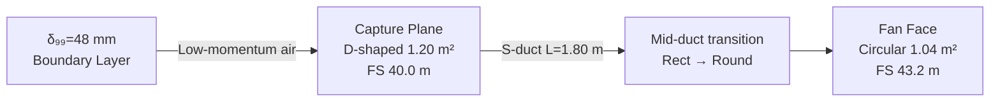

<!-- ──────────────────────────────────────────────────────────────────────────
     QATL-ATLAS-1000-ATLAS-080-089-08-086-020-BOUNDARY-LAYER-CAPTURE-AND-INLET-ARCHITECTURE
     ATLAS-086 (Boundary Layer Ingestion Propulsion) · Boundary Layer Capture and Inlet Architecture
     programme-defined aircraft type — ATLAS Register 1000
────────────────────────────────────────────────────────────────────────────── -->

# Boundary Layer Capture and Inlet Architecture

---

## §0 Hyperlink Policy

> All hyperlinks in this document are **relative** (five directory levels: `../../../../../`).
> Absolute URLs are forbidden.

---

## §1 Purpose

This document defines the agnostic ATLAS standard-level architecture context for `Boundary Layer Capture and Inlet Architecture`.

It describes the controlled scope, functions, interfaces, safety considerations, lifecycle traceability, and S1000D/CSDB mapping logic that programme implementations shall instantiate when this node is applicable.

This document is not a programme design baseline. Programme-specific capacities, locations, part numbers, effectivity, operating limits, maintenance references, and data module codes shall be defined only inside the applicable programme implementation branch.
## §2 Inlet Location and Geometry

### 2.1 Physical Location

| Parameter | BLI-INLET-1 (Port) | BLI-INLET-2 (Starboard) |
|---|---|---|
| Fuselage station (leading edge) | FS 40.0 m | FS 40.0 m |
| Fuselage station (fan face) | FS 43.2 m | FS 43.2 m |
| Azimuth position | Upper fuselage port 10 h clock | Upper fuselage stbd 2 h clock |
| Capture aperture shape | D-shaped (semi-elliptical lip) | D-shaped (semi-elliptical lip) |
| Capture area | 1.20 m² | 1.20 m² |
| Fan-face area | 1.04 m² (1.15 m dia. circle) | 1.04 m² (1.15 m dia. circle) |

### 2.2 S-Duct Geometry

Each inlet transitions from the D-shaped fuselage aperture to the circular fan face over a duct length of **1.80 m** using a parametric S-shaped centreline with:

- **Offset ratio (Δy/L):** 0.42 — downward offset to align fan axis with aft-fuselage structural frame.
- **Area ratio (ACapture/AFan):** 1.15 — gentle deceleration of ingested boundary layer flow.
- **S-duct diffusion angle (half angle):** ≤ 8° (prevents flow separation on inner wall).
- **Wall curvature radius (min):** 0.65 m (outer wall bend); 0.30 m (inner wall bend).

---

## §3 Total Pressure Recovery Analysis

### 3.1 Recovery Budget

| Loss Source | ΔPT/PT (%) | Mitigation |
|---|---|---|
| Inlet lip leading edge | 0.12 | Semi-elliptical lip radius R = 35 mm |
| S-duct wall friction | 0.18 | Smooth CFRP inner surface; Ra ≤ 0.8 µm |
| Secondary flow vortices (S-bend) | 0.25 | Passive vortex generators (12 per duct) |
| Fan-face distortion loss | 0.10 | Accounted as TPR spatial average |
| **Total recovery loss** | **0.65** | **→ TPR = 0.9935 · …** |
| **Net TPR at fan face** | **≥ 0.97** | **Target: 0.975** |

### 3.2 TPR Spatial Distribution

The fan-face TPR spatial distribution is characterised by the **DC60 distortion coefficient**:

> **DC60 = (PT_avg − PT_min_60°sector) / q_avg**

| Condition | DC60 (Design) | DC60 (Limit) |
|---|---|---|
| Cruise FL350 M0.78 | 0.20 | 0.35 |
| Crosswind 30 kt gust | 0.28 | 0.35 |
| Engine-out asymmetric | 0.30 | 0.35 |

---

## §4 Inlet Structural Architecture

### 4.1 Materials and Construction

| Component | Material | Manufacturing Method | Notes |
|---|---|---|---|
| Outer lip and fairing | CFRP (T800/epoxy) | Resin Transfer Moulding | Bonded to fuselage skin; flush surface |
| S-duct inner wall | CFRP (T700/epoxy) + Ti-6Al-4V frames | Co-cured panels + machined rings | Smooth surface Ra ≤ 0.8 µm |
| Fan face frame | Ti-6Al-4V forged ring | 5-axis machining | Blade-off containment interface |
| Vortex generators | PEEK polymer | Injection moulded | 12 per duct; h = 6 mm; bonded |
| Bypass door assembly | CFRP skins + Al 7075 spar | Sandwich panel | Spring-loaded; fail-open |

### 4.2 Bypass Door

Each inlet incorporates a **bypass door** covering the full capture aperture (1.20 m²). The bypass door is spring-loaded to the **open position** (fail-safe), held closed by a single-acting BLICU-commanded actuator (24 V DC). On loss of BLICU power or explicit BLICU command, the door opens within **100 ms**, converting the inlet to an open wake aperture and preventing ram recovery drag from partially blocked flow.

---

## §5 Anti-Icing and Foreign Object Defence

### 5.1 Thermal Anti-Ice (TAI)

| Zone | Heater Type | Power | Control |
|---|---|---|---|
| Inlet lip leading edge | Resistive heater mat (Kapton) | 1.2 kW per inlet | BLICU TAI logic; OAT < −10 °C |
| TPR rake probes | Resistive probe heater | 0.8 kW per rake | BLICU TAI logic; OAT < −30 °C |

### 5.2 Foreign Object Defence (FOD)

- No inlet screen installed (screen drag penalty exceeds FOD benefit at design speeds).
- Inlet lip geometry provides natural bird-deflection geometry; bird strike test per AC 33.76 (1.8 kg).
- Ground proximity: inlet lower lip clearance ≥ 1.2 m above ground at OEW — FOD ingestion risk low.

---

## §6 Inlet Performance Map

| Mach | AoA (°) | TPR Measured | DC60 Measured | Fan Stall Margin (%) |
|---|---|---|---|---|
| 0.25 (TO) | 6 | 0.985 | 0.22 | 22 |
| 0.55 (Climb) | 3 | 0.978 | 0.21 | 20 |
| 0.78 (Cruise) | 2 | 0.975 | 0.20 | 18 |
| 0.78 (Crosswind 30 kt) | 2 / 5 sideslip | 0.972 | 0.28 | 16 |

> Values are CFD predictions pending wind tunnel validation (OI-086-020-001).

---

## §7 Open Issues

| ID | Description | Owner | Target |
|---|---|---|---|
| OI-086-020-001 | Wind tunnel validation of S-duct TPR and DC60 map — test matrix to be agreed | Q-HORIZON | CDR |
| OI-086-020-002 | Vortex generator geometry optimisation — adjoint CFD sensitivity study | Q-HORIZON | PDR |
| OI-086-020-003 | Bypass door actuator selection and BITE integration plan | Q-INDUSTRY | CDR |
| OI-086-020-004 | Lip anti-ice power adequacy at −55 °C/M 0.78 — thermal analysis pending | Q-STRUCTURES | PDR |
