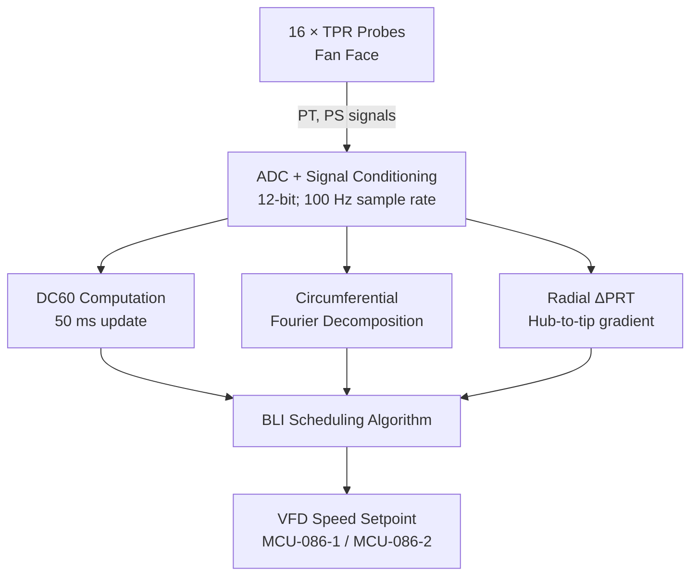
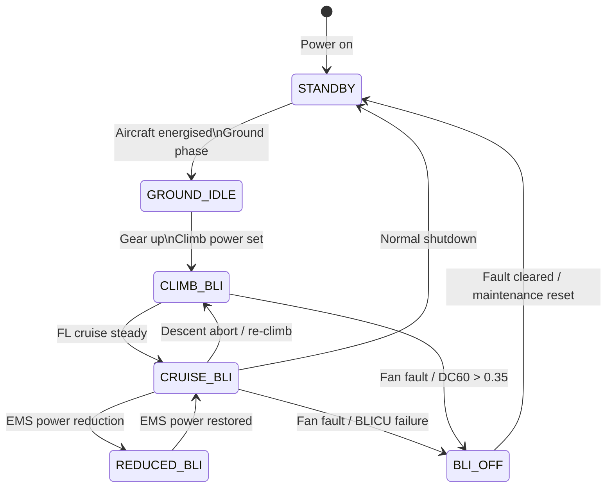

<!-- ──────────────────────────────────────────────────────────────────────────
     QATL-ATLAS-1000-ATLAS-080-089-08-086-050-INLET-DISTORTION-STABILITY-AND-CONTROL-LOGIC
     ATLAS-086 (Boundary Layer Ingestion Propulsion) · Inlet Distortion Stability and Control Logic
     AMPEL360E eWTW — ATLAS Register 1000
────────────────────────────────────────────────────────────────────────────── -->

# Inlet Distortion Stability and Control Logic

---

## §0 Hyperlink Policy

> All hyperlinks in this document are **relative** (five directory levels: `../../../../../`).
> Absolute URLs are forbidden.

---

## §1 Purpose

ATLAS subsubject 086-050 defines the BLICU control architecture, the inlet distortion state estimation algorithm, the stall margin management logic, and the operating mode state machine that governs BLI propulsor control across all flight phases.

---

## §2 BLICU Control Architecture

The **BLI Control Unit (BLICU)** implements a hierarchical control structure with three layers:

| Layer | Function | Cycle Time |
|---|---|---|
| L1 — Inner Loop (MCU-086) | FOC torque control; speed governor | 1 ms |
| L2 — BLI Scheduling (BLICU) | TPR-based speed trim; distortion index feedback | 50 ms |
| L3 — Energy Management (ATLAS-079 EMS) | BLI power allocation; mode arbitration | 200 ms |

### 2.1 TPR State Estimation

The BLICU processes the **16-probe fan-face TPR rake** data to compute:

1. **DC60 distortion index** — average total pressure minus worst 60° sector, divided by mean dynamic pressure.
2. **Circumferential distortion pattern** — Fourier decomposition to 4th harmonic; identifies 1-per-rev and 2-per-rev distortion lobes.
3. **Radial distortion index (ΔPRT)** — hub-to-tip total pressure gradient; used to detect boundary layer thickening events.

---

## §3 BLI Scheduling Algorithm

The BLI scheduling algorithm computes the optimal fan speed setpoint based on:

1. **Nominal operating line setpoint** from flight phase lookup table (indexed by Mach, altitude, AoA).
2. **DC60 trim** — if DC60 > 0.22, apply speed reduction:
   - `ΔN_DC60 = K_DC × (DC60 − 0.22) × N_nominal` where K_DC = −1 200 RPM/DC60-unit
3. **Radial distortion trim** — if ΔPRT > 8 % hub-to-tip gradient, apply additional −200 RPM.
4. **Energy Management trim** — EMS may reduce power by up to 30 % via L3 command; BLICU scales speed accordingly.
5. **Stall margin guard** — if computed stall margin < 16 %, BLICU activates `CAUTION_HIGH_DISTORTION` and reduces speed to recover to ≥ 16 % SM.

---

## §4 Mode State Machine

The BLICU implements a **6-mode state machine**:

| Mode | Fan Speed | DC60 Monitor | BLICU Channel | EMS Interface |
|---|---|---|---|---|
| STANDBY | 0 RPM | Off | A active; B standby | Disconnected |
| GROUND_IDLE | 1 500 RPM (purge) | Active (calibration) | A active; B standby | Monitoring |
| CLIMB_BLI | 4 500–5 500 RPM | Active; trim enabled | A active; B standby | Power request sent |
| CRUISE_BLI | 5 500–6 200 RPM | Active; full optimisation | A active; B standby | Demand dispatch active |
| REDUCED_BLI | 3 000–4 500 RPM | Active; guard on | A active; B standby | Reduced power demand |
| BLI_OFF | 0 RPM; bypass open | Monitoring only | A or B (degraded) | Zero power request |

---

## §5 Distortion Event Handling

| Event | DC60 Threshold | BLICU Response | Crew Alert |
|---|---|---|---|
| Elevated distortion — caution | DC60 > 0.25 | Speed trim −200 RPM; log event | `BLI CAUTION` (amber) |
| High distortion — warning | DC60 > 0.30 | Speed trim −400 RPM; CAUTION_HIGH_DISTORTION flag | `BLI DISTORT HIGH` (amber) |
| Near-stall — critical | DC60 > 0.34 | Rapid speed reduction; arm bypass | `BLI STALL RISK` (red) |
| Stall detected (vibration > 3σ) | Any | Bypass door open; BLI_OFF mode | `BLI FAIL` (red) |
| Channel A fault | N/A | Switchover to Channel B; 50 ms max | `BLI DEGRADED` (amber) |

---

## §6 BLICU Software Architecture

| Partition | DAL | Function | Cycle |
|---|---|---|---|
| P1 — Safety Monitor | DAL C | Stall detection; bypass door command; channel watchdog | 10 ms |
| P2 — BLI Scheduler | DAL C | Speed setpoint computation; distortion state estimation | 50 ms |
| P3 — Health Monitor | DAL D | TPR probe status; fault logging; BITE | 200 ms |
| P4 — Communications | DAL D | AFDX ARINC 664 P7 encode/decode; GSE link | 100 ms |

---

## §7 Open Issues

| ID | Description | Owner | Target |
|---|---|---|---|
| OI-086-050-001 | K_DC gain calibration — requires full-scale fan rig test data | Q-HORIZON | CDR |
| OI-086-050-002 | BLICU software architecture review — confirm DAL C sufficiency vs. CS-25.1309 | Q-GREENTECH | PDR |
| OI-086-050-003 | Stall detection vibration threshold 3σ — qualification test required | Q-HPC | CDR |
| OI-086-050-004 | EMS L3 command latency < 200 ms — AFDX VL sizing confirmation with ATLAS-079 team | Q-GREENTECH | PDR |
