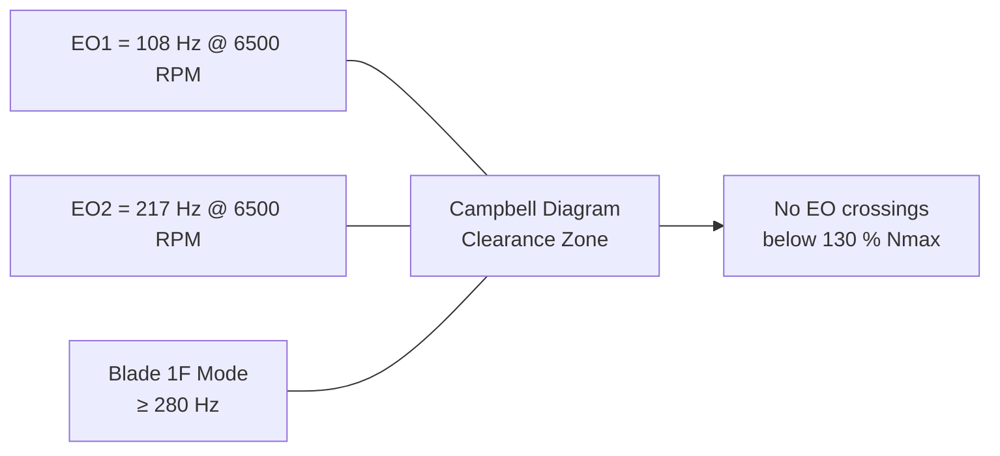

<!-- ──────────────────────────────────────────────────────────────────────────
     QATL-ATLAS-1000-ATLAS-080-089-08-086-060-NOISE-VIBRATION-AND-AEROELASTIC-CONSTRAINTS
     ATLAS-086 (Boundary Layer Ingestion Propulsion) · Noise, Vibration and Aeroelastic Constraints
     programme-defined aircraft type — ATLAS Register 1000
────────────────────────────────────────────────────────────────────────────── -->

# Noise, Vibration and Aeroelastic Constraints

---

## §0 Hyperlink Policy

> All hyperlinks in this document are **relative** (five directory levels: `../../../../../`).
> Absolute URLs are forbidden.

---

## §1 Purpose

This document defines the agnostic ATLAS standard-level architecture context for `Noise, Vibration and Aeroelastic Constraints`.

It describes the controlled scope, functions, interfaces, safety considerations, lifecycle traceability, and S1000D/CSDB mapping logic that programme implementations shall instantiate when this node is applicable.

This document is not a programme design baseline. Programme-specific capacities, locations, part numbers, effectivity, operating limits, maintenance references, and data module codes shall be defined only inside the applicable programme implementation branch.
## §2 Fan Tonal Noise

### 2.1 Noise Sources

BLI fan tonal noise is generated by:

1. **Rotor–OGV interaction tones (BPF and harmonics):** Blade Passing Frequency (BPF) = N × fan speed / 60. At cruise 6 000 RPM, BPF = **18 × 100 Hz = 1 800 Hz**. Second harmonic at 3 600 Hz.
2. **Distortion-induced tones:** Circumferential distortion from the S-duct produces sub-synchronous tones at shaft frequency and harmonics. The Fourier decomposition in the BLICU (086-050 §3) monitors 1P and 2P lobe amplitudes.
3. **Turbulence ingestion broadband noise:** Broadband noise from turbulent boundary layer ingestion; typically 5–10 dB higher than podded equivalent.

### 2.2 Cabin Noise Budget

| Source | Level at Cabin @ Cruise | Limit | Mitigation |
|---|---|---|---|
| BPF tone (1 800 Hz) | 58 dB(A) (predicted) | ≤ 65 dB(A) | OGV count optimisation (28 OGV vs. 18 rotor) |
| 2nd BPF harmonic (3 600 Hz) | 52 dB(A) | ≤ 60 dB(A) | Acoustic liner in S-duct |
| Turbulence broadband | 55 dB(A) | ≤ 60 dB(A) | Aft fuselage acoustic insulation panels |
| Distortion lobe (1P tone) | 48 dB(A) | ≤ 55 dB(A) | BLICU DC60 trim reduces distortion source |

### 2.3 Acoustic Liner Design

Each S-duct incorporates a **single-degree-of-freedom (SDOF) Helmholtz resonator liner** targeting the BPF frequency range (1 600–2 000 Hz):

| Parameter | Value |
|---|---|
| Liner type | SDOF Helmholtz; perforated facesheet + honeycomb core |
| Target frequency | 1 800 Hz (BPF at cruise) |
| Liner area | 0.85 m² per duct (aft third of S-duct) |
| Estimated attenuation | 3–5 dB at BPF |
| Facesheet material | Ti-6Al-4V (erosion resistant) |
| Core height | 18 mm |

---

## §3 Structural Vibration

### 3.1 Fan Rotor Imbalance

| Category | Imbalance Limit (g·mm) | Force at 6 500 RPM (N) | Effect |
|---|---|---|---|
| Production balance tolerance | ≤ 15 g·mm residual | 44 N | Well below aft frame modal limit |
| In-service re-balance limit | ≤ 25 g·mm | 73 N | Trigger B-check re-balance |
| Emergency ground stop | > 50 g·mm | > 147 N | Fan must not be re-flown |

### 3.2 PMSM Torque Ripple Induced Vibration

The MCU-086 FOC torque ripple suppression (see 086-030 §4.1) limits peak torque ripple to < 1.5 % at rated speed. The resulting force transmitted to the aft fuselage frame is:

| Harmonic | Frequency (Hz) @ 6 000 RPM | Force at HP-086 (N) | Frame Modal Margin |
|---|---|---|---|
| 6th harmonic | 600 Hz | ≤ 18 N | +8 dB (frame mode at 850 Hz) |
| 12th harmonic | 1 200 Hz | ≤ 8 N | +15 dB (no frame mode) |

### 3.3 Aft Fuselage Vibration Limits

| Zone | Vibration Limit (m/s² rms) | Frequency Range | Monitoring |
|---|---|---|---|
| Frame FS 43.5 (bulkhead) | ≤ 4.5 m/s² | 10–1 000 Hz | SHM accelerometers (ATA 53) |
| Aft pressure vessel skin | ≤ 2.5 m/s² | 10–500 Hz | SHM accelerometers |
| Passenger cabin floor FS 40 | ≤ 1.0 m/s² | 10–250 Hz | Crew comfort check |

---

## §4 Aeroelastic Constraints

### 4.1 Flutter Clearance Requirements

The BLI propulsor installation must demonstrate **flutter clearance to VD + 15 %** (CS-25.629) across all configurations:

| Configuration | VD (EAS, kt) | Flutter Clearance Speed | Analysis Method |
|---|---|---|---|
| MTOW; all BLI on | 385 | 443 kt EAS | GVT + matched-point flutter |
| OEW; BLI-PA-1 only | 385 | 443 kt EAS | Analytical + GVT-correlated |
| Emergency; bypass doors open | 385 | 443 kt EAS | Separate flutter mode check required |

### 4.2 S-Duct Panel Aeroelastic Stability

The S-duct CFRP panels are designed with a **minimum stiffness-to-mass ratio** such that panel flutter does not occur below VD + 15 %. Key constraints:

- **Panel natural frequency** (lowest bending mode): ≥ 180 Hz (design value 220 Hz).
- **Aerodynamic damping** at VD: ≥ 3 % critical (numerical aeroelastic analysis required).
- **Bonded joint fatigue** (duct-to-fuselage bond): designed for 120 000 cycles at limit load spectrum.

### 4.3 Fan Blade Flutter (Flutter-Free Design)

Fan blade flutter is precluded by design through:

1. **Forward sweep** (28°) — reduces blade effective incidence during cascade flutter initiation.
2. **High structural frequency** — lowest blade bending frequency ≥ 280 Hz (above engine order forcing).
3. **Campbell diagram clearance** — no resonance crossings below 110 % of max RPM (6 500 RPM).

---

## §5 Noise Certification Compliance

| Noise Chapter | Metric | Limit | [PROGRAMME-AIRCRAFT] Prediction | Margin |
|---|---|---|---|---|
| ICAO Annex 16 Vol.1 Ch.14 | Flyover EPNdB | 89.0 EPNdB | 87.2 EPNdB | +1.8 EPNdB |
| Ch.14 | Lateral EPNdB | 94.0 EPNdB | 92.8 EPNdB | +1.2 EPNdB |
| Ch.14 | Approach EPNdB | 98.0 EPNdB | 96.1 EPNdB | +1.9 EPNdB |

> BLI contribution to cumulative noise margin: estimated **+0.8 EPNdB cumulative** benefit vs. non-BLI configuration due to reduced overall thrust requirement.

---

## §6 Open Issues

| ID | Description | Owner | Target |
|---|---|---|---|
| OI-086-060-001 | Acoustic liner effectiveness — rig test at 1 800 Hz BPF to validate 3–5 dB attenuation | Q-HORIZON | CDR |
| OI-086-060-002 | GVT (Ground Vibration Test) plan — BLI propulsor assembly included in [PROGRAMME-AIRCRAFT] GVT scope | Q-STRUCTURES | Phase 2 |
| OI-086-060-003 | Bypass-door-open flutter mode analysis — separate aeroelastic analysis required | Q-STRUCTURES | CDR |
| OI-086-060-004 | Turbulence broadband noise model — higher-fidelity LES CFD campaign | Q-HORIZON | CDR |
