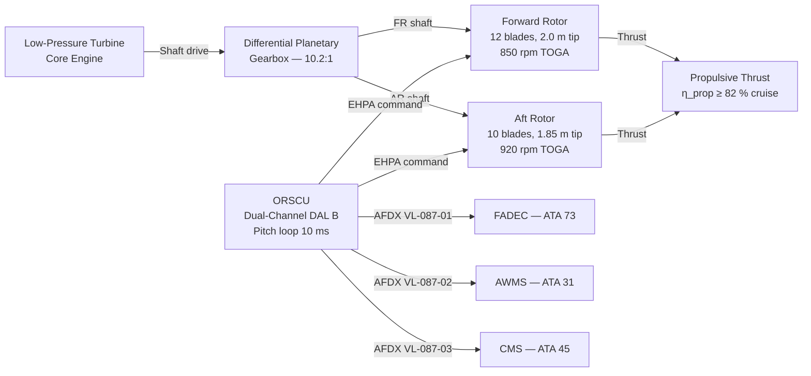
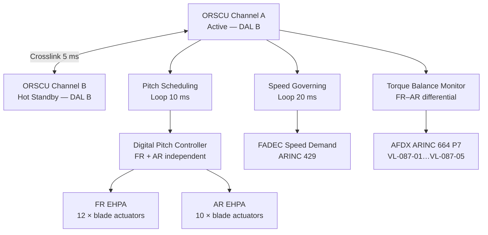

<!-- ──────────────────────────────────────────────────────────────────────────
     QATL-ATLAS-1000-ATLAS-080-089-08-087-000-OPEN-ROTOR-AND-COUNTER-ROTATING-GENERAL
     ATLAS-087 (Open Rotor and Counter-Rotating) · General
     programme-defined aircraft type — ATLAS Register 1000
────────────────────────────────────────────────────────────────────────────── -->

# Open Rotor and Counter-Rotating — General

---

## §0 Hyperlink Policy

> All hyperlinks in this document are **relative** (five directory levels: `../../../../../`).
> Absolute URLs are forbidden. Every linked document must exist in the Q+ATLANTIDE repository
> before the link is activated. Broken links are treated as open issues and must be resolved
> before the document is promoted from `DRAFT` to `APPROVED`.

---

## §1 Purpose

This document defines the agnostic ATLAS standard-level architecture context for `Open Rotor and Counter-Rotating — General`.

It describes the controlled scope, functions, interfaces, safety considerations, lifecycle traceability, and S1000D/CSDB mapping logic that programme implementations shall instantiate when this node is applicable.

This document is not a programme design baseline. Programme-specific capacities, locations, part numbers, effectivity, operating limits, maintenance references, and data module codes shall be defined only inside the applicable programme implementation branch.
## §2 Applicability

| Applicability Level | Rule |
|---|---|
| Standard taxonomy | Applies to the ATLAS node `087` |
| Programme implementation | Conditional; determined by programme architecture, trade studies, certification basis, and applicability model |
| Product configuration | Defined in the programme-specific configuration baseline |
| Effectivity | Defined in the programme CSDB / applicability layer |
| Non-applicability | Must be explicitly stated in the programme impact-study branch when excluded |
## §3 Functional Description

The programme-defined aircraft type **Open Rotor and Counter-Rotating (ORCR)** propulsor is an unducted contra-rotating fan module integrated at the aft fuselage pylon stations (P-AFT-PORT and P-AFT-STBD). The ORCR comprises the following major subsystems:

1. **Forward Rotor (FR):** 12 variable-pitch composite blades (FR-BLD-01…12) of titanium/CFRP hybrid spar construction, tip radius 2.0 m, design rotational speed 850 rpm at take-off. Blade pitch is controlled by the ORSCU in the range −5° to +85° (feather) via electro-hydraulic pitch actuators (EHPAs).

2. **Aft Rotor (AR):** 10 variable-pitch composite blades (AR-BLD-01…10), tip radius 1.85 m, counter-rotating at 920 rpm at take-off. The reduced blade count and slightly smaller radius optimise swirl recovery and reduce the interaction noise produced by the FR–AR wake interference.

3. **Differential Planetary Gearbox (DPGB):** A two-stage epicyclic differential gearbox transmitting shaft power from the low-pressure turbine (LPT) to the FR and AR at the required speed ratios (FR:AR = 1:1.08) while reacting torque through the engine nacelle mount. Gear ratio is 10.2:1 overall reduction from LPT.

4. **Open-Rotor Supervisory Control Unit (ORSCU):** Dual-channel DAL B controller (Channel A — active; Channel B — hot standby) executing the pitch scheduling loop at 10 ms, shaft-speed governing, torque-balance control, and safety monitoring. ORSCU interfaces with the FADEC (ATA 73) and the Aircraft Warning and Monitoring System (AWMS, ATA 31).

5. **Electro-Hydraulic Pitch Actuators (EHPA):** Independent pitch actuators per blade, powered from the on-board hydraulic system (3 000 psi / 207 bar) and controlled by ORSCU via ARINC 429 blade-control data buses. Pitch actuators are fail-safe to fine-pitch (flight fine) on hydraulic loss.

6. **Blade-Off Containment Shell (BOCS):** A lightweight aramid/UHMWPE composite partial-arc containment structure mounted on the engine nacelle from 60° to 300° (arc of passenger cabin exposure), designed to arrest a detached FR or AR blade segment per CS-25.571(e) blade-off assessment.

---

## §4 Functional Breakdown

| ID | Name | Description | Lead Division |
|---|---|---|---|
| F-001 | ORCR General / Overview | System scope, architecture baseline, DMRL, governing standards | Q-GREENTECH |
| F-002 | Open Rotor Baseline and Scope | Technology trade study, TRL status, mission performance trade space | Q-GREENTECH |
| F-003 | Counter-Rotating Propulsor Architecture | UCRF topology, DPGB, FR/AR speed and torque design | Q-HORIZON |
| F-004 | Rotor Blade Design and Aeroacoustics | Blade geometry, materials, sweep, twist, aero-acoustic analysis | Q-STRUCTURES |
| F-005 | Gearbox Drive and Torque-Transfer Interfaces | DPGB design, oil system, shaft-coupling, torque measurement | Q-INDUSTRY |
| F-006 | Propulsor Airframe Integration and Clearance Zones | Pylon station, ground clearance, FOD zones, integration loads | Q-STRUCTURES |
| F-007 | Noise, Vibration and Cabin Comfort Constraints | Far-field noise budget, cockpit/cabin NVH, ICAO Chapter 14 | Q-HORIZON |
| F-008 | Safety, Containment and Blade-Off Risk Management | BOCS, blade-off trajectory, FOD, feather/reverse mode safety | Q-GREENTECH |
| F-009 | Monitoring, Diagnostics and Control Interfaces | ORSCU BITE, blade-pitch health, rotor-speed monitoring, AFDX | Q-HPC |
| F-010 | S1000D / CSDB Mapping and Traceability | DMRL, BREX-087-v1, ICN registry, CSDB publication milestones | Q-DATAGOV |

---

## §5 System Context — Mermaid Diagram

---

## §6 ORSCU Internal Architecture — Mermaid Diagram

---

## §7 Components and LRUs

| Component | Part Number | Qty | Location | Maint. Interval | Notes |
|---|---|---|---|---|---|
| ORSCU (Dual-Channel) | ORSCU-PN-TBD | 2 | Aft avionics bay (2 × 3-MCU) | Software update per SB; C-check BITE | DO-178C DAL B; DO-254 DAL B |
| Forward Rotor Blade (FR-BLD) | FR-BLD-PN-TBD | 12 | FR hub | On-condition; 4 000 h tip inspection | Ti/CFRP hybrid spar; SHM strain gauges |
| Aft Rotor Blade (AR-BLD) | AR-BLD-PN-TBD | 10 | AR hub | On-condition; 4 000 h tip inspection | CFRP; integrated de-icing mat |
| Differential Planetary Gearbox | DPGB-PN-TBD | 2 (P/S) | Engine nacelle — gear section | A-check oil check; 8 000 h overhaul | 10.2:1 reduction; integral oil cooler |
| EHPA (per blade) | EHPA-PN-TBD | 22 total | FR hub (12) + AR hub (10) | 6 000 h exchange | Fail-safe to flight fine pitch |
| Blade-Off Containment Shell | BOCS-PN-TBD | 2 (P/S) | Nacelle — partial arc 60°–300° | Inspect per SB after any bird strike | Aramid/UHMWPE layup |
| DPGB Oil Cooler Heat Exchanger | DPGB-OHX-TBD | 2 | Nacelle inlet strut | A-check flow check; 4 000 h clean | Air-oil type; 30 kW rating |
| Blade Pitch Position Sensor (BPPS) | BPPS-PN-TBD | 22 | Per EHPA | A-check calibration | RVDT type; dual-redundant |

---

## §8 Interfaces

| Interface Type | Connected System | Protocol / Medium | Data / Function |
|---|---|---|---|
| Shaft drive — LPT | Core engine LPT | Mechanical — splined coupling | Power input; up to 16 MW shaft power at TOGA |
| Pitch command — FR | FR EHPA (12 blades) | ARINC 429 high-speed (100 kbit/s) | Blade pitch angle demand ±0.1° resolution |
| Pitch command — AR | AR EHPA (10 blades) | ARINC 429 high-speed (100 kbit/s) | Blade pitch angle demand ±0.1° resolution |
| FADEC link | FADEC — ATA 73 | AFDX ARINC 664 P7 VL-087-01 | Rotor speed governor reference; power demand; mode status |
| AWMS | AWMS — ATA 31 | AFDX ARINC 664 P7 VL-087-02 | ORCR BITE faults; blade-off warning; over-speed alert |
| CMS / Maintenance | CMS — ATA 45 | AFDX ARINC 664 P7 VL-087-03 | ORSCU diagnostic data; LRU health; pitch-log download |
| Hydraulic supply | HYD System — ATA 29 | Physical — 3 000 psi hydraulic lines | EHPA actuation power; return flow |
| Ground Support | ORSCU-GSE-1 | USB-C 3.2 + dedicated test port | ORSCU programming; EHPA calibration; pitch-log download |

---

## §9 Operating Modes

| Mode | Trigger | Pitch Setting | ORSCU State | Thrust Available |
|---|---|---|---|---|
| Ground Idle | Engines running; weight on wheels | FR/AR at flat-pitch hold | ORSCU in GROUND mode; pitch limits enforced | 0 % (ground idle) |
| Reverse Thrust | T/R lever deployed; ground roll | FR/AR negative-pitch (reverse) | ORSCU REVERSE mode; BOCS in heightened monitor | −20 to −30 % |
| Takeoff (TOGA) | Throttle TOGA; liftoff | FR 32°; AR 29° (design values) | ORSCU TAKEOFF mode; peak-power pitch schedule | 100 % |
| Climb | Gear up; climb schedule | FR 38°–45° (altitude-adapted) | ORSCU CLIMB mode; LPT speed governing | 88–96 % |
| Cruise | FL 350, M 0.78 | FR 52°; AR 49° (nominal) | ORSCU CRUISE mode; efficiency-optimised schedule | 72–80 % |
| Descent | FMS descent; throttle idle | FR/AR reduced pitch; partial feather | ORSCU DESCENT mode | 10–20 % |
| Feather | Engine shutdown or emergency | FR/AR full feather (85°) | ORSCU FEATHER mode; pitch-lock armed | 0 % (drag minimised) |
| Degraded — Single Channel | ORSCU Ch A or B fault | Current pitch hold → safe-pitch migrate | Degraded DM-1; alternate channel | 60–80 % (schedule limited) |

---

## §10 Performance and Budgets

| Parameter | Requirement | Target / Design Value | Status |
|---|---|---|---|
| Propulsive efficiency at M 0.78 cruise | ≥ 80 % | 83 % (FR + AR contra-rotating) | TBD |
| Shaft power input (TOGA) | ≤ 16 MW | 15.4 MW | TBD |
| Forward rotor tip speed (TOGA) | ≤ 230 m/s | 218 m/s | TBD |
| Aft rotor tip speed (TOGA) | ≤ 220 m/s | 209 m/s | TBD |
| FR–AR blade-passing interaction noise | ≤ ICAO Ch14 − 3 dB EPNdB | Ch14 − 3.5 dB EPNdB (target) | TBD |
| ORSCU pitch loop response time | ≤ 15 ms (95 % demand) | 10 ms | TBD |
| EHPA pitch-rate (max) | ≥ 8 °/s | 10 °/s | TBD |
| Feather activation time | ≤ 10 s (from demand) | 8 s (full-feather from cruise) | TBD |
| DPGB oil temperature (max continuous) | ≤ 130 °C | 115 °C (OHX-cooled) | TBD |
| ORSCU availability | ≥ 99.97 % (DAL B) | Dual-channel hot standby | TBD |
| Specific fuel consumption improvement vs. CFM56 | ≥ 12 % | 15 % (integrated prediction) | TBD |

---

## §11 Safety and Certification Constraints

| Constraint | Requirement Source | Description |
|---|---|---|
| Blade-Off Containment | CS-25.571(e); CS-25.963 | BOCS must arrest or deflect any single FR or AR blade fragment from entering the pressure hull; trajectory analysis and ballistic test required |
| Over-Speed Protection | CS-25.901(c); CS-E 840 | ORSCU must command feather within 500 ms of confirmed rotor over-speed; redundant over-speed shutdown channel independent of pitch controller |
| Feather Fail-Safe | CS-25.1309 | EHPA hydraulic failure must default to fine pitch (flight fine), preventing uncontrolled reverse or over-feather; pitch-lock mechanism required |
| Noise Compliance | ICAO Annex 16, Volume I, Chapter 14 | Far-field cumulative noise budget must be ≤ ICAO Chapter 14 limits at take-off, sideline, and approach; demonstrated by rig test and prediction |
| FOD Ground Clearance | CS-25.939; operator AOC requirement | FR/AR blade tip must clear ground and runway surface debris by ≥ 1.2 m at maximum ramp weight with worn tyres |
| EMI / Lightning | DO-160G Sections 22 and 23 | ORSCU and EHPA wiring must meet DO-160G Cat L/M for electromagnetic compatibility; lightning protection per CS-25.899 |
| Propeller / Rotor Certification | CS-P; EASA AMC 20-XX | Open rotor qualification testing programme per applicable CS-P or equivalent AMC; blade fatigue, bird-strike, ice-throw, and windmill tests required |

---

## §12 Document Lineage

| Predecessor | Document ID | Notes |
|---|---|---|
| ATLAS-087 README | QATL-ATLAS-1000-ATLAS-080-089-08-087-README | Subsection index; status updated to active |
| ATLAS-080 Quantum Sensing | QATL-...-080-000-... | Quantum sensor nodes applicable to blade-pitch health monitoring |
| ATLAS-085 DEP | QATL-...-085-000-... | Distributed electric fan sets co-installed at aft pylon; clearance co-ordination |
| ATLAS-086 BLI | QATL-...-086-000-... | BLI propulsors at S-duct inlets; nacelle proximity study with ORCR aft station |

---

## §13 Open Issues

| ID | Description | Owner | Target |
|---|---|---|---|
| OI-087-001 | CS-P / open-rotor airworthiness basis confirmation with EASA | Q-GREENTECH | PDR |
| OI-087-002 | FR/AR blade-off trajectory CFD and FEA analysis (MSN 001 configuration) | Q-STRUCTURES | CDR |
| OI-087-003 | DPGB overhaul interval TBD pending endurance test data | Q-INDUSTRY | Phase 2 |
| OI-087-004 | ICAO Chapter 14 cumulative noise margin verification by acoustic rig test | Q-HORIZON | CDR |
| OI-087-005 | ORSCU DO-178C DAL B development plan and IQ/OQ qualification schedule | Q-GREENTECH | PDR |

---

## §14 References

| Ref | Title | Source |
|---|---|---|
| [R-001] | EASA CS-25 Amendment 27+ | EASA |
| [R-002] | EASA CS-P (Propellers) | EASA |
| [R-003] | DO-178C Software Considerations in Airborne Systems | RTCA |
| [R-004] | DO-254 Design Assurance Guidance for Airborne Electronic Hardware | RTCA |
| [R-005] | DO-160G Environmental Conditions and Test Procedures | RTCA |
| [R-006] | ICAO Annex 16 Volume I Chapter 14 Aircraft Noise Standards | ICAO |
| [R-007] | S1000D Issue 5.0 Technical Publications Specification | ASD/AIA |
| [R-008] | ATLAS-080 Quantum Sensing for Propulsion (QATL-080-000) | Q+ATLANTIDE |
| [R-009] | ATLAS-085 Distributed Electric Propulsion Architecture (QATL-085-000) | Q+ATLANTIDE |
| [R-010] | ATLAS-086 Boundary-Layer Ingestion Propulsion (QATL-086-000) | Q+ATLANTIDE |
