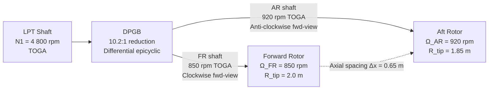

<!-- ──────────────────────────────────────────────────────────────────────────
     QATL-ATLAS-1000-ATLAS-080-089-08-087-020-COUNTER-ROTATING-PROPULSOR-ARCHITECTURE
     ATLAS-087 (Open Rotor and Counter-Rotating) · Counter-Rotating Propulsor Architecture
     programme-defined aircraft type — ATLAS Register 1000
────────────────────────────────────────────────────────────────────────────── -->

# Counter-Rotating Propulsor Architecture

---

## §0 Hyperlink Policy

> All hyperlinks in this document are **relative** (five directory levels: `../../../../../`).
> Absolute URLs are forbidden.

---

## §1 Purpose

This document defines the agnostic ATLAS standard-level architecture context for `Counter-Rotating Propulsor Architecture`.

It describes the controlled scope, functions, interfaces, safety considerations, lifecycle traceability, and S1000D/CSDB mapping logic that programme implementations shall instantiate when this node is applicable.

This document is not a programme design baseline. Programme-specific capacities, locations, part numbers, effectivity, operating limits, maintenance references, and data module codes shall be defined only inside the applicable programme implementation branch.
## §2 Topology Overview

The ORCR adopts a **pusher-configuration contra-rotating** layout at the aft fuselage pylon stations. In the pusher configuration the rotor rows are aft of the pylon attachment point, minimising ingestion of boundary-layer air from the fuselage and maximising clean-flow propulsive efficiency. Both rotor rows are directly driven from the LPT shaft through the DPGB.

---

## §3 Rotor Design Parameters

| Parameter | Forward Rotor (FR) | Aft Rotor (AR) |
|---|---|---|
| Number of blades | 12 | 10 |
| Tip radius | 2.0 m | 1.85 m |
| Hub radius | 0.42 m | 0.40 m |
| Design rotational speed (TOGA) | 850 rpm | 920 rpm |
| Tip speed (TOGA) | 178 m/s (subsonic) | 178 m/s |
| Solidity at 75 % span | 0.38 | 0.32 |
| Blade pitch range | −5° to +85° | −5° to +85° |
| Rotation direction (fwd view) | Clockwise | Counter-clockwise |
| Design lift coefficient (75 % span) | C_L = 0.65 | C_L = 0.70 |
| Design swirl recovery (AR) | — | ≥ 95 % of FR exit swirl |

---

## §4 DPGB Architecture

The Differential Planetary Gearbox (DPGB) is a two-stage compound epicyclic system. The first stage (input) is a simple planetary with fixed ring gear, reducing the LPT shaft speed from 4 800 rpm to an intermediate carrier speed. The second stage is a differential epicyclic with two output shafts: the FR shaft (driven from the second-stage planet carrier) and the AR shaft (driven from the second-stage ring gear in opposite sense), producing the contra-rotation without external reaction torque through external structure.

| DPGB Parameter | Value |
|---|---|
| Overall reduction ratio | 10.2:1 (LPT to FR axis) |
| FR–AR speed ratio | 1 : 1.082 (FR : AR) |
| Input torque capacity (TOGA) | 120 000 N·m |
| DPGB housing material | Titanium alloy Ti-6Al-4V (cast + machined) |
| Lubrication | Pressurised MIL-PRF-23699 type IV oil; integral oil-cooler heat exchanger |
| Oil pump redundancy | 2 × driven oil pumps (engine gear-driven) + 1 × electrical standby |
| Operating oil temperature | 60–115 °C continuous; 130 °C transient 5 min limit |
| Torsional vibration damper | Elastomeric coupling on LPT input flange; 10–200 Hz range |
| Overhaul interval | 8 000 FC (flight cycles); TBO subject to endurance test validation |

---

## §5 Axial Spacing and Acoustic Clocking

The axial gap between the FR trailing edge plane and the AR leading edge plane is a primary driver of the blade-passing interaction (BPI) tone, which is the dominant noise component of the ORCR.

- **Design axial spacing:** Δx = 0.65 m (measured at 75 % span)
- **Minimum spacing (structural limit):** Δx_min = 0.50 m (flutter, gust load, deflection budget)
- **Acoustic clocking:** The FR–AR blade count ratio of 12:10 yields a highest-common-factor of 2, producing BPI tone at 2 × blade-passing-frequency (BPF). ORSCU implements an **active acoustic clocking algorithm** that adjusts the AR rotational phase relative to FR (within ±5° of design) during cruise to exploit destructive interference, targeting a reduction of ≥ 3 dB in BPI tone.

---

## §6 Speed and Torque Schedule

| Flight Phase | FR Speed (rpm) | AR Speed (rpm) | FR Torque (kN·m) | AR Torque (kN·m) | Net Thrust (kN) |
|---|---|---|---|---|---|
| Ground idle | 320 | 346 | 8 | 8 | 5 |
| Takeoff TOGA | 850 | 920 | 105 | 95 | 310 |
| Climb (initial) | 780 | 845 | 88 | 80 | 255 |
| Cruise (M 0.78, FL 350) | 680 | 736 | 65 | 60 | 165 |
| Descent (idle) | 420 | 455 | 12 | 11 | 20 |
| Reverse (ground) | 380 | 410 | 55 | 50 | −90 (reverse) |
| Feather | 200 | 216 | < 2 | < 2 | ~0 |

---

## §7 Inter-Rotor Swirl Recovery Efficiency

The contra-rotating architecture achieves its efficiency advantage by converting the tangential kinetic energy (swirl) imparted by the FR back into axial thrust through the AR. The swirl recovery efficiency (η_SR) is defined as:

η_SR = (AR power output) / (FR swirl kinetic energy input) × 100 %

Design target: **η_SR ≥ 95 %** at cruise, equating to a propulsive efficiency gain of approximately 5 % compared to a single-rotation open rotor with equivalent total power.

---

## §8 Open Issues

| ID | Description | Owner | Target |
|---|---|---|---|
| OI-087-020-001 | DPGB differential stage gear mesh frequency — NVH impact on fuselage structure to be confirmed by FEA | Q-STRUCTURES | CDR |
| OI-087-020-002 | Active acoustic clocking algorithm — flutter interaction at ±5° phase variation to be validated by CFD | Q-HORIZON | CDR |
| OI-087-020-003 | DPGB oil-out time (gravity/windmill) — establish 30 s or 60 s BITE limit for MEL | Q-INDUSTRY | PDR |
