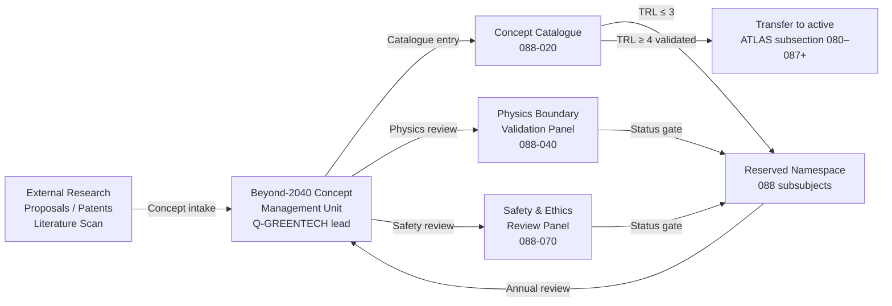
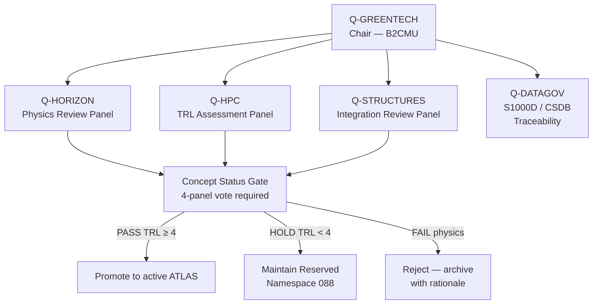

<!-- ──────────────────────────────────────────────────────────────────────────
     QATL-ATLAS-1000-ATLAS-080-089-08-088-000-BEYOND-2040-CONCEPTS-RESERVED-GENERAL
     ATLAS-088 (Beyond-2040 Concepts Reserved) · General
     AMPEL360E eWTW — ATLAS Register 1000
────────────────────────────────────────────────────────────────────────────── -->

# Beyond-2040 Concepts Reserved — General

---

## §0 Hyperlink Policy

> All hyperlinks in this document are **relative** (five directory levels: `../../../../../`).
> Absolute URLs are forbidden. Every linked document must exist in the Q+ATLANTIDE repository
> before the link is activated. Broken links are treated as open issues and must be resolved
> before the document is promoted from `DRAFT` to `APPROVED`.

---

## §1 Purpose

ATLAS subsubject 088-000 is the **apex reference** for the Beyond-2040 Concepts Reserved (B2CR) propulsion research namespace of the AMPEL360E eWTW programme. It establishes the overall framework description, concept taxonomy, technology intake criteria, governance constraints, and reserved-namespace management applicable across the full B2CR scope. All subordinate subsubject documents (088-010 through 088-090) are governed by, and must be consistent with, this general baseline document.

The B2CR framework provides a **controlled research repository** for post-conventional propulsion concepts whose underlying physics, engineering feasibility, or manufacturing readiness cannot be confirmed within the current state of the art (pre-2026 knowledge base). Concepts admitted to subsection 088 are subject to strict claim-validation protocols managed by the **Beyond-2040 Concept Management Unit (B2CMU)**, a governance body — not a physical avionics unit — that coordinates Q-GREENTECH, Q-HORIZON, Q-HPC, and Q-STRUCTURES review panels. Physical candidate hardware or prototype systems, when they reach TRL 4, are transferred to the appropriate active ATLAS subsection (080–087 or a future 089+).

---

## §2 Applicability

| Attribute | Value |
|---|---|
| Aircraft Programme | AMPEL360E eWTW (research roadmap horizon 2040+) |
| ATA Reference | ATLAS-088 (Beyond-2040 Concepts Reserved) |
| Governance Body | Beyond-2040 Concept Management Unit (B2CMU) |
| Certification Basis | Research phase — no active certification basis; future CS-25, CS-P, CS-E references identified per concept |
| S1000D SNS | 088-000-00 |
| DMRL Reference | BREX-088-v1; 30 Data Modules |
| Effectivity | AMPEL360E eWTW research roadmap; MSN 001+ if and when concepts reach applicable TRL thresholds |

---

## §3 Functional Description

The AMPEL360E eWTW **Beyond-2040 Concepts Reserved (B2CR)** namespace is structured around six post-conventional propulsion technology families, each assigned a catalogue identifier (B2C-Fxxx) and governed by the B2CMU intake and validation process:

1. **Field and Quantum-Vacuum Propulsion (B2C-F100):** Concepts that claim to derive thrust from interaction with the quantum vacuum (zero-point field), electromagnetic asymmetric cavities, or proposed scalar-field gradients. All B2C-F100 concepts are subject to mandatory independent experimental replication prior to concept promotion.

2. **Compact Nuclear and Fusion Propulsion (B2C-F200):** Micro-reactor and inertial confinement or magnetic confinement fusion concepts scaled to airborne platforms. Includes D-T fusion, field-reversed configuration (FRC) reactors, and muon-catalysed fusion in a conceptual airborne context. Q-HORIZON leads physics review.

3. **Photonic and Directed-Energy Propulsion (B2C-F300):** Laser ablation, photon pressure, microwave-beamed energy, and directed-energy momentum transfer concepts for atmospheric or near-space vehicles. Includes ground-based or orbital power-beaming architectures.

4. **Magnetohydrodynamic (MHD) Atmospheric Propulsion (B2C-F400):** MHD accelerator concepts for ionised-atmosphere cruise, Lorentz-force propulsion, and plasma-jet hybrid concepts distinct from ATLAS-082 (ionic propulsion for low-drag augmentation).

5. **Superconducting Rotating and Linear Motors (B2C-F500):** High-temperature superconductor (HTS) electric motor and linear-drive concepts operating at near-ambient temperatures via room-temperature superconductor (RTSC) materials, should such materials be demonstrated beyond 2030.

6. **Space-Time Metric and Gravitational Engineering (B2C-F600):** Concepts predicated on local modification of spacetime curvature, Alcubierre-class metric engineering, or gravitational anomaly propulsion. Admitted as horizon-monitoring objects only; experimental basis threshold is higher than for B2C-F100 through B2C-F500.

---

## §4 Functional Breakdown

| ID | Name | Description | Lead Division |
|---|---|---|---|
| F-001 | B2CR General / Overview | Framework scope, concept taxonomy, B2CMU governance, DMRL | Q-GREENTECH |
| F-002 | Beyond-2040 Scope and Controlled Reservation | Intake criteria, concept status lifecycle, exit conditions | Q-GREENTECH |
| F-003 | Post-Conventional Concept Catalogue | Concept IDs B2C-F100–F600, descriptions, physics basis | Q-HORIZON |
| F-004 | TRL Readiness and Maturity Assessment | Extended TRL scale for research concepts, assessment methodology | Q-HPC |
| F-005 | Physics Boundary and Claim Validation | Independent review protocol, known-physics compliance, falsifiability | Q-HORIZON |
| F-006 | Energy Source and Conversion Concepts | Energy density requirements, conversion efficiency, source candidates | Q-GREENTECH |
| F-007 | Airframe Integration and Mission Compatibility | Mass, volume, thermal, EMI budgets for candidate concepts | Q-STRUCTURES |
| F-008 | Safety, Certification and Ethical Use Constraints | Novel hazard taxonomy, certification pathway, dual-use controls | Q-GREENTECH |
| F-009 | Monitoring, Diagnostics and Control Interfaces | Sensing paradigms, telemetry concepts, prototype control architecture | Q-HPC |
| F-010 | S1000D / CSDB Mapping and Traceability | DMRL, BREX-088-v1, ICN registry, CSDB milestones | Q-DATAGOV |

---

## §5 System Context — Mermaid Diagram

---

## §6 B2CMU Governance Architecture — Mermaid Diagram

---

## §7 Concept Technology Families

| Family ID | Name | Physics Basis | TRL Range (2026) | B2CMU Status |
|---|---|---|---|---|
| B2C-F100 | Field and Quantum-Vacuum Propulsion | QED vacuum fluctuation, EM asymmetry | 1–2 | Active monitoring |
| B2C-F200 | Compact Nuclear and Fusion Propulsion | D-T fusion, FRC, muon-catalysed | 2–4 | Active monitoring |
| B2C-F300 | Photonic and Directed-Energy Propulsion | Photon pressure, laser ablation, beamed energy | 3–5 | Active monitoring |
| B2C-F400 | MHD Atmospheric Propulsion | Lorentz force, ionised atmosphere | 3–4 | Active monitoring |
| B2C-F500 | Superconducting Motors (RTSC) | HTS, room-temperature SC (conditional) | 2–4 | Active monitoring |
| B2C-F600 | Space-Time Metric Engineering | GR metric modification, Alcubierre | 1 | Horizon watch only |

---

## §8 Interfaces

| Interface Type | Connected System | Protocol / Medium | Data / Function |
|---|---|---|---|
| Concept intake | External research (universities, patents, DARPA/ESA outputs) | Structured proposal form — B2CMU-INT-001 | New concept admission |
| Physics validation | Q-HORIZON physics review panel | Offline review — B2CMU-REV-001 | Experimental data package assessment |
| TRL escalation | Active ATLAS subsections (080–087+) | Baseline change request (BCR) | Promote concept to active subsection |
| Ethics and dual-use | ORB-LEG, Q-DATAGOV | Compliance review — ETHICS-088 | Dual-use export control, ethical constraint tagging |
| S1000D traceability | AMPEL360E-EWTW CSDB | CSDB namespace 088 | Research DM registration under BREX-088-v1 |
| Annual review | B2CMU review board | Governance meeting — annual | Status gate decision for all active concepts |

---

## §9 Concept Lifecycle Modes

| Mode | Entry Condition | Exit Condition | B2CMU Action |
|---|---|---|---|
| Intake Review | Proposal received | Physics pre-screen complete | Assign B2C-Fxxx ID; catalogue |
| Active Monitoring | Physics pre-screen passed | Annual review | Maintain subsubject records; commission studies |
| Horizon Watch | Physics basis contested or unverified | Experimental replication confirmed | Archive with watch tag; no resource allocation |
| Promotion Eligible | TRL ≥ 4 in laboratory | CDR-level data package available | Initiate BCR to active ATLAS subsection |
| Rejected | Physics impossibility demonstrated | — | Archive with rejection rationale; close ID |

---

## §10 Performance and Budgets (Placeholder Targets)

| Parameter | Notional Requirement | Notes |
|---|---|---|
| Thrust-to-power ratio (B2C-F concept at cruise) | ≥ 10 N/kW (long-range goal) | Comparable to or better than advanced turbofan |
| Specific impulse equivalent (non-chemical) | > 5 000 s equivalent | Conceptual target for energy-beam-assisted propulsion |
| Airborne mass of propulsion system | < 20 % MTOW | Includes energy storage and conversion hardware |
| Electromagnetic emissions (EMI) | Compliant with DO-160G Cat M minimum | Requirement for any prototype airborne integration |
| Radiation shielding (B2C-F200) | Crew dose < 1 mSv/year | ICRP-103 limit for radiation workers |
| Operating temperature excursion | < 2 000 K at external surfaces | Consistent with CS-25 material temperature limits |

---

## §11 Safety and Governance Constraints

| Constraint | Requirement Source | Description |
|---|---|---|
| Physics Claim Validation | B2CMU-REV-001 | All admitted concepts must have at least one peer-reviewed publication or replicated experimental dataset; pure theoretical claims not based on established physics are horizon-watch only |
| Dual-Use Control | ORB-LEG; ITAR/EAR; EU Dual-Use Regulation 2021/821 | Concepts with potential directed-energy, nuclear, or high-power EM weapons applications require export-control classification before documentation release |
| Radiation Safety (B2C-F200) | IAEA Safety Standards; ICRP-103 | Compact nuclear or fusion concepts must carry a radiological safety assessment before any airborne prototype testing |
| Ethical Use | B2CMU Ethics Charter v1.0 | No concept admitted under 088 shall be developed with the primary intent of causing harm; dual-use concerns must be disclosed at intake |
| Intellectual Property | ORB-LEG IP Policy | Patent, trade-secret, and open-science IP status must be declared for each concept at intake; third-party IP encumbrances must be resolved before CSDB publication |
| Reversibility | CS-25 Amendment policy | Any airframe integration study must assume complete reversibility of concept installation without structural compromise to the primary airframe |

---

## §12 Document Lineage

| Predecessor | Document ID | Notes |
|---|---|---|
| ATLAS-088 README | QATL-ATLAS-1000-ATLAS-080-089-08-088-README | Subsection index; status updated to active |
| ATLAS-080 Quantum Sensing | QATL-...-080-000-... | Quantum sensing technologies applicable to novel propulsion monitoring |
| ATLAS-082 Plasma Propulsion | QATL-...-082-000-... | Plasma/ionic concepts boundary with B2C-F400 MHD family |
| ATLAS-084 Hybrid Architectures | QATL-...-084-000-... | BGHA energy management informs B2C-F500 superconducting motor pathways |
| ATLAS-085 DEP | QATL-...-085-000-... | DEP architecture informs integration constraints for B2C-F300/F400 |

---

## §13 Open Issues

| ID | Description | Owner | Target |
|---|---|---|---|
| OI-088-001 | B2CMU governance charter v1.0 — formal approval by ORB-PMO and Q-GREENTECH | Q-GREENTECH | PDR |
| OI-088-002 | Physics claim validation protocol (B2CMU-REV-001) — draft and review cycle | Q-HORIZON | PDR |
| OI-088-003 | Dual-use classification assessment for B2C-F100, F200, F300, F600 families | ORB-LEG | PDR |
| OI-088-004 | TRL-extended scale definition (B2CMU-TRL-088) — alignment with NASA TRL 1–9 and ESA SRL scale | Q-HPC | PDR |
| OI-088-005 | CSDB SNS 088 namespace reservation in AMPEL360E-EWTW CSDB instance | Q-DATAGOV | PDR |

---

## §14 References

| Ref | Title | Source |
|---|---|---|
| [R-001] | EASA CS-25 Amendment 27+ | EASA |
| [R-002] | NASA Technology Readiness Level (TRL) Definitions | NASA |
| [R-003] | ESA Technology Readiness Level (TRL) and Manufacturing Readiness Level (MRL) Definitions | ESA |
| [R-004] | ICRP Publication 103 — The 2007 Recommendations of the International Commission on Radiological Protection | ICRP |
| [R-005] | EU Dual-Use Regulation 2021/821 | European Union |
| [R-006] | DO-160G Environmental Conditions and Test Procedures | RTCA |
| [R-007] | S1000D Issue 5.0 Technical Publications Specification | ASD/AIA |
| [R-008] | ATLAS-080 Quantum Sensing for Propulsion (QATL-080-000) | Q+ATLANTIDE |
| [R-009] | ATLAS-082 Plasma and Ionic Propulsion Concepts (QATL-082-000) | Q+ATLANTIDE |
| [R-010] | ATLAS-084 Hybrid Architectures Beyond Gen-2 (QATL-084-000) | Q+ATLANTIDE |
