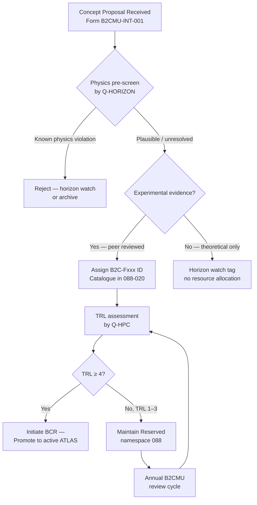

<!-- ──────────────────────────────────────────────────────────────────────────
     QATL-ATLAS-1000-ATLAS-080-089-08-088-010-BEYOND-2040-SCOPE-AND-CONTROLLED-RESERVATION
     ATLAS-088 (Beyond-2040 Concepts Reserved) · Beyond-2040 Scope and Controlled Reservation
     programme-defined aircraft type — ATLAS Register 1000
────────────────────────────────────────────────────────────────────────────── -->

# Beyond-2040 Scope and Controlled Reservation

---

## §0 Hyperlink Policy

> All hyperlinks in this document are **relative** (five directory levels: `../../../../../`).
> Absolute URLs are forbidden.

---

## §1 Purpose

This document defines the agnostic ATLAS standard-level architecture context for `Beyond-2040 Scope and Controlled Reservation`.

It describes the controlled scope, functions, interfaces, safety considerations, lifecycle traceability, and S1000D/CSDB mapping logic that programme implementations shall instantiate when this node is applicable.

This document is not a programme design baseline. Programme-specific capacities, locations, part numbers, effectivity, operating limits, maintenance references, and data module codes shall be defined only inside the applicable programme implementation branch.
## §2 Scope Boundary Definition

### 2.1 In-Scope for ATLAS-088

The following categories of propulsion concept are in scope for admission to the B2CR namespace:

| Category | Description | Minimum Admission Criteria |
|---|---|---|
| Post-Newtonian propulsion | Concepts that require relativistic or quantum-field treatment for their claimed propulsive effect | At least one peer-reviewed paper in a SCIE-indexed journal |
| Non-chemical, non-electrochemical thrust | Concepts that do not rely on combustion, ionic acceleration (covered 082), or electric motor torque (covered 083–087) | Reproducible laboratory measurement of claimed effect |
| Compact nuclear/fusion | Airborne micro-reactor or fusion concepts | Feasibility study by recognised nuclear research institution |
| Directed-energy and beamed propulsion | Photon, microwave, laser ablation thrust in atmosphere or near-space | Sub-scale experimental demonstration |
| Novel thermodynamic cycles | Cycles that claim to exceed Carnot efficiency through unconventional physical mechanisms | Independent experimental data package |

### 2.2 Out of Scope

| Topic | Reason for Exclusion | Where Covered |
|---|---|---|
| Conventional SAF combustion | Active technology, TRL ≥ 8 | ATLAS-078 |
| Battery and fuel-cell energy storage | Active technology | ATLAS-072, 075 |
| Hydrogen storage and distribution | Active technology | ATLAS-076, 077 |
| Plasma/ionic propulsion (low-thrust augmentation) | Active research, TRL ≥ 4 | ATLAS-082 |
| Open-rotor systems | Active design programme | ATLAS-087 |
| Standard quantum sensing instrumentation | Active programme | ATLAS-080 |
| Science fiction concepts with no physical basis | No experimental basis; no peer review | Rejected at intake |

---

## §3 Controlled Reservation Mechanism

### 3.1 Concept Intake Process

### 3.2 Concept Status Codes

| Code | Label | Meaning | Resource Allocation |
|---|---|---|---|
| B2C-INTAKE | Intake Review | Proposal received; pre-screen in progress | Administrative only |
| B2C-WATCH | Horizon Watch | Physics basis contested or experimental evidence absent | Watch only — no programme funding |
| B2C-ACTIVE | Active Monitoring | Physics plausible; experimental evidence exists; TRL < 4 | Analytical studies authorised |
| B2C-PROMOTE | Promotion Eligible | TRL ≥ 4; CDR-level data package ready | Initiate BCR to active ATLAS |
| B2C-REJECT | Rejected | Physics impossibility demonstrated | Archive with rationale; no reinstatement |
| B2C-ARCHIVE | Archived | Transferred to active ATLAS or closed by supersession | Read-only reference |

### 3.3 Annual Review Cycle

The B2CMU conducts an annual status review of all B2C-ACTIVE and B2C-WATCH concepts each Q1. The review outputs a **Concept Status Report (CSR-088-YYYY)** documenting:

- Status changes (upgrades, downgrades, rejections, promotions)
- New experimental data incorporated since last review
- TRL delta assessments from Q-HPC
- Dual-use status updates from ORB-LEG
- Resource allocation recommendations to Q-GREENTECH programme management

---

## §4 Reservation Namespace Structure

The B2CR namespace reserves the following subsubject codes within ATLAS-088:

| NN Range | Reserved For | Current Status |
|---|---|---|
| 000 | General overview and framework | Active (this document set) |
| 010 | Scope and controlled reservation | Active |
| 020 | Post-conventional concept catalogue | Active |
| 030 | TRL readiness and maturity assessment | Active |
| 040 | Physics boundary and claim validation | Active |
| 050 | Energy source and conversion concepts | Active |
| 060 | Airframe integration and mission compatibility | Active |
| 070 | Safety, certification and ethical use constraints | Active |
| 080 | Monitoring, diagnostics and control interfaces | Active |
| 090 | S1000D / CSDB mapping and traceability | Active |
| 091–099 | Future expansion (by B2CMU authorisation) | Reserved |

---

## §5 Exit Conditions from Reserved Status

### 5.1 Promotion to Active ATLAS Subsection

A concept held in B2C-ACTIVE status is eligible for promotion when **all** of the following are satisfied:

1. TRL ≥ 4 confirmed by Q-HPC TRL Assessment Panel using criteria in 088-030.
2. Physics review panel (Q-HORIZON) has confirmed no fundamental violation of established thermodynamic, electromagnetic, or nuclear physics laws.
3. A CDR-level data package (experimental results, prototype description, mass/power/thermal budgets, safety analysis) has been submitted to the B2CMU.
4. Dual-use classification confirmed by ORB-LEG with no unresolved export-control holds.
5. Target active ATLAS subsection identified and concurrence obtained from subsection lead Q-Division.

### 5.2 Rejection Conditions

A concept is moved to B2C-REJECT when **any** of the following applies:

1. Experimental claims have been independently demonstrated to be non-reproducible after two independent replication attempts.
2. The claimed physical mechanism is proven impossible within established physics (e.g., violates conservation of energy, momentum, or charge).
3. The concept is found to have no discriminating advantage over technologies already active in ATLAS-080–087.
4. Continuing development would violate dual-use export controls or ethical constraints irresolvably.

---

## §6 Governing Documents

| Document | Title | Rev |
|---|---|---|
| QATL-ATLAS-1000-ATLAS-080-089-08-088-000 | B2CR General | 0.1 |
| B2CMU-INT-001 | Concept Intake Form and Screening Protocol | 1.0 |
| B2CMU-REV-001 | Physics Claim Validation Protocol | 1.0 |
| B2CMU-TRL-088 | Extended TRL Scale for B2CR Concepts | 1.0 |
| ORB-LEG-DU-001 | Dual-Use Classification Policy | Current |

---

## §7 Open Issues

| ID | Description | Owner | Target |
|---|---|---|---|
| OI-088-010-001 | Formalise B2CMU-INT-001 intake form template and submit to Q-GREENTECH for approval | Q-GREENTECH | PDR |
| OI-088-010-002 | Define resource allocation caps for B2C-ACTIVE concepts per annual review cycle | Q-GREENTECH / ORB-FIN | PDR |
| OI-088-010-003 | Establish liaison protocol with ESA, DARPA, and EU Horizon research programmes for external concept sourcing | Q-HORIZON | CDR |
| OI-088-010-004 | Clarify overlap boundary between ATLAS-082 (plasma) and B2C-F400 (MHD) — joint Q-GREENTECH / Q-HORIZON review required | Q-GREENTECH | PDR |
