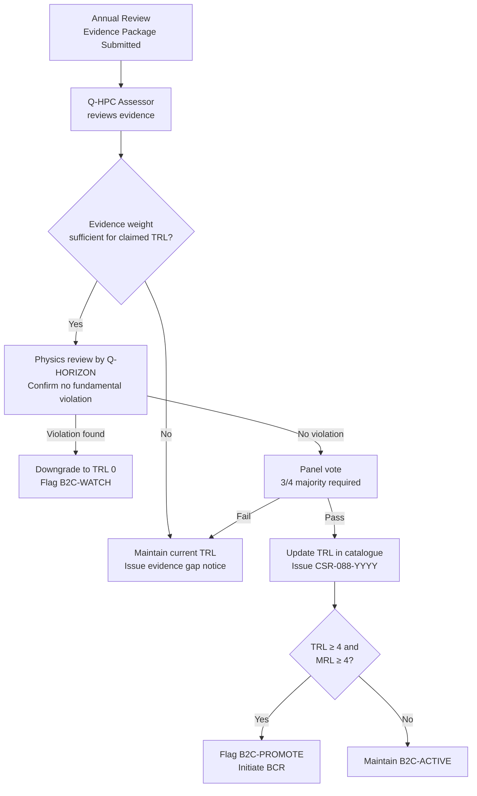

<!-- ──────────────────────────────────────────────────────────────────────────
     QATL-ATLAS-1000-ATLAS-080-089-08-088-030-TRL-READINESS-AND-MATURITY-ASSESSMENT
     ATLAS-088 (Beyond-2040 Concepts Reserved) · TRL Readiness and Maturity Assessment
     AMPEL360E eWTW — ATLAS Register 1000
────────────────────────────────────────────────────────────────────────────── -->

# TRL Readiness and Maturity Assessment

---

## §0 Hyperlink Policy

> All hyperlinks in this document are **relative** (five directory levels: `../../../../../`).
> Absolute URLs are forbidden.

---

## §1 Purpose

ATLAS subsubject 088-030 defines the Technology Readiness Level (TRL) and Manufacturing Readiness Level (MRL) assessment framework applied to all B2CR concepts catalogued in 088-020. It adapts the standard NASA/ESA TRL 1–9 scale with an extended pre-TRL layer for concepts whose fundamental physical mechanism is not yet experimentally confirmed. The assessment methodology ensures a consistent, evidence-based basis for B2CMU status gate decisions.

---

## §2 Extended TRL Scale for B2CR Concepts

The B2CMU applies the following extended TRL scale (B2CMU-TRL-088), which prepends two sub-TRL levels to the standard NASA TRL 1–9 scale:

| Level | Label | Definition | Evidence Required | Typical B2C Status |
|---|---|---|---|---|
| TRL 0 | Physics Hypothesis | Concept is theoretically proposed; no experimental test designed or attempted | Peer-reviewed theoretical paper in SCIE-indexed journal | B2C-WATCH |
| TRL 0+ | Unconfirmed Signal | Laboratory measurement claims to detect claimed effect; independent replication not achieved | At least one experimental report; must disclose uncertainty budget | B2C-WATCH |
| TRL 1 | Basic Principles Observed | Claimed physical effect observed in controlled laboratory conditions; independent replication underway | ≥ 1 independent replication with consistent sign; uncertainty < 10 × claimed signal | B2C-WATCH / B2C-ACTIVE |
| TRL 2 | Technology Concept Formulated | Technology application concept defined; analytical and experimental studies confirm basic properties | Detailed concept paper; bench-level measurements of key parameters; no integrated system | B2C-ACTIVE |
| TRL 3 | Experimental Proof of Concept | Laboratory demonstration of individual key functions; performance at sub-system level | Component-level laboratory test results; analytical model validated against data | B2C-ACTIVE |
| TRL 4 | Technology Validated in Laboratory | End-to-end prototype validated in laboratory environment; performance and interface parameters characterised | Integrated prototype test report; traceable performance measurements; safety characterisation | B2C-PROMOTE eligible |
| TRL 5 | Technology Validated in Relevant Environment | Prototype demonstrated in simulated relevant environment (altitude chamber, thermal-vacuum, scale test rig) | Relevant environment test results; environmental performance characterisation | Promote to active ATLAS |
| TRL 6 | Technology Demonstrated in Relevant Environment | Full-scale system demonstrated in relevant operational environment | Full-scale demonstration results; system CDR data package | Active ATLAS; standard programme |
| TRL 7 | System Prototype Demonstrated in Operational Environment | System tested at full scale in operational environment (flight test or equivalent) | Flight test / full operational environment data | Active ATLAS; certification track |
| TRL 8 | System Complete and Qualified | System qualified through test and demonstration to regulatory standards | Certification basis compliance; design freeze | Active ATLAS; production |
| TRL 9 | System Proven Through Successful Mission Operations | System successfully deployed in operational use | Service entry; operational data | Active ATLAS; operational |

---

## §3 Manufacturing Readiness Level (MRL) for B2CR Concepts

Manufacturing maturity is assessed in parallel with TRL using the following abridged MRL scale:

| MRL | Label | Definition |
|---|---|---|
| MRL 1–2 | Feasibility study | Manufacturing processes conceptualised; no manufacturing trials |
| MRL 3–4 | Laboratory proof | Key manufacturing processes demonstrated at laboratory scale |
| MRL 5–6 | Prototype | Prototype manufactured; basic supply chain identified |
| MRL 7–8 | Pilot production | Pilot production demonstrated; supply chain validated |
| MRL 9–10 | Rate production | Full rate production capability established |

For concepts in the B2CR namespace, MRL ≥ 5 is required at the same time as TRL ≥ 5 for promotion to an active ATLAS subsection.

---

## §4 Assessment Methodology

### 4.1 TRL Assessment Panel

Each B2CR concept is assessed annually by the Q-HPC TRL Assessment Panel, composed of:

- Q-HPC lead assessor (panel chair)
- Q-HORIZON physics reviewer (1 member)
- Q-STRUCTURES integration reviewer (1 member)
- Q-GREENTECH programme representative (observer, non-voting)

The panel uses the **B2CMU-TRL-088 Evidence Checklist** as the primary assessment instrument. Each level transition requires a majority vote (2 of 3 voting members).

### 4.2 Evidence Hierarchy

Evidence submitted in support of TRL claims is ranked by weight:

| Weight | Evidence Type |
|---|---|
| 5 (highest) | Peer-reviewed publication in SCIE journal with full experimental data appendix |
| 4 | Reviewed conference paper (AIAA, IAC, NuFact) with measurement data |
| 3 | Government laboratory technical report (NASA, ESA, JAXA, DLR, CERN) |
| 2 | University thesis with independent supervisor attestation |
| 1 | Company white paper or patent disclosure |
| 0 (not accepted) | Blog post, press release, social media, unreviewed preprint without data |

### 4.3 TRL Gate Decision Flow

---

## §5 Current TRL Snapshot (2026)

| B2C-ID | Concept | TRL (2026) | MRL (2026) | TRL Δ vs. 2025 | Next Review |
|---|---|---|---|---|---|
| B2C-F101 | Asymmetric EM Cavity | TRL 0+ | MRL 1 | 0 | Q1 2027 |
| B2C-F102 | Mach Effect Thruster | TRL 3 | MRL 2 | +1 | Q1 2027 |
| B2C-F103 | Quantum Vacuum Plasma | TRL 0 | MRL 1 | 0 | Q1 2027 |
| B2C-F104 | Casimir Effect Micro-Thruster | TRL 1 | MRL 1 | 0 | Q1 2027 |
| B2C-F201 | Micro D-T Fusion | TRL 3 | MRL 2 | +1 | Q1 2027 |
| B2C-F202 | FRC Reactor | TRL 4 | MRL 3 | +1 | Special gate 2026 |
| B2C-F203 | Muon-Catalysed Fusion | TRL 2 | MRL 1 | 0 | Q1 2027 |
| B2C-F204 | Fission-Fragment Rocket | TRL 2 | MRL 1 | 0 | Q1 2027 |
| B2C-F205 | Aneutronic p-B11 Fusion | TRL 3 | MRL 2 | 0 | Q1 2027 |
| B2C-F301 | Ground Laser Ablation | TRL 4 | MRL 3 | 0 | Special gate 2026 |
| B2C-F302 | Microwave Power Beaming | TRL 5 | MRL 4 | +1 | Special gate 2026 |
| B2C-F303 | Orbital Laser Sail | TRL 5 | MRL 4 | 0 | Q1 2027 |
| B2C-F304 | Laser-Thermal Atmospheric | TRL 4 | MRL 3 | +1 | Special gate 2026 |
| B2C-F401 | MHD Atmospheric Accelerator | TRL 4 | MRL 3 | 0 | Q1 2027 |
| B2C-F402 | SC MHD Thruster | TRL 4 | MRL 3 | +1 | Q1 2027 |
| B2C-F403 | Plasma Jet MHD | TRL 3 | MRL 2 | 0 | Q1 2027 |
| B2C-F404 | Electroaerodynamic (EAD) | TRL 5 | MRL 4 | +1 | Special gate 2026 |
| B2C-F501 | HTS Motor (LN₂) | TRL 5 | MRL 4 | +1 | Special gate 2026 |
| B2C-F502 | RTSC Motor | TRL 0+ | MRL 1 | 0 | Q1 2027 |
| B2C-F503 | SC Linear Induction Drive | TRL 3 | MRL 2 | 0 | Q1 2027 |
| B2C-F601 | Alcubierre Warp Drive | TRL 0 | MRL 1 | 0 | Q1 2028 |
| B2C-F602 | Gravitational Anomaly | TRL 0 | MRL 1 | 0 | Q1 2028 |
| B2C-F603 | Quantum Inertia Modification | TRL 0 | MRL 1 | 0 | Q1 2028 |

---

## §6 Target TRL Roadmap (2026–2040)

| B2C-ID | TRL 2026 | Target TRL 2030 | Target TRL 2035 | Target TRL 2040 | Promotion Gate |
|---|---|---|---|---|---|
| B2C-F202 (FRC) | 4 | 6 | 8 | 9 | 2026 special gate |
| B2C-F302 (MPB) | 5 | 7 | 8 | 9 | 2026 special gate |
| B2C-F404 (EAD) | 5 | 7 | 8 | 9 | 2026 special gate |
| B2C-F501 (HTS) | 5 | 7 | 8 | 9 | 2026 special gate |
| B2C-F102 (MET) | 3 | 4 | 5 | 6 | 2030 if replication successful |
| B2C-F401 (MHD) | 4 | 5 | 6 | 7 | 2028 if mass budget resolved |
| B2C-F205 (p-B11) | 3 | 4 | 5 | 6 | 2030 if ignition achieved |

---

## §7 Open Issues

| ID | Description | Owner | Target |
|---|---|---|---|
| OI-088-030-001 | Formalise B2CMU-TRL-088 document as controlled governance reference and obtain ORB-PMO approval | Q-HPC | PDR |
| OI-088-030-002 | Schedule 2026 special gate reviews for B2C-F202, F302, F404, F501 — prepare promotion evidence packages | Q-HPC / Q-GREENTECH | Q3 2026 |
| OI-088-030-003 | Establish MRL assessment process for B2CR concepts — identify manufacturing partners for laboratory-scale evaluation | Q-STRUCTURES | CDR |
| OI-088-030-004 | Define TRL assessment metrics specific to F600 family (metric engineering) — current TRL 1–9 scale does not adequately represent speculative theoretical-only concepts | Q-HORIZON | PDR |
