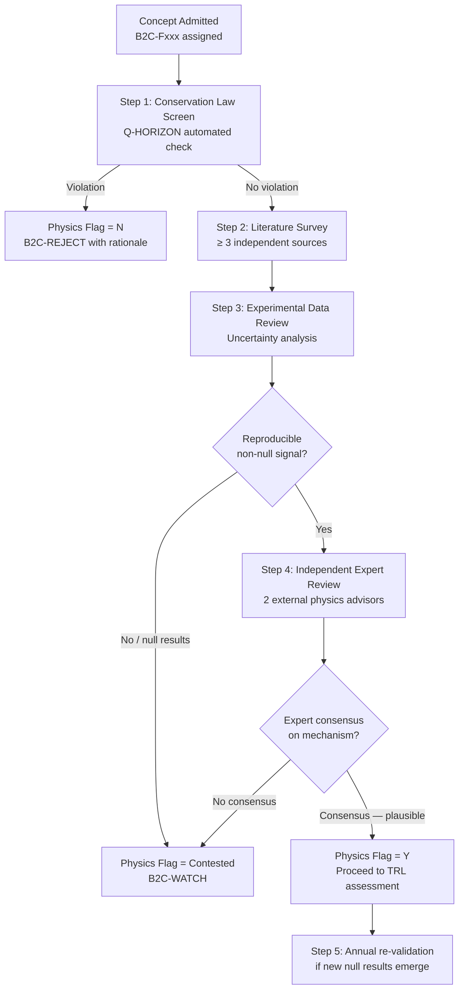

<!-- ──────────────────────────────────────────────────────────────────────────
     QATL-ATLAS-1000-ATLAS-080-089-08-088-040-PHYSICS-BOUNDARY-AND-CLAIM-VALIDATION
     ATLAS-088 (Beyond-2040 Concepts Reserved) · Physics Boundary and Claim Validation
     programme-defined aircraft type — ATLAS Register 1000
────────────────────────────────────────────────────────────────────────────── -->

# Physics Boundary and Claim Validation

---

## §0 Hyperlink Policy

> All hyperlinks in this document are **relative** (five directory levels: `../../../../../`).
> Absolute URLs are forbidden.

---

## §1 Purpose

This document defines the agnostic ATLAS standard-level architecture context for `Physics Boundary and Claim Validation`.

It describes the controlled scope, functions, interfaces, safety considerations, lifecycle traceability, and S1000D/CSDB mapping logic that programme implementations shall instantiate when this node is applicable.

This document is not a programme design baseline. Programme-specific capacities, locations, part numbers, effectivity, operating limits, maintenance references, and data module codes shall be defined only inside the applicable programme implementation branch.
## §2 Known-Physics Boundary Framework

### 2.1 Conservation Laws (Absolute Constraints)

The following conservation laws are treated as **inviolable** within the B2CMU review framework. Any concept that claims to operate by violating these laws is immediately assigned Physics Boundary Flag = N and moved to B2C-REJECT:

| Conservation Law | Statement | Implication for Propulsion |
|---|---|---|
| Conservation of Energy | Total energy of an isolated system is constant | No propulsion concept may claim to produce more thrust energy than it consumes; perpetual-motion propulsion is inadmissible |
| Conservation of Momentum | Total momentum of an isolated system is constant | Net thrust requires an equal and opposite momentum transfer to the environment (exhaust, radiation pressure, field, or mass); reactionless drives in truly isolated systems violate this law |
| Conservation of Charge | Electric charge cannot be created or destroyed | Electromagnetic propulsion concepts must respect charge conservation; no concept may claim net charge emission without an equal return path |
| Baryon Number Conservation | Net baryon number is conserved in all SM processes | Antimatter annihilation produces baryon-number-zero leptons/photons; this is physics-compliant. Claimed baryon-number-violating drives are inadmissible unless supported by BSM physics evidence |

### 2.2 Thermodynamic Constraints

| Constraint | Statement | B2CMU Application |
|---|---|---|
| Second Law of Thermodynamics | Entropy of an isolated system does not decrease | Concepts claiming to extract useful work from thermal equilibrium environments without a cold reservoir violate 2nd Law; inadmissible |
| Carnot Efficiency Limit | No heat engine operating between T_H and T_C can exceed η = 1 − T_C/T_H | Thermal propulsion cycles claiming to exceed Carnot efficiency require extraordinary evidence and immediate independent review |

### 2.3 Relativistic Constraints

| Constraint | Statement | B2CMU Application |
|---|---|---|
| Finite speed of light | c is invariant; no signal or matter travels faster than c in vacuum in the local frame | Concepts requiring FTL communication or transport in vacuum are B2C-WATCH (F600) unless a valid GR metric-modification mechanism with experimentally verifiable intermediate predictions is provided |
| Mass-energy equivalence | E = mc²; energy and mass are interconvertible | All energy calculations for B2CR concepts must account for relativistic mass-energy equivalence; classical approximations must be explicitly justified |

### 2.4 Quantum Mechanical Constraints

| Constraint | Statement | B2CMU Application |
|---|---|---|
| Heisenberg Uncertainty Principle | Δx · Δp ≥ ℏ/2 | Concepts claiming arbitrary simultaneous precision in position and momentum measurement are inadmissible |
| No-Cloning Theorem | An arbitrary unknown quantum state cannot be perfectly copied | Quantum communication or control schemes must respect no-cloning |
| Quantum vacuum energy density | QED predicts finite vacuum energy; extraction for macroscopic work requires asymmetric coupling not predicted by standard QED | B2C-F100 concepts must provide explicit coupling mechanism; appeal to generic "zero-point energy" without mechanism is insufficient |

---

## §3 Physics Claim Validation Protocol (B2CMU-REV-001)

### 3.1 Validation Steps

### 3.2 Evidence Requirements by Physics Flag

| Flag | Meaning | Minimum Evidence Required |
|---|---|---|
| Y (Compliant) | Claimed mechanism is consistent with established or BSM physics; no conservation law violated; reproducible non-null experimental signal obtained by ≥ 2 independent groups | 2 independent experimental replications; peer-reviewed publications in SCIE journals; uncertainty budget demonstrating signal > noise at 5σ |
| Contested | Mechanism is theoretically plausible under some interpretations of physics; experimental results are mixed or below 5σ significance | ≥ 1 experimental report showing non-null signal; ≥ 1 independent null result; active theoretical debate in peer-reviewed literature |
| N (Non-Compliant) | Mechanism demonstrably violates a conservation law or has been independently shown to produce null results across all credible experimental attempts | ≥ 2 independent high-quality null results with uncertainty budget demonstrating measurement sensitivity exceeding claimed signal level |

### 3.3 Falsifiability Requirement

All B2CR concepts admitted to B2C-ACTIVE status must have at least one **falsifiable experimental prediction** documented in the B2CMU concept record. The prediction must:

1. Be quantitative (e.g., "concept X predicts thrust of Y μN at power level Z W in vacuum at 10⁻⁶ Torr").
2. Be testable within the current state of laboratory measurement technology.
3. Have a clear null result criterion (e.g., "if thrust < 0.1 μN at stated conditions across 3 independent experiments, concept is falsified").

Concepts without a falsifiable prediction are classified as B2C-WATCH or B2C-REJECT regardless of theoretical interest.

---

## §4 Physics Boundary Map by Technology Family

| Family | Key Physics Domains | Known Boundaries | Boundary Flag Disposition |
|---|---|---|---|
| B2C-F100 (Quantum Vacuum) | QED, Casimir physics, EM cavity resonance | Conservation of momentum in isolated cavity; QED vacuum energy extraction limits | Contested for most; Y if independent non-null signal at >5σ |
| B2C-F200 (Nuclear/Fusion) | Nuclear physics, plasma physics, QCD | Lawson criterion; radiation safety; energy balance including muon yield | Y for all F200 physics; engineering feasibility is the constraint |
| B2C-F300 (Photonic/Beamed) | Electrodynamics, photon momentum | Speed-of-light limit; photon pressure well-characterised; laser safety limits | Y — established physics; engineering and safety are constraints |
| B2C-F400 (MHD) | MHD, plasma physics, EM | Ionisation energy cost; magnetic Reynolds number; power-to-thrust ratio | Y — established physics; efficiency and mass budget are constraints |
| B2C-F500 (SC Motors) | Solid-state physics, SC theory | BCS theory limits on T_c; RTSC unconfirmed; thermodynamic constraints on motor efficiency | Y for HTS (LN₂); Contested for RTSC pending experimental confirmation |
| B2C-F600 (Metric Engineering) | General relativity, exotic matter | Negative energy density requirement not physically demonstrated; causality constraints | N/Contested — no admitted concept has crossed falsifiability threshold |

---

## §5 Validation Outcome Register

| B2C-ID | Concept | Physics Flag (2026) | Last Review | Review Outcome | Next Review |
|---|---|---|---|---|---|
| B2C-F101 | Asymmetric EM Cavity | Contested | Q1 2026 | Null results at NASA, Dresden outweigh Shawyer signal; insufficient 5σ evidence | Q1 2027 |
| B2C-F102 | Mach Effect Thruster | Contested | Q1 2026 | Non-null signal at Woodward lab; independent replication underway at TU Dresden | Q1 2027 |
| B2C-F202 | FRC Reactor | Y | Q2 2025 | TAE 2023 result; FRC physics well-established; engineering feasibility contested | Special 2026 |
| B2C-F302 | Microwave Power Beaming | Y | Q1 2026 | JAXA MPT demo; physics and engineering confirmed | Special 2026 |
| B2C-F404 | EAD Body Force | Y | Q1 2026 | MIT 2018 flight; ionic wind mechanism confirmed; no conservation violation | Special 2026 |
| B2C-F501 | HTS Motor | Y | Q1 2026 | Multiple independent demonstrations; physics well-understood | Special 2026 |
| B2C-F601 | Alcubierre Warp | N (exotic energy) | Q1 2026 | Requires negative energy density; not demonstrated; causality concerns | Q1 2028 |
| B2C-F602 | Gravitational Anomaly | Contested | Q1 2026 | No reproducible non-null result across multiple groups | Q1 2028 |

---

## §6 Open Issues

| ID | Description | Owner | Target |
|---|---|---|---|
| OI-088-040-001 | Formalise B2CMU-REV-001 protocol document — obtain Q-HORIZON director approval | Q-HORIZON | PDR |
| OI-088-040-002 | Commission independent replication of B2C-F102 (MET) — contract external laboratory (TU Dresden or JPL) | Q-HORIZON | Q3 2026 |
| OI-088-040-003 | Establish 5σ significance threshold validation procedure for thrust measurement campaigns — align with metrology standards (BIPM) | Q-HPC | PDR |
| OI-088-040-004 | Update F601 (Alcubierre) review to incorporate Lentz (2021) positive-energy geometry — determine if new architecture changes physics flag | Q-HORIZON | Q1 2027 |
