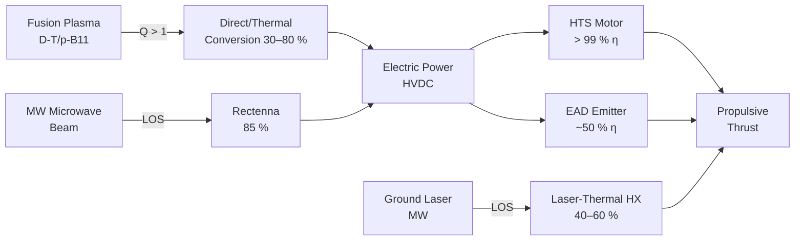

<!-- ──────────────────────────────────────────────────────────────────────────
     QATL-ATLAS-1000-ATLAS-080-089-08-088-050-ENERGY-SOURCE-AND-CONVERSION-CONCEPTS
     ATLAS-088 (Beyond-2040 Concepts Reserved) · Energy Source and Conversion Concepts
     programme-defined aircraft type — ATLAS Register 1000
────────────────────────────────────────────────────────────────────────────── -->

# Energy Source and Conversion Concepts

---

## §0 Hyperlink Policy

> All hyperlinks in this document are **relative** (five directory levels: `../../../../../`).
> Absolute URLs are forbidden.

---

## §1 Purpose

This document defines the agnostic ATLAS standard-level architecture context for `Energy Source and Conversion Concepts`.

It describes the controlled scope, functions, interfaces, safety considerations, lifecycle traceability, and S1000D/CSDB mapping logic that programme implementations shall instantiate when this node is applicable.

This document is not a programme design baseline. Programme-specific capacities, locations, part numbers, effectivity, operating limits, maintenance references, and data module codes shall be defined only inside the applicable programme implementation branch.
## §2 Energy Density Landscape

The following table positions B2CR energy sources against conventional references to provide context for airborne applicability:

| Energy Source | Specific Energy (MJ/kg) | Energy Density (MJ/L) | Applicable B2C Family | Maturity |
|---|---|---|---|---|
| Jet fuel (Jet-A) | 43.2 | 34.7 | Reference (non-B2CR) | TRL 9 |
| Liquid hydrogen (LH₂) | 120.0 | 8.5 | Reference (non-B2CR) | TRL 7–8 |
| Li-ion battery (<BATTERY-CHEMISTRY>) | 0.9 | 2.2 | Reference (non-B2CR) | TRL 9 |
| PEMFC + LH₂ system | ~20 (system) | ~3 (system) | Reference (non-B2CR) | TRL 7 |
| D-T fusion (theoretical max) | 3.4 × 10⁸ | — (plasma) | B2C-F201, F202 | TRL 3–4 |
| p-B11 fusion (theoretical max) | 6.7 × 10⁸ | — (plasma) | B2C-F205 | TRL 3 |
| Antimatter annihilation (p + p̄) | 9.0 × 10¹⁰ | — | Horizon watch only | TRL 0 |
| Beamed microwave (ground source) | Unlimited (off-board) | N/A (receiver) | B2C-F302 | TRL 5 |
| Laser ablation (off-board laser) | Unlimited (off-board) | N/A (ablator) | B2C-F301, F304 | TRL 4 |
| Photon pressure (orbital source) | Unlimited (off-board) | N/A (sail) | B2C-F303 | TRL 5 |
| HTS motor (off-board grid / FC) | As source (BGHA) | As source | B2C-F501 | TRL 5 |
| Electroaerodynamic (grid power) | As grid source | N/A (air ions) | B2C-F404 | TRL 5 |

---

## §3 Energy Source Descriptions by B2CR Family

### 3.1 Compact Fusion Energy (B2C-F200 Family)

**Source:** D-T, D-D, or p-B11 nuclear fusion plasma confined magnetically or inertially within an airborne reactor.

**Conversion chain:**
1. Plasma heating to fusion ignition temperature (D-T: ~150 million K; p-B11: ~5 billion K).
2. Energetic particles (neutrons for D-T; charged α-particles for p-B11) interact with blanket or direct-conversion system.
3. Thermal cycle or direct charged-particle conversion produces electricity (target η_conv ≥ 50 %).
4. Electricity drives electric propulsion (HTS motors, MHD accelerators, or ion engines).

**Key constraints:**
- Lawson criterion (n · τ · T product) for D-T ignition requires magnetic field strengths achievable with HTS coils (B ≥ 10 T).
- Net energy gain (Q > 1) from a compact airborne device is the primary unresolved engineering challenge.
- Radiation shielding mass for D-T (neutron flux) is a critical mass-budget item; p-B11 (aneutronic) offers significant shielding-mass advantage.
- Target airborne reactor mass: < 5 000 kg including shielding and conversion system for 1 MW electrical output.

| Parameter | D-T Concept | p-B11 Concept | Unit |
|---|---|---|---|
| Ignition temperature | 150 | 5 000 | Million K |
| Neutron flux | High | Negligible | — |
| Shielding mass (1 MW) | 1 500–3 000 | 200–500 | kg (estimated) |
| η_conversion (direct) | 30–40 % (thermal) | 60–80 % (direct) | % |
| Q target (airborne) | ≥ 2 | ≥ 5 | — |

### 3.2 Beamed Energy Concepts (B2C-F300 Family)

**Source:** Off-board — ground-based laser or microwave transmitter, or orbital relay satellite.

**Conversion chains:**

*Microwave Power Beaming (B2C-F302):*
1. Ground/satellite transmitter generates microwave beam (frequency 5.8 GHz or 35 GHz).
2. Aircraft rectenna array (rectifying antenna) converts microwave to DC electricity (η_rect ≥ 85 % demonstrated at 5.8 GHz).
3. DC power drives electric propulsion system (HTS motors, fans).

*Laser Thermal (B2C-F304):*
1. Ground laser (kW–MW class, 1 μm wavelength) illuminates heat-exchanger intake.
2. Atmospheric air heated to > 3 000 K by laser absorption in heat exchanger.
3. Hot gas exhausted for thrust (Isp ~800–1 200 s equivalent).

**Key constraint for airborne MPB:** Continuous beam tracking accuracy ≤ 0.1 mrad at 100 km range; weather attenuation at 5.8 GHz is low but significant at 35 GHz (rain fade). Line-of-sight (LOS) requirement limits range of operation.

| Parameter | MPB (B2C-F302) | Laser-Thermal (B2C-F304) | Unit |
|---|---|---|---|
| Transmitter power | 10–100 | 0.1–10 | MW |
| Frequency / wavelength | 5.8 GHz | ~1 μm | — |
| Rectenna / absorber η | ≥ 85 % | ~40–60 % | % |
| Range (LOS) | 200–500 | 50–200 | km |
| Weather sensitivity | Low (5.8 GHz) | High (fog, cloud) | — |

### 3.3 Electroaerodynamic Energy (B2C-F404)

**Source:** On-board electrical power (from HVDC bus, BGHA architecture per ATLAS-084, or dedicated PEMFC stack).

**Conversion chain:**
1. High-voltage power supply (HVPS, 20–40 kV DC) energises emitter electrodes.
2. Corona discharge ionises ambient air; ion bombardment imparts momentum to neutral air molecules.
3. Net ionic wind provides body force thrust (thrust ~ 1–10 N per kW at atmospheric density).

**Key constraint:** Thrust-to-power ratio ~5 N/kW (MIT 2018 demonstration); significant improvement required for transport-scale application (target ~20 N/kW). Thrust density scales with air density, making high-altitude performance challenging.

### 3.4 HTS Motor Energy (B2C-F501)

**Source:** On-board electrical power from BGHA hybrid energy architecture (ATLAS-084: SSBP + FCSS + VCGT).

**Conversion chain:**
1. BGHA provides HVDC <NOMINAL-VOLTAGE> to HTS motor drive inverter.
2. HTS stator windings (cooled to 77 K by LN₂ supply) carry current with zero resistive loss.
3. High-temperature SC rotor (or conventional rotor with SC stator) generates high air-gap flux density (B ≥ 5 T).
4. Motor drives open-rotor or ducted fan for thrust.

**Advantage over conventional PM motors:** HTS motors achieve power densities of 10–20 kW/kg versus 3–5 kW/kg for best conventional PMSMs. This enables propulsor systems previously mass-prohibitive. LN₂ supply mass is the key cost (~0.2 L/kWh of motor operation at 1 MW continuous).

---

## §4 Energy Conversion Efficiency Comparison

---

## §5 Energy System Mass Budgets (Notional, 2040 Target)

| Concept | Energy Source | Onboard Mass Budget | Power Output | Notes |
|---|---|---|---|---|
| B2C-F202 FRC fusion | Compact FRC reactor | < 5 000 kg | 1–5 MW | Target; MRL 3 |
| B2C-F302 MPB | Rectenna array (100 m² aircraft dorsal) | 500 kg | 5 MW | LOS constraint |
| B2C-F304 Laser-thermal | Heat exchanger + inlet | 200 kg | 1 MW (heat) | Ground laser required |
| B2C-F404 EAD | HVPS + emitter arrays | 300 kg | 500 kW input → 50 N | Scale-up challenge |
| B2C-F501 HTS motor | HTS stator + LN₂ system | 400 kg / 2 MW | 2 MW | Per motor; replaces PMSM |

---

## §6 Open Issues

| ID | Description | Owner | Target |
|---|---|---|---|
| OI-088-050-001 | Commission parametric mass budget study for B2C-F202 compact FRC reactor at 1 MW scale | Q-GREENTECH / Q-STRUCTURES | PDR |
| OI-088-050-002 | Define LN₂ supply architecture for B2C-F501 HTS motors — interface with ATLAS-076 cryogenic infrastructure | Q-GREENTECH | CDR |
| OI-088-050-003 | Evaluate rectenna integration on programme-defined aircraft type dorsal fuselage (100 m² aperture constraint) for B2C-F302 | Q-STRUCTURES | PDR |
| OI-088-050-004 | Obtain independent energy-balance analysis for B2C-F205 (p-B11) at airborne ignition power levels | Q-HORIZON | CDR |
