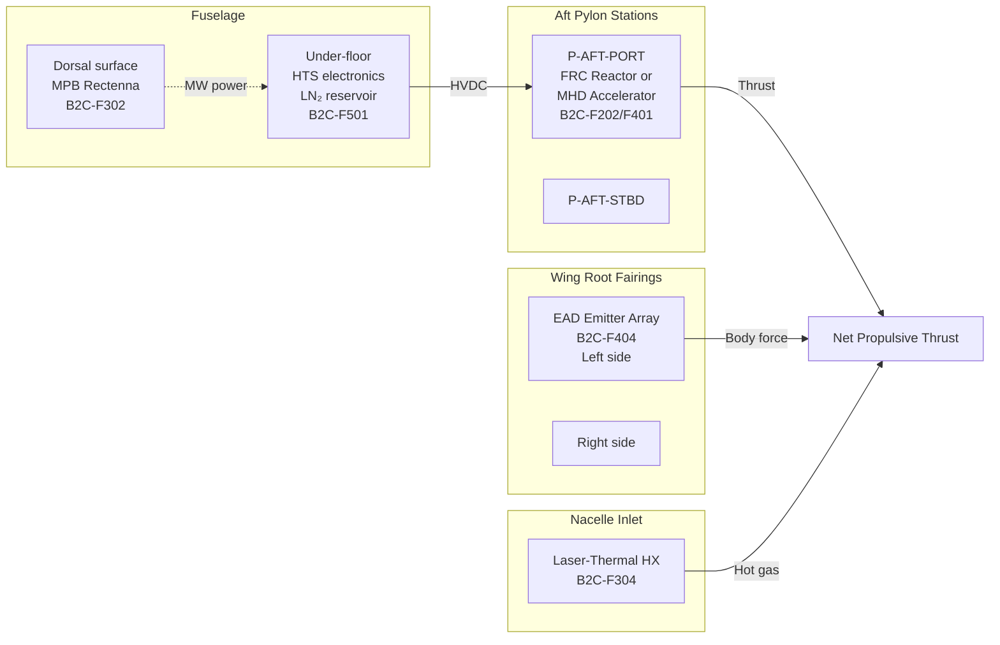

<!-- ──────────────────────────────────────────────────────────────────────────
     QATL-ATLAS-1000-ATLAS-080-089-08-088-060-AIRFRAME-INTEGRATION-AND-MISSION-COMPATIBILITY
     ATLAS-088 (Beyond-2040 Concepts Reserved) · Airframe Integration and Mission Compatibility
     programme-defined aircraft type — ATLAS Register 1000
────────────────────────────────────────────────────────────────────────────── -->

# Airframe Integration and Mission Compatibility

---

## §0 Hyperlink Policy

> All hyperlinks in this document are **relative** (five directory levels: `../../../../../`).
> Absolute URLs are forbidden.

---

## §1 Purpose

This document defines the agnostic ATLAS standard-level architecture context for `Airframe Integration and Mission Compatibility`.

It describes the controlled scope, functions, interfaces, safety considerations, lifecycle traceability, and S1000D/CSDB mapping logic that programme implementations shall instantiate when this node is applicable.

This document is not a programme design baseline. Programme-specific capacities, locations, part numbers, effectivity, operating limits, maintenance references, and data module codes shall be defined only inside the applicable programme implementation branch.
## §2 Airframe Integration Budget Framework

### 2.1 Mass Budget Allocation

| Budget Item | Conventional Baseline (Ref.) | B2CR Concept Allowance | Notes |
|---|---|---|---|
| Propulsion system mass (total) | 8 200 kg (TOGA engines + nacelles) | ≤ 9 500 kg | Additional 1 300 kg allowance for novel components |
| Novel propulsion subsystem (within above) | 0 | ≤ 2 000 kg | B2CR-specific hardware (reactor, rectenna, HTS stator, etc.) |
| Energy conversion subsystem | 0 (within engine) | ≤ 1 500 kg | Power conditioning, heat exchangers, cryogen supply |
| Shielding (if applicable) | 0 | ≤ 500 kg | Radiation shielding for B2C-F200 class concepts |
| MTOW impact | 79 000 kg (baseline) | ≤ 82 000 kg | +3 000 kg MTOW growth gate; requires wing/gear reassessment |

### 2.2 Volume Budget

| Installation Zone | Volume Available | Candidate B2CR Concepts | Constraints |
|---|---|---|---|
| Aft fuselage pylon stations (P-AFT-PORT, P-AFT-STBD) | ~4 m³ per station | B2C-F202 (compact FRC), B2C-F401 (MHD) | Access for maintenance; ground clearance 1.2 m min |
| Dorsal fuselage surface (180 m² usable) | ~100 m² effective aperture | B2C-F302 (MPB rectenna) | Antenna weight < 10 kg/m²; no structural breach |
| Forward fuselage under-floor (pressurised zone) | ~12 m³ | B2C-F501 (HTS motor drive electronics, LN₂ reservoir) | Pressure-vessel containment; T < −50 °C lines insulated |
| Wing root fairings (optional extension) | ~2 m³ per side | B2C-F404 (EAD emitter arrays) | EMI shielding from flight-critical avionics |
| Engine nacelle (replacement / modification) | Existing nacelle volume | B2C-F304 (laser-thermal heat exchanger) | Intake modification; structural analysis of HX loads |

### 2.3 Thermal Budget

| Concept | Heat Rejection Rate | Rejection Mechanism | Airframe Impact |
|---|---|---|---|
| B2C-F202 (FRC fusion) | 500 kW – 2 MW (blanket) | Dedicated RAHX (radiative + air-air HX) | New HX installation on empennage; structural loading |
| B2C-F302 (MPB rectenna) | ~50 kW (rectenna I²R losses) | Passive radiation from dorsal surface | Minimal; dorsal skin temperature rise < 30 °C |
| B2C-F304 (laser-thermal) | ~400 kW (HX exhaust to atmosphere) | Atmospheric air exhaust | Inlet geometry modification; back-pressure considerations |
| B2C-F404 (EAD) | ~20 kW (HVPS losses) | Convective cooling from ambient | Low impact; HVPS pod cooling integrated |
| B2C-F501 (HTS motor) | ~10 kW (LN₂ boil-off heat) | LN₂ venting — controlled overboard | Vent path design; cryogen storage per ATLAS-076 approach |

---

## §3 Mission Envelope Compatibility

### 3.1 Mission Performance Requirements

All B2CR concepts integrated into the programme-defined aircraft type must demonstrate compatibility with the following baseline mission envelope:

| Parameter | Requirement | Notes |
|---|---|---|
| Design range | ≥ 2 000 NM | Full programme-defined aircraft type design mission |
| Cruise Mach | 0.78 ± 0.02 | Driven by wing aero-optimisation |
| Cruise altitude | FL 310 – FL 390 | Must account for air density effect on concepts using atmospheric air |
| MTOW | ≤ 82 000 kg | B2CR growth gate per §2.1 |
| Payload | ≥ 18 000 kg (180 pax) | Minimum commercial viability |
| Runway length (TODA) | ≤ 2 500 m | ISA, sea-level, MTOW |
| Fuel/energy burn reduction | ≥ 10 % vs. GTF reference | Minimum programme target to justify B2CR integration |

### 3.2 Concept-Specific Mission Compatibility Assessment

| B2C-ID | Mission Range | Cruise Alt. | Key Limitation | Compatibility Assessment |
|---|---|---|---|---|
| B2C-F202 (FRC) | > 2 000 NM | All | Reactor mass; ignition energy start-up | Conditional — mass budget critical |
| B2C-F302 (MPB) | LOS limited (~500 km) | FL 050–200 (line of sight) | Ground station LOS requirement | Range-limited — suitable for regional ops only |
| B2C-F304 (Laser-thermal) | LOS limited (~200 km) | FL 050–150 | Ground laser LOS; weather sensitivity | Range and weather-limited |
| B2C-F404 (EAD) | All (supplementary) | FL 000–200 (thrust reduces with altitude) | Air density dependency; thrust density low | Suitable as low-drag augmentation below FL 200 |
| B2C-F501 (HTS motor) | > 2 000 NM | All | LN₂ supply mass and logistics | Fully compatible if BGHA energy source sufficient |
| B2C-F401 (MHD) | All (supplementary) | FL 000–200 | Ionised atmosphere efficiency; magnet mass | Suitable as supplementary cruise propulsor |

---

## §4 Structural Integration Constraints

### 4.1 Primary Structure Interface

All B2CR hardware installed on the programme-defined aircraft type must interface with primary structure only at **qualified hard-points** (wing pylon stations, fuselage frame stations, empennage attachment frames). No B2CR installation may:

- Breach a pressure-vessel boundary without a qualified penetration fitting.
- Introduce a load path that exceeds the primary structural DLL/DUL without a structural substantiation report.
- Interfere with evacuation routes, emergency access panels, or fuel system venting paths.

### 4.2 Reversibility Requirement

All B2CR concept installations must be **fully reversible** without permanent structural modification to the programme-defined aircraft type primary airframe, per CS-25 Amendment 27+ modification classification guidance. This constraint ensures that failed or superseded B2CR concepts can be removed and replaced with conventional propulsion without aircraft retirement.

### 4.3 Ground Clearance

All novel propulsion installations at fuselage pylon or under-wing stations must maintain:

- Minimum blade or nozzle tip-to-ground clearance of **1.2 m** at MTOW with worn tyres.
- Minimum propulsion installation clearance from fuel system vents: **3 m**.
- Minimum EMF-emitting surface clearance from passenger windows: **2 m** (for B2C-F404 EAD high-voltage emitters).

---

## §5 Electromagnetic Compatibility (EMC) Constraints

| Concept | EM Emission Type | EMC Risk | Mitigation |
|---|---|---|---|
| B2C-F302 (MPB rectenna) | Microwave 5.8 GHz reception | Interference with ATC/nav radars at same frequency band | Filter design; operational coordination with ATC; frequency coordination per ITU |
| B2C-F404 (EAD) | Corona discharge; high-voltage transients | HIRF and indirect lightning strike coupling; avionics interference | DO-160G Cat L shielding; separation from flight-critical avionics per CS-25.1353 |
| B2C-F202 (FRC) | Magnetic field from SC coils (up to 10 T local) | Disruption of nearby magnetic sensors, HDD-based data recorders | 2 m exclusion zone from avionics; flux-shielding design |
| B2C-F501 (HTS motor) | Magnetic field from HTS stator (5 T local) | Similar to FRC; magnetic sensor interference | Same mitigation as FRC; 1 m exclusion zone |

---

## §6 Integration Concept Diagrams

### 6.1 B2CR Integration Zones on programme-defined aircraft type

---

## §7 Open Issues

| ID | Description | Owner | Target |
|---|---|---|---|
| OI-088-060-001 | Structural analysis of FRC reactor installation at P-AFT pylon — preliminary load case study | Q-STRUCTURES | PDR |
| OI-088-060-002 | Dorsal rectenna integration study (100 m²) — skin stiffening and aerodynamic drag increment analysis | Q-STRUCTURES | PDR |
| OI-088-060-003 | EMC analysis for B2C-F202 FRC 10 T magnetic field — interference with ADS-B, VHF COM, and inertial navigation | Q-HPC | CDR |
| OI-088-060-004 | Define LN₂ distribution system routing from under-floor reservoir to aft pylon HTS motors — interface with ATLAS-076/077 cryo infrastructure | Q-GREENTECH / Q-STRUCTURES | CDR |
| OI-088-060-005 | Ground clearance verification for MHD installation at P-AFT — preliminary sketch clearance envelope | Q-STRUCTURES | PDR |
