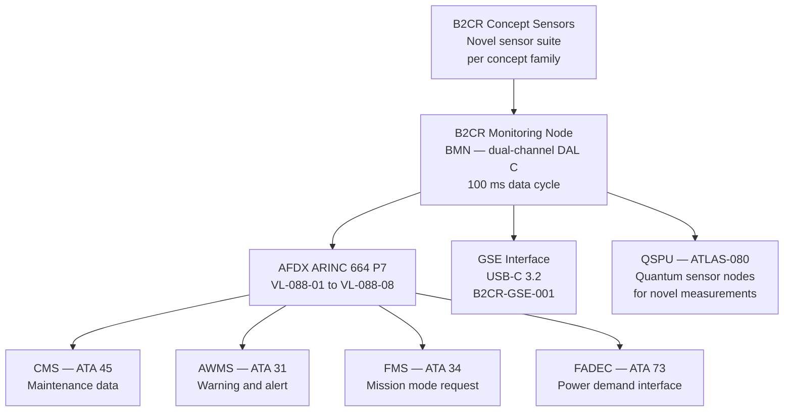
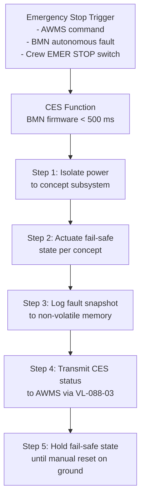

<!-- ──────────────────────────────────────────────────────────────────────────
     QATL-ATLAS-1000-ATLAS-080-089-08-088-080-BEYOND-2040-MONITORING-DIAGNOSTICS-AND-CONTROL-INTERFACES
     ATLAS-088 (Beyond-2040 Concepts Reserved) · Beyond-2040 Monitoring, Diagnostics and Control Interfaces
     programme-defined aircraft type — ATLAS Register 1000
────────────────────────────────────────────────────────────────────────────── -->

# Beyond-2040 Monitoring, Diagnostics and Control Interfaces

---

## §0 Hyperlink Policy

> All hyperlinks in this document are **relative** (five directory levels: `../../../../../`).
> Absolute URLs are forbidden.

---

## §1 Purpose

This document defines the agnostic ATLAS standard-level architecture context for `Beyond-2040 Monitoring, Diagnostics and Control Interfaces`.

It describes the controlled scope, functions, interfaces, safety considerations, lifecycle traceability, and S1000D/CSDB mapping logic that programme implementations shall instantiate when this node is applicable.

This document is not a programme design baseline. Programme-specific capacities, locations, part numbers, effectivity, operating limits, maintenance references, and data module codes shall be defined only inside the applicable programme implementation branch.
## §2 Monitoring Architecture Concept

### 2.1 B2CR Monitoring Node (BMN) Concept

For any B2CR concept integrated at TRL ≥ 4, the monitoring architecture is based on the **B2CR Monitoring Node (BMN)** concept — a modular, concept-agnostic monitoring platform that can be configured per B2C family:

### 2.2 BMN Hardware Specification (Notional)

| Parameter | Specification | Notes |
|---|---|---|
| Channels | Dual (A active; B hot standby) | DAL C for B2CR monitoring (non-primary propulsion) |
| Processing | Quad-core ARM Cortex-A72 + FPGA | Real-time data acquisition; configurable per B2C family |
| Data cycle | 100 ms nominal; 10 ms burst mode | Burst mode triggered on anomaly detection |
| Input channels | 128 analogue (24-bit); 64 digital; 16 frequency; 8 ARINC 429 | Configurable per concept |
| Output interfaces | AFDX ARINC 664 P7 (8 VLs); ARINC 429 (4 channels); USB-C 3.2 | |
| Radiation tolerance | 20 krad TID (for B2C-F200 environments) | Option — standard BMN not radiation-hardened |
| Operating temp | −55 °C to +85 °C | Extended range for cryogenic environment proximity |
| Software | DO-178C DAL C | BMN firmware; concept plugin architecture |
| Form factor | 3-MCU ARINC 600 | Aft avionics bay or dedicated concept equipment bay |

---

## §3 Concept-Specific Monitoring Requirements

### 3.1 B2C-F202 Compact FRC Fusion Reactor Monitoring

| Parameter | Sensor Type | Sample Rate | Alarm Threshold | B2CMU Safety Link |
|---|---|---|---|---|
| Plasma electron temperature | Thomson scattering / diamagnetic loop | 1 ms | T_e < T_ignition − 20 % | NH-001; plasma loss alarm |
| Neutron flux (D-T) | He-3 proportional counter | 100 ms | > 1 mSv/h crew dose rate | NH-001; immediate shutdown |
| Magnetic field strength (primary coils) | Hall-effect array (24 nodes) | 10 ms | B < 95 % nominal | NH-006; confinement loss warning |
| Coolant loop temperature | PT1000 RTD | 100 ms | > 200 °C blanket outlet | NH-006; loss-of-cooling alarm |
| Plasma position (centroid) | Rogowski coils (8 channels) | 1 ms | Displacement > 2 cm from axis | NH-006; plasma instability warning |
| Gamma dose rate (crew compartment) | Geiger-Müller tube | 1 s | > 0.1 mSv/h | NH-001; regulatory limit warning |

### 3.2 B2C-F302 Microwave Power Beaming (MPB) Monitoring

| Parameter | Sensor Type | Sample Rate | Alarm Threshold | Notes |
|---|---|---|---|---|
| Rectenna output power | Hall-effect current sensor + voltage divider | 10 ms | < 80 % expected (tracking misalign) | Beam track loss alert to FMS |
| Beam pointing angle (aircraft attitude) | IRS/GNSS combined | 100 ms | Beam elevation < 5° (LOS risk) | Auto beam-request inhibit |
| Rectenna surface temperature | Thermocouple array (32 nodes) | 1 s | > 80 °C per element | Hot-spot monitor; MW overload protection |
| MPB frequency lock | Spectrum analyser IF output | 1 s | Δf > ±1 MHz from 5.8 GHz nominal | Frequency-lock loss; rectenna de-tune alarm |
| Crew/passenger compartment MW power density | Broadband field probe | 1 s | > 1 mW/cm² (ICNIRP limit) | NH-002; beam power reduce command |

### 3.3 B2C-F404 Electroaerodynamic (EAD) Monitoring

| Parameter | Sensor Type | Sample Rate | Alarm Threshold | Notes |
|---|---|---|---|---|
| HVPS output voltage | High-voltage divider (1:10 000) | 10 ms | > 42 kV or < 18 kV | Over/under voltage protection |
| Corona current per emitter | Precision shunt resistor (1 Ω, 0.01 %) | 10 ms | > 50 mA (design limit) | Over-current protection per emitter |
| Thrust produced (per array) | Micro force balance (strain gauge, 0.1 N resolution) | 100 ms | < 50 % expected | EAD efficiency degradation alert |
| Ozone concentration | Electrochemical O₃ sensor | 1 s | > 0.1 ppm (WHO limit) | NH-004; HVPS power reduction command |
| Emitter insulation resistance | Megohmmeter BITE (at powerdown) | Pre-flight / daily | < 10 GΩ | Insulation degradation fault; no-go condition |

### 3.4 B2C-F501 HTS Motor Monitoring

| Parameter | Sensor Type | Sample Rate | Alarm Threshold | Notes |
|---|---|---|---|---|
| HTS stator winding temperature | Platinum RTD + cryo calibration | 100 ms | > 110 K (LN₂ cooling margin loss) | Quench warning; reduce load |
| LN₂ coolant flow rate | Cryogenic ultrasonic flowmeter | 100 ms | < 80 % nominal | Coolant loss warning; HVPS trip |
| Winding current (per phase) | Rogowski coil (cryogenic-rated) | 1 ms | > I_c (critical current) | Quench protection trigger |
| Magnetic field (rotor, 3-axis) | Hall-effect array, cryogenic | 10 ms | Δ|B| > 0.5 T vs. model | Motor health deviation alert |
| LN₂ tank level | Capacitance-type cryo level sensor | 1 s | < 20 % (30 min reserve) | Low coolant caution |
| Motor vibration (NDE / DE bearing) | MEMS accelerometer (3-axis) | 100 ms | > 2 g at bearing frequencies | Bearing degradation alert |

---

## §4 Control Interface Architecture

### 4.1 B2CR Concept Control Modes

All B2CR concepts are controlled through a layered interface to existing aircraft systems:

| Layer | System | Interface | Function |
|---|---|---|---|
| L1 — Mission | FMS (ATA 34) | AFDX VL-088-01 | Concept enable/disable per flight phase; power demand schedule |
| L2 — Power | FADEC (ATA 73) / BGHA (ATLAS-084) | AFDX VL-088-02 | Power allocation to B2CR concept; total power budget arbitration |
| L3 — Safety | AWMS (ATA 31) | AFDX VL-088-03 | Novel hazard alarm routing; emergency shutdown request |
| L4 — Maintenance | CMS (ATA 45) | AFDX VL-088-04 | BMN BITE data download; fault history; LRU health |
| L5 — Concept Control | BMN → Concept actuators | ARINC 429 / dedicated serial | Direct concept hardware control (plasma field, HVPS setpoint, etc.) |

### 4.2 Emergency Shutdown Logic

Each B2CR concept integrated at prototype stage must implement a **Concept Emergency Stop (CES)** function within the BMN firmware, executed within 500 ms of trigger:

Fail-safe states by concept:
- **B2C-F202 (FRC):** Plasma discharge quench; coolant circulation maintained; shielding doors closed.
- **B2C-F302 (MPB):** Rectenna de-tune to absorb minimum power; beam-off signal to ground station via SATCOM.
- **B2C-F404 (EAD):** HVPS discharge to ground; all emitter arrays de-energised.
- **B2C-F501 (HTS motor):** Motor current commanded to zero; LN₂ coolant flow maintained at idle; quench detected → venting initiated.

---

## §5 Quantum Sensing Integration (ATLAS-080 Link)

The QSPU (Quantum Sensing Propulsion Unit, ATLAS-080) provides supplementary sensing capability for B2CR concepts that require measurement beyond conventional sensor accuracy limits:

| QSPU Sensor Node | B2CR Concept Application | Measurement Advantage |
|---|---|---|
| NV-centre magnetometer | B2C-F202 FRC field mapping; B2C-F501 HTS motor field | pT-level field sensitivity; spatial resolution < 1 mm |
| Atom interferometer accelerometer | Mach Effect Thruster (B2C-F102) micro-thrust measurement | ng-level acceleration resolution for nano-Newton thrust characterisation |
| Optomechanical pressure sensor | FRC plasma pressure; EAD ion density | Ultra-low-mass sensor deployable in radiation-tolerant packaging |
| SQUID magnetometer | FRC confinement field uniformity | Sub-fT field sensitivity for plasma position control |

---

## §6 BITE Architecture

### 6.1 BMN BITE Self-Test Sequence (Pre-Flight)

| Step | Test | Duration | Pass Criterion |
|---|---|---|---|
| BT-001 | BMN power-on self-test (POST) | 5 s | All RAM, ROM, processor cores pass; no checksum error |
| BT-002 | Sensor channel continuity check (all 128 AI, 64 DI) | 30 s | All channels respond within ±0.5 % of reference |
| BT-003 | AFDX VL connectivity check (all 8 VLs) | 10 s | All VLs acknowledge at correct latency |
| BT-004 | ARINC 429 output channel check | 5 s | CMS BITE DM received on all 4 ARINC 429 outputs |
| BT-005 | USB-C port self-test | 2 s | GSE handshake acknowledged |
| BT-006 | Concept-specific BITE (concept plugin firmware) | 30 s | Per concept; see concept datasheet |
| **Total** | | **~82 s** | All pass → BMN OPERATIONAL; any fail → BMN FAULT |

---

## §7 Open Issues

| ID | Description | Owner | Target |
|---|---|---|---|
| OI-088-080-001 | Define BMN plug-in firmware architecture for concept-specific BITE — publish interface specification B2CMU-BMN-ICD-001 | Q-HPC | PDR |
| OI-088-080-002 | Evaluate radiation-hardened BMN variant for B2C-F202 FRC environment — select candidate FPGA for 20 krad TID spec | Q-HPC | CDR |
| OI-088-080-003 | Integrate QSPU atom interferometer into B2C-F102 (MET) laboratory test campaign for micro-thrust measurement | Q-HPC / Q-HORIZON | Q3 2026 |
| OI-088-080-004 | Define AFDX VL-088-01 through VL-088-08 virtual link specifications in aircraft network architecture document | Q-HPC / Q-DATAGOV | PDR |
| OI-088-080-005 | Develop crew EMER STOP switch design (position, guard, legend) for B2CR prototype flights — coordinate with ATA 31 AWMS team | Q-HPC / Q-STRUCTURES | CDR |
