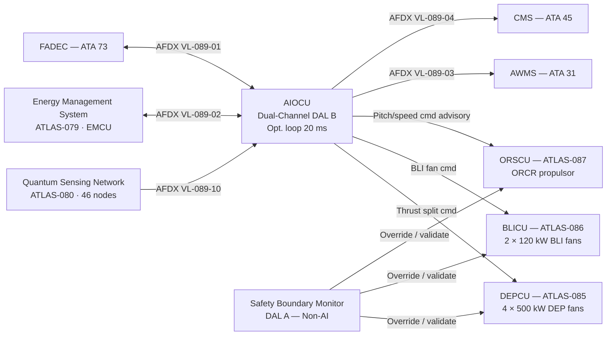
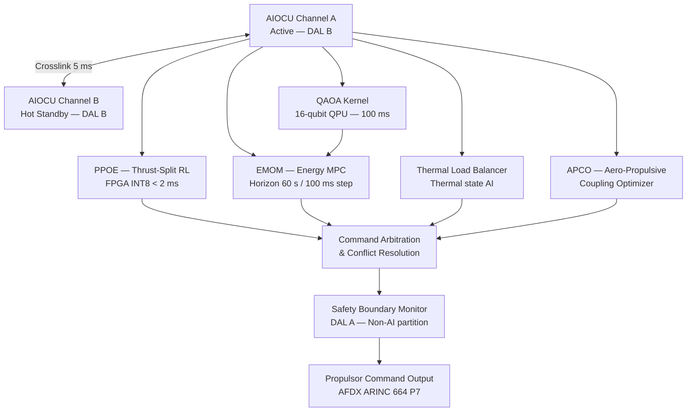

<!-- ──────────────────────────────────────────────────────────────────────────
     QATL-ATLAS-1000-ATLAS-080-089-08-089-000-PROPULSION-AI-OPTIMIZATION-HOOKS-GENERAL
     ATLAS-089 (Propulsion AI Optimization Hooks) · General
     AMPEL360E eWTW — ATLAS Register 1000
────────────────────────────────────────────────────────────────────────────── -->

# Propulsion AI Optimization Hooks — General

---

## §0 Hyperlink Policy

> All hyperlinks in this document are **relative** (five directory levels: `../../../../../`).
> Absolute URLs are forbidden. Every linked document must exist in the Q+ATLANTIDE repository
> before the link is activated. Broken links are treated as open issues and must be resolved
> before the document is promoted from `DRAFT` to `APPROVED`.

---

## §1 Purpose

ATLAS subsubject 089-000 is the **apex reference** for the Propulsion AI Optimization Hooks (PAIO) subsection of the AMPEL360E eWTW. It establishes the overall system description, functional decomposition, interface catalogue, operating mode inventory, and certification constraints applicable across the full PAIO scope. All subordinate subsubject documents (089-010 through 089-090) are governed by, and must be consistent with, this general baseline document.

The PAIO architecture provides **closed-loop AI-driven optimization** of the AMPEL360E eWTW propulsion ensemble — encompassing the Distributed Electric Propulsion (DEP, ATLAS-085), Boundary-Layer Ingestion fans (BLI, ATLAS-086), Open-Rotor and Counter-Rotating propulsor (ORCR, ATLAS-087), the Energy Management System (EMS, ATLAS-079), and the quantum-enhanced sensor network (ATLAS-080). The AI Optimization Control Unit (AIOCU), qualified to DAL B, executes multi-objective optimization loops at 20 ms cycle time, balancing propulsive efficiency, fuel/energy consumption, thermal load, propulsor health, and noise — subject to hard safety boundaries enforced by a separate, non-AI safety monitor.

---

## §2 Applicability

| Attribute | Value |
|---|---|
| Aircraft Program | AMPEL360E eWTW |
| ATA Reference | ATLAS-089 (Propulsion AI Optimization Hooks) |
| Certification Basis | EASA CS-25 Amendment 27+; DO-178C DAL B (AIOCU software); DO-254 DAL B (AIOCU hardware); DO-160G (environmental); EASA AI Roadmap v2.0; EUROCAE ED-324 (AI/ML airworthiness) |
| S1000D SNS | 089-000-00 |
| DMRL Reference | BREX-089-v1; 30 Data Modules |
| Effectivity | All AMPEL360E eWTW aircraft from MSN 001 |

---

## §3 Functional Description

The AMPEL360E eWTW **Propulsion AI Optimization Hooks (PAIO)** system provides a unified AI-driven optimization layer that interfaces with every propulsion subsystem through standardized data hooks. The PAIO comprises the following major subsystems:

1. **AI Optimization Control Unit (AIOCU):** Dual-channel DAL B controller (Channel A — active; Channel B — hot standby) executing multi-objective optimization algorithms at a 20 ms control cycle. The AIOCU hosts three optimization engines: a Reinforcement Learning (RL) Policy Network for cruise efficiency, a Model Predictive Control (MPC) layer for energy dispatch, and a Quantum-Assisted Optimization Algorithm (QAOA) kernel (16-qubit QPU interface, 100 ms update) for mission-profile macro-optimization. AIOCU interfaces with the FADEC (ATA 73), EMS (ATLAS-079), and AWMS (ATA 31) via AFDX ARINC 664 P7 virtual links.

2. **Propulsion Performance Optimization Engine (PPOE):** Real-time neural-network inference module (onboard FPGA accelerator, INT8 quantized, < 2 ms inference latency) computing optimal thrust split between ORCR, DEP fans, and BLI propulsors for any given flight condition. Inputs: Mach, altitude, AoA, air-data; sensor data from ATLAS-080 quantum sensing network (46 nodes). Outputs: thrust-split command vector to FADEC (ORCR) and DEPCU (DEP, BLI).

3. **Energy Management Optimization Module (EMOM):** Closed-loop MPC module (prediction horizon 60 s, step size 100 ms) managing battery State-of-Charge (SoC) trajectory, fuel-cell power dispatch, PMSG regenerative capacity, and BLI fan power to maximize total energy utilization efficiency per mission phase. Interfaces with the EMS (ATLAS-079) EMCU.

4. **Thermal Load Balancer (TLB):** AI model monitoring propulsor thermal signatures (motor winding temperatures, power electronics junction temperatures, DPGB oil temperature) and redistributing loads across DEP fans P1–P4 and BLI propulsors to prevent thermal hot-spots while maintaining thrust allocation targets.

5. **Aero-Propulsive Coupling Optimizer (APCO):** Module exploiting real-time aerodynamic state (wing pressure distribution from FBG network, sideslip, control surface deflections) to co-optimize propulsor thrust asymmetry and differential pitch scheduling for drag reduction and yaw-control augmentation.

6. **Safety Boundary Monitor (SBM):** Non-AI, deterministic watchdog (DAL A, separate hardware partition) enforcing hard constraints on all AIOCU outputs before relay to actuator controllers. SBM overrides AIOCU commands if any output would violate certification-constrained safety envelopes. SBM is architecturally independent from the AI optimization engines.

---

## §4 Functional Breakdown

| ID | Name | Description | Lead Division |
|---|---|---|---|
| F-001 | PAIO General / Overview | System scope, architecture baseline, DMRL, governing standards | Q-HPC |
| F-002 | AI Optimization Baseline and Scope | Technology trade study, TRL status, algorithm selection rationale | Q-HPC |
| F-003 | Propulsion Performance Optimization Models | PPOE neural network architecture, inference pipeline, FPGA accelerator | Q-HPC |
| F-004 | Energy Management and Mission Profile Optimization | EMOM MPC design, SoC trajectory planning, QAOA macro-optimization | Q-GREENTECH |
| F-005 | Thermal Load and Propulsor Health Optimization | TLB models, thermal sensor integration, health-state estimation | Q-STRUCTURES |
| F-006 | Aero-Propulsive Coupling Optimization | APCO aerodynamic state estimation, drag-thrust co-optimization | Q-HORIZON |
| F-007 | Fault Tolerance, Degraded Modes and Reconfiguration Logic | AIOCU channel redundancy, graceful degradation, mode transitions | Q-HPC |
| F-008 | Safety Boundaries, Human Oversight and Certification Constraints | SBM architecture, DO-178C DAL B/A partitioning, AI airworthiness | Q-GREENTECH |
| F-009 | Monitoring, Diagnostics and Control Interfaces | AIOCU BITE, explainability logging, AFDX topology, GSE | Q-HPC |
| F-010 | S1000D / CSDB Mapping and Traceability | DMRL, BREX-089-v1, ICN registry, CSDB publication milestones | Q-DATAGOV |

---

## §5 System Context — Mermaid Diagram

---

## §6 AIOCU Internal Architecture — Mermaid Diagram

---

## §7 Components and LRUs

| Component | Part Number | Qty | Location | Maint. Interval | Notes |
|---|---|---|---|---|---|
| AIOCU (Dual-Channel) | AIOCU-PN-TBD | 2 | Forward avionics bay (2 × 4-MCU) | Software update per SB; C-check BITE | DO-178C DAL B; DO-254 DAL B |
| AIOCU FPGA Accelerator Module | AIOCU-FPGA-TBD | 2 | Inside AIOCU chassis | On-condition (BITE monitored) | INT8 neural network inference; < 2 ms latency |
| Safety Boundary Monitor (SBM) | SBM-PN-TBD | 1 (simplex + watchdog) | Separate partition — forward avionics bay | A-check BITE functional test | DO-178C DAL A; fully isolated from AIOCU AI partition |
| QPU Interface Card | QAOA-IFC-TBD | 1 | AIOCU Ch A — QPU bus adaptor | Software update per SB | 16-qubit interface; cryogenic QPU in aft electronics rack |
| Quantum Processing Unit (QPU) | QPU-PN-TBD | 1 | Aft pressurised electronics rack | On-condition (health monitored by AIOCU) | 16-qubit superconducting; cryocooler 4 K; mission-profile optimization |

---

## §8 Interfaces

| Interface Type | Connected System | Protocol / Medium | Data / Function |
|---|---|---|---|
| FADEC link | FADEC — ATA 73 | AFDX ARINC 664 P7 VL-089-01 | Throttle demand; ORCR speed/pitch references; fuel flow advisory |
| EMS link | EMCU — ATLAS-079 | AFDX ARINC 664 P7 VL-089-02 | Battery SoC/SoH; fuel-cell power; PMSG regenerative state; dispatch commands |
| AWMS | AWMS — ATA 31 | AFDX ARINC 664 P7 VL-089-03 | AIOCU BITE faults; optimization mode status; SBM override events |
| CMS / Maintenance | CMS — ATA 45 | AFDX ARINC 664 P7 VL-089-04 | AIOCU diagnostic data; algorithm version; inference latency log |
| DEPCU link | DEPCU — ATLAS-085 | AFDX ARINC 664 P7 VL-089-05 | DEP fan thrust-split commands; P1–P4 torque limits |
| BLICU link | BLICU — ATLAS-086 | AFDX ARINC 664 P7 VL-089-06 | BLI fan power setpoints; DC60 correction offsets |
| Quantum Sensing Network | ATLAS-080 QSPU | AFDX ARINC 664 P7 VL-089-10 | 46-node sensor data (40 Hz); QE-EKF state estimates |
| Ground Support | AIOCU-GSE-1 | USB-C 3.2 + Ethernet 1000Base-T | AIOCU model update; BITE run; explainability log download |

---

## §9 Operating Modes

| Mode | Trigger | PPOE State | EMOM State | AIOCU Authority |
|---|---|---|---|---|
| Ground Pre-flight | Weight on wheels; engines initializing | Standby | Battery pre-conditioning | Parameter validation only; no thrust commands |
| Takeoff Optimization | Throttle TOGA; airborne | Thrust-split TOGA schedule | Peak-power dispatch | Full authority — SBM active |
| Climb Optimization | Gear up; climb schedule | Altitude-adaptive thrust split | Battery charge trajectory | Full authority — SBM active |
| Cruise Optimization | FL cruise; M nominal | RL efficiency policy active | MPC SoC trajectory | Full authority — SBM active |
| Descent / Regeneration | FMS descent profile | Minimum thrust; BLI windmill | Regenerative charging | Energy recovery authority |
| Degraded — Ch A Fault | AIOCU Ch A failure | PPOE in fallback schedule | EMOM fixed dispatch | Ch B hot standby; reduced optimization |
| Degraded — AI Inhibit | SBM override; pilot discretion | Fixed thrust-split tables | Fixed dispatch tables | AI optimization suspended; deterministic fallback |
| Maintenance | Ground power; AIOCU maintenance mode | Off | Off | GSE access; no propulsive authority |

---

## §10 Performance and Budgets

| Parameter | Requirement | Target / Design Value | Status |
|---|---|---|---|
| AIOCU optimization loop cycle time | ≤ 25 ms | 20 ms (PPOE + EMOM + TLB) | TBD |
| PPOE inference latency (FPGA) | ≤ 5 ms | < 2 ms (INT8 quantized) | TBD |
| QAOA macro-optimization update period | ≤ 200 ms | 100 ms | TBD |
| Cruise fuel-burn improvement (PAIO vs. fixed tables) | ≥ 3 % | 4.5 % (simulation) | TBD |
| DEP thrust-split uncertainty (PAIO vs. optimal) | ≤ 2 % | < 1.5 % (RL policy) | TBD |
| AIOCU availability | ≥ 99.97 % (DAL B) | Dual-channel hot standby | TBD |
| SBM override rate (false positive) | ≤ 0.1 /FH | < 0.05 /FH (target) | TBD |
| Thermal constraint violations (TLB) | 0 exceedances per mission | 0 (by design) | TBD |
| AI explainability log completeness | 100 % of AIOCU decisions logged | 100 % (non-real-time, post-flight) | TBD |

---

## §11 Safety and Certification Constraints

| Constraint | Requirement Source | Description |
|---|---|---|
| AI Software Assurance | EASA AI Roadmap v2.0; EUROCAE ED-324 | AIOCU AI/ML components classified as Learning-Assurance Level (LAL) 1B; learning phase must be completed prior to deployment; no online learning in flight |
| DAL B / DAL A Partitioning | DO-178C; DO-254; CS-25.1309 | AIOCU optimization engines (DAL B) and SBM (DAL A) must reside in fully isolated hardware and software partitions (ARINC 653 partitioned RTOS); SBM must be able to override any AIOCU output independently |
| No Autonomous Override of Safety Limits | CS-25.671; CS-25.901 | AIOCU may not command any actuator output that violates structural load limits, over-speed limits, or thermal limits; all such constraints implemented as hard limits in SBM |
| Human Oversight — Pilot Override | CS-25.1329 (adapted for AI); AMC 25.1329 | Crew must be able to inhibit AIOCU and revert to deterministic fixed-schedule mode via a single cockpit action (AI-OPT-OFF guarded switch); reversion must complete within 1 s |
| Explainability and Auditability | EASA AI Roadmap; ED-324 §5.4 | All AIOCU optimization decisions must be logged with input state, selected action, predicted reward, and SBM status at ≥ 1 Hz; logs downloadable by CMS for post-flight audit |
| Algorithm Version Control | DO-178C §12; EASA CM-SWCEH-001 | AIOCU neural network weights and QAOA circuit parameters are configuration-controlled artefacts subject to formal release management; field update requires SB and ground BITE verification |

---

## §12 Document Lineage

| Predecessor | Document ID | Notes |
|---|---|---|
| ATLAS-089 README | QATL-ATLAS-1000-ATLAS-080-089-08-089-README | Subsection index; status updated to active |
| ATLAS-079 Energy Management | QATL-...-079-000-... | EMS EMCU is primary downstream consumer of EMOM commands |
| ATLAS-080 Quantum Sensing | QATL-...-080-000-... | 46-node quantum sensor network feeds PPOE and TLB |
| ATLAS-085 DEP Architecture | QATL-...-085-000-... | DEPCU receives thrust-split commands from AIOCU |
| ATLAS-086 BLI Propulsion | QATL-...-086-000-... | BLICU receives BLI fan power setpoints from AIOCU |
| ATLAS-087 Open Rotor | QATL-...-087-000-... | ORSCU receives pitch/speed advisory from AIOCU (non-safety channel) |

---

## §13 Open Issues

| ID | Description | Owner | Target |
|---|---|---|---|
| OI-089-001 | EASA LAL classification agreement for PPOE RL network and QAOA kernel | Q-HPC | PDR |
| OI-089-002 | SBM DAL A independence from AIOCU verified by independent tool qualification plan | Q-HPC | PDR |
| OI-089-003 | QPU cryocooler integration in aft pressurised electronics rack — thermal and vibration clearance | Q-STRUCTURES | CDR |
| OI-089-004 | AI-OPT-OFF cockpit switch reversion time ≤ 1 s — verify via iron-bird HIL | Q-GREENTECH | CDR |
| OI-089-005 | AIOCU training dataset provenance and bias assessment per ED-324 §4.2 | Q-HPC | PDR |

---

## §14 References

| Ref | Title | Source |
|---|---|---|
| [R-001] | EASA CS-25 Amendment 27+ | EASA |
| [R-002] | DO-178C Software Considerations in Airborne Systems | RTCA |
| [R-003] | DO-254 Design Assurance Guidance for Airborne Electronic Hardware | RTCA |
| [R-004] | DO-160G Environmental Conditions and Test Procedures | RTCA |
| [R-005] | EASA Artificial Intelligence Roadmap v2.0 | EASA |
| [R-006] | EUROCAE ED-324 Guidelines for Development of AI/ML-Based Systems | EUROCAE |
| [R-007] | S1000D Issue 5.0 Technical Publications Specification | ASD/AIA |
| [R-008] | ATLAS-079 Energy Management System (QATL-079-000) | Q+ATLANTIDE |
| [R-009] | ATLAS-080 Quantum Sensing for Propulsion (QATL-080-000) | Q+ATLANTIDE |
| [R-010] | ATLAS-085 Distributed Electric Propulsion Architecture (QATL-085-000) | Q+ATLANTIDE |
| [R-011] | ATLAS-086 Boundary-Layer Ingestion Propulsion (QATL-086-000) | Q+ATLANTIDE |
| [R-012] | ATLAS-087 Open Rotor and Counter-Rotating (QATL-087-000) | Q+ATLANTIDE |
