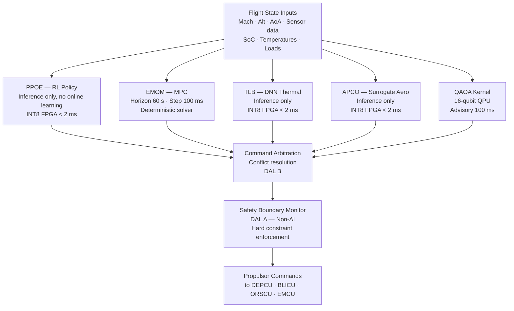

<!-- ──────────────────────────────────────────────────────────────────────────
     QATL-ATLAS-1000-ATLAS-080-089-08-089-010-AI-OPTIMIZATION-BASELINE-AND-SCOPE
     ATLAS-089 (Propulsion AI Optimization Hooks) · AI Optimization Baseline and Scope
     programme-defined aircraft type — ATLAS Register 1000
────────────────────────────────────────────────────────────────────────────── -->

# AI Optimization Baseline and Scope

---

## §0 Hyperlink Policy

> All hyperlinks in this document are **relative** (five directory levels: `../../../../../`).
> Absolute URLs are forbidden.

---

## §1 Purpose

This document defines the agnostic ATLAS standard-level architecture context for `AI Optimization Baseline and Scope`.

It describes the controlled scope, functions, interfaces, safety considerations, lifecycle traceability, and S1000D/CSDB mapping logic that programme implementations shall instantiate when this node is applicable.

This document is not a programme design baseline. Programme-specific capacities, locations, part numbers, effectivity, operating limits, maintenance references, and data module codes shall be defined only inside the applicable programme implementation branch.
## §2 Technology Baseline — Algorithm Trade Study

| Optimization Approach | Coverage | Cycle Time | Certifiability | TRL (2026) | Decision |
|---|---|---|---|---|---|
| Fixed look-up tables (LUT) | Thrust split only | N/A (static) | DO-178C DAL A feasible | 9 | Reference baseline; retained as fallback |
| Gain-scheduled PID | Thrust split + energy | 50 ms | DO-178C DAL B feasible | 8 | Partial selection — deterministic MPC layer |
| Model Predictive Control (MPC) | Energy dispatch | 100 ms | DO-178C DAL B feasible | 7 | **Selected — EMOM MPC layer** |
| Reinforcement Learning (RL) policy | Thrust-split cruise efficiency | 20 ms (inference) | LAL 1B per ED-324 | 5–6 | **Selected — PPOE RL engine** |
| Deep Neural Network (DNN) regression | Thermal load balancing | 20 ms (inference) | LAL 1B per ED-324 | 5 | **Selected — TLB module** |
| Quantum Annealing / QAOA | Mission-profile macro-opt. | 100 ms (QPU call) | Research — ED-324 emerging | 4 | **Selected — QAOA kernel (advisory)** |

**Rationale:** A layered architecture combining deterministic MPC (EMOM) with RL-based thrust-split (PPOE) and AI-based thermal balancing (TLB) provides the best trade between optimization performance, certifiability, and fallback capability. The QAOA kernel operates in an advisory role with a 100 ms update period, providing macro-mission profile optimization without being on the safety-critical control path.

---

## §3 TRL Status

| Subsystem | TRL (2026) | Key Demonstration | Target TRL (PDR) | Target TRL (CDR) |
|---|---|---|---|---|
| AIOCU hardware (FPGA + processor) | 6 | Prototype board functional test (2025) | 7 | 8 |
| PPOE RL policy network (INT8, FPGA) | 5 | Simulation + HIL thrust-split bench (2025) | 6 | 7 |
| EMOM MPC (MATLAB/Simulink generated C) | 6 | Iron-bird EMS integration test (2025) | 7 | 8 |
| TLB thermal AI (DNN inference) | 5 | Lab thermal bench with DEP motors (2024) | 6 | 7 |
| APCO aero-propulsive coupling model | 4 | CFD-backed surrogate model (2025) | 5 | 6 |
| QAOA kernel — QPU interface | 4 | 8-qubit algorithm demo (2025) | 5 | 6 |
| Safety Boundary Monitor (SBM, DAL A) | 6 | Formal methods model checking (2025) | 7 | 8 |

---

## §4 Optimization Scope Boundary

| In Scope (ATLAS-089 PAIO) | Out of Scope |
|---|---|
| Thrust-split optimization between ORCR, DEP, BLI | Core engine turbine control (FADEC, ATA 73) |
| Battery SoC trajectory and fuel-cell dispatch | Battery cell electrochemistry management (ATLAS-072 BMS) |
| DEP fan torque and speed advisory commands | DEP motor winding control loops (ATLAS-085 DEPCU) |
| BLI fan power setpoint optimization | BLI inlet flow control actuation (ATLAS-086 BLICU) |
| ORCR pitch/speed advisory (non-binding) | ORCR safety-critical pitch control (ATLAS-087 ORSCU) |
| Thermal load redistribution across propulsor set | Engine core thermal management (ATA 75) |
| Aero-propulsive coupling drag reduction | Primary flight control surface actuation (ATA 27) |
| Mission-profile macro-optimization (QAOA) | FMS route optimization (ATA 34) |
| Explainability logging and audit trail | Flight data recorder mandatory parameters (ATA 31) |

---

## §5 Algorithm Architecture Summary

---

## §6 Learning Assurance Classification

| Component | ED-324 Learning Assurance Level | Justification | Online Learning |
|---|---|---|---|
| PPOE RL policy network | LAL 1B | Safety effect: significant; direct thrust command | Prohibited — inference only in flight |
| TLB DNN thermal model | LAL 1B | Safety effect: significant; prevents thermal exceedances | Prohibited — inference only in flight |
| APCO surrogate model | LAL 2 | Safety effect: limited; advisory drag optimization | Prohibited |
| QAOA kernel | LAL 2 (emerging) | Advisory role; not on safety-critical path | Prohibited |
| EMOM MPC | N/A — deterministic | Model-based; DO-178C DAL B applicable | Not applicable |
| SBM | N/A — DO-178C DAL A | Deterministic logic; no ML component | Not applicable |

---

## §7 Governing Documents

| Document | Title | Rev |
|---|---|---|
| QATL-ATLAS-1000-ATLAS-080-089-08-089-000 | PAIO General | 0.1 |
| EASA CS-25 Amdt 27+ | Airworthiness Standards | — |
| DO-178C | Software Considerations in Airborne Systems | — |
| DO-254 | Hardware Assurance | — |
| EASA AI Roadmap v2.0 | Artificial Intelligence in Aviation | — |
| EUROCAE ED-324 | AI/ML Airworthiness Guidelines | — |

---

## §8 Open Issues

| ID | Description | Owner | Target |
|---|---|---|---|
| OI-089-010-001 | Confirm QAOA kernel LAL classification with EASA — ED-324 quantum computing annex not yet published | Q-HPC | PDR |
| OI-089-010-002 | PPOE RL policy training data adequacy assessment per ED-324 §4.1 — dataset size and operational coverage | Q-HPC | PDR |
| OI-089-010-003 | APCO surrogate model validation against full CFD — 500-point test matrix planned for 2026 | Q-HORIZON | CDR |
