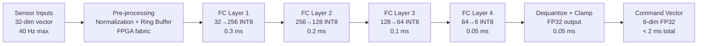

<!-- ──────────────────────────────────────────────────────────────────────────
     QATL-ATLAS-1000-ATLAS-080-089-08-089-020-PROPULSION-PERFORMANCE-OPTIMIZATION-MODELS
     ATLAS-089 (Propulsion AI Optimization Hooks) · Propulsion Performance Optimization Models
     AMPEL360E eWTW — ATLAS Register 1000
────────────────────────────────────────────────────────────────────────────── -->

# Propulsion Performance Optimization Models


---

## §0 Hyperlink Policy

> All hyperlinks in this document are **relative** (five directory levels: `../../../../../`).
> Absolute URLs are forbidden.

---

## §1 Purpose

ATLAS subsubject 089-020 defines the Propulsion Performance Optimization Engine (PPOE) — the real-time neural-network inference module that computes the optimal thrust-split between the ORCR, DEP fans (P1–P4), and BLI propulsors for any given flight condition. It covers the RL policy network architecture, the FPGA inference pipeline, the training methodology, the input/output data contract, and the performance validation framework.

---

## §2 PPOE Architecture Overview

The PPOE is a **Reinforcement Learning (RL) inference engine** implemented as a stationary policy (trained offline; no online learning in flight). The policy network is a 4-layer fully-connected neural network (input → 256 → 128 → 64 → output) with ReLU activations, quantized to INT8 for FPGA deployment. Inference is executed on a dedicated Xilinx Versal AI Core FPGA module inside the AIOCU chassis.

### 2.1 Policy Network Specification

| Attribute | Value |
|---|---|
| Architecture | 4-layer fully-connected (FC) | 
| Layer sizes | 32 (input) → 256 → 128 → 64 → 6 (output) |
| Activations | ReLU (hidden layers); Softplus (output, thrust constraints) |
| Quantization | INT8 post-training quantization (PTQ); calibration on 10 000-sample dataset |
| FPGA inference latency | < 2 ms (measured on Xilinx Versal AI Core at 400 MHz) |
| Model size (FP32) | 180 kB |
| Model size (INT8 deployed) | 45 kB |
| Training algorithm | Proximal Policy Optimization (PPO); reward engineering per §4 |

### 2.2 Input Feature Vector (32 dimensions)

| Index | Feature | Source | Units | Update Rate |
|---|---|---|---|---|
| 0–2 | Mach, CAS, TAS | Air-data computer | — | 10 Hz |
| 3 | Altitude (pressure) | ADC | ft | 10 Hz |
| 4 | Angle of attack (AoA) | ATLAS-080 atom interferometer | ° | 40 Hz |
| 5 | Sideslip (β) | ATLAS-080 gravimeter | ° | 40 Hz |
| 6–9 | DEP fan P1–P4 thrust (measured) | DEPCU — ATLAS-085 | kN | 20 Hz |
| 10–11 | BLI fan thrust (port, stbd) | BLICU — ATLAS-086 | kN | 20 Hz |
| 12 | ORCR net thrust | FADEC — ATA 73 | kN | 20 Hz |
| 13 | Total propulsive efficiency (η_prop) | Computed — AIOCU | — | 20 Hz |
| 14–17 | DEP P1–P4 power (measured) | DEPCU | kW | 20 Hz |
| 18–19 | BLI power (port, stbd) | BLICU | kW | 20 Hz |
| 20 | Battery SoC | EMS EMCU — ATLAS-079 | % | 5 Hz |
| 21 | Fuel-cell power available | EMS EMCU | kW | 5 Hz |
| 22–25 | DEP P1–P4 motor winding temperature | ATLAS-080 NV-center sensors | °C | 10 Hz |
| 26–27 | BLI motor temperatures (port, stbd) | ATLAS-080 | °C | 10 Hz |
| 28–30 | Wing pressure distribution coefficients (3 Chebyshev modes) | ATLAS-080 FBG | — | 40 Hz |
| 31 | Flight phase code | FMS — ATA 34 | enum | 1 Hz |

### 2.3 Output Command Vector (6 dimensions)

| Index | Command | Target System | Units | Clamp (SBM) |
|---|---|---|---|---|
| 0–3 | DEP P1–P4 thrust demand (ΔT from trim) | DEPCU — ATLAS-085 | kN | ±15 % of trim |
| 4 | BLI port+stbd combined power adjustment | BLICU — ATLAS-086 | kW | ±20 kW |
| 5 | ORCR thrust advisory offset | FADEC — ATA 73 (advisory) | kN | ±5 % of demand |

---

## §3 Training Methodology

### 3.1 Simulation Environment

The PPOE RL policy is trained in a **high-fidelity propulsion system simulator** (AMPEL360E-PSim v2.3), combining:
- 6-DOF flight dynamics model (validated against wind-tunnel data)
- ORCR aerodynamic and thermodynamic model (CFD-derived look-up tables)
- DEP fan electrical and aerodynamic sub-models (from ATLAS-085)
- BLI inlet distortion and fan performance model (from ATLAS-086)
- EMS battery and fuel-cell dynamic model (from ATLAS-079)

### 3.2 Reward Function

The PPO reward at each 20 ms step is:

```
R = w₁·Δη_prop + w₂·(−ΔE_total) + w₃·(−ΔT_asymmetry) + w₄·(−penalty_SBM)
```

| Term | Weight | Description |
|---|---|---|
| Δη_prop | w₁ = 0.40 | Propulsive efficiency improvement vs. fixed tables |
| −ΔE_total | w₂ = 0.35 | Total energy consumption reduction |
| −ΔT_asymmetry | w₃ = 0.15 | Lateral thrust asymmetry penalty (yaw coupling) |
| −penalty_SBM | w₄ = 0.10 | Penalty for approaching or triggering SBM limits |

### 3.3 Training Dataset

| Dataset | Size | Source |
|---|---|---|
| PSim training episodes | 500 000 episodes × 2 h mission | AMPEL360E-PSim v2.3 |
| Real-flight data augmentation | 200 h (iron-bird HIL) | Iron-bird test rig Phase 1 |
| Edge-case scenarios | 50 000 episodes (degraded propulsor, extreme OAT) | Scripted scenario injection |

---

## §4 FPGA Inference Pipeline



---

## §5 Performance Validation Framework

| Validation Test | Method | Pass Criterion | Status |
|---|---|---|---|
| Inference latency (FPGA) | Hardware timing measurement | < 2 ms at 400 MHz | TBD |
| Thrust-split accuracy vs. optimal | 1 000-point PSim test set | ≤ 1.5 % mean absolute error | TBD |
| Cruise efficiency improvement | PSim 2 000 NM design mission | ≥ 3 % vs. fixed tables | TBD |
| Quantization accuracy loss | INT8 vs. FP32 inference comparison | < 0.5 % mean absolute error | TBD |
| Robustness — sensor fault injection | 10 % random feature masking | Policy output within ±5 % | TBD |
| SBM interaction test | 500-scenario SBM activation rate | < 0.05 triggers per flight hour | TBD |

---

## §6 Open Issues

| ID | Description | Owner | Target |
|---|---|---|---|
| OI-089-020-001 | Iron-bird HIL real-flight data augmentation plan — confirm 200 h allocation | Q-HPC | PDR |
| OI-089-020-002 | Quantization effect on edge-case scenarios (single DEP fan failure) — re-validate INT8 accuracy | Q-HPC | CDR |
| OI-089-020-003 | PPOE output for ORCR advisory path — confirm FADEC interface acceptance of non-binding advisory offset | Q-GREENTECH | PDR |
