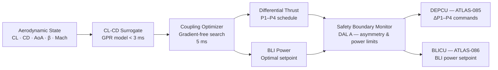

<!-- ──────────────────────────────────────────────────────────────────────────
     QATL-ATLAS-1000-ATLAS-080-089-08-089-050-AERO-PROPULSIVE-COUPLING-OPTIMIZATION
     ATLAS-089 (Propulsion AI Optimization Hooks) · Aero-Propulsive Coupling Optimization
     AMPEL360E eWTW — ATLAS Register 1000
────────────────────────────────────────────────────────────────────────────── -->

# Aero-Propulsive Coupling Optimization

---

## §0 Hyperlink Policy

> All hyperlinks in this document are **relative** (five directory levels: `../../../../../`).
> Absolute URLs are forbidden.

---

## §1 Purpose

ATLAS subsubject 089-050 defines the Aero-Propulsive Coupling Optimizer (APCO) module within the AIOCU. It covers the real-time aerodynamic state estimation pipeline, the surrogate model for drag-thrust coupling, the differential thrust strategy for yaw-control augmentation, and the interaction with the BLI boundary-layer ingestion efficiency model. APCO operates in an advisory capacity and does not command primary flight control surfaces.

---

## §2 Aerodynamic State Estimation

APCO relies on real-time aerodynamic state from the ATLAS-080 Quantum Sensing Network:

| State Variable | Sensor | Source | Update Rate | Notes |
|---|---|---|---|---|
| Wing upper surface Cp distribution | FBG strain gauges — 28 chordwise sensors per wing | ATLAS-080 QSPU | 40 Hz | Mapped to lift coefficient CL via surrogate model |
| Wing lower surface Cp distribution | FBG strain gauges — 28 chordwise sensors per wing | ATLAS-080 QSPU | 40 Hz | As above |
| Angle of attack (AoA) | Atom interferometer inertial sensor | ATLAS-080 QSPU | 40 Hz | ±0.01° accuracy |
| Sideslip angle (β) | Atom interferometer gravimeter | ATLAS-080 QSPU | 40 Hz | ±0.02° accuracy |
| Flap/slat deflection | LVDT position sensors | ATA 27 flight control | 20 Hz | High-lift configuration state |
| Mach, CAS, TAS | Air-data computer | ATA 34 | 10 Hz | — |
| Wing root bending moment | FBG — wing root | ATLAS-080 QSPU | 40 Hz | Load factor confirmation |

### 2.1 CL–CD Surrogate Model

APCO uses a CFD-trained **surrogate model** mapping the aerodynamic state vector to the current drag polar (CL vs. CD) of the complete AMPEL360E-ORCR-DEP-BLI configuration:

| Attribute | Value |
|---|---|
| Architecture | Gaussian Process Regression (GPR) with 500-point training grid |
| Inputs | CL, Mach, altitude, AoA, flap code, DEP fan wake influence parameter |
| Outputs | CD (induced + profile + wave + interference), BLI efficiency gain ΔCD_BLI |
| Inference latency | < 3 ms (FPGA-assisted GP prediction) |
| Training dataset | 500 000 CFD RANS solutions (AMPEL360E eWTW complete configuration) |
| Validation accuracy | CD error < 3 drag counts (0.0003) RMS | 

---

## §3 Differential Thrust Strategy

### 3.1 Yaw Control Augmentation

The APCO exploits the asymmetric thrust capability of the DEP fan set (P1–P4 distributed across wing span) to provide **yaw-control augmentation** (YCA) at high lift conditions (take-off, approach), reducing the load on the conventional rudder and improving directional control efficiency:

| Condition | YCA Authority | DEP Differential ΔT | Rudder Load Reduction |
|---|---|---|---|
| Take-off crosswind (OEI not active) | ±1.5° yaw moment | Up to ±30 kN asymmetry (P1 vs. P4) | 12–18 % |
| Approach (flap 30°, Vapp) | ±1.0° yaw moment | Up to ±20 kN asymmetry | 8–12 % |
| Cruise (clean, β < 1°) | Not engaged | 0 | 0 |

**Safety constraint:** YCA differential thrust commands are subject to SBM hard limits on maximum lateral thrust asymmetry (ΔT_lateral ≤ 35 kN at any condition) to prevent structural overload at the wing–fuselage attachment.

### 3.2 Drag Reduction via Circulation Control

The APCO optimizes BLI fan power to exploit **boundary-layer suction drag reduction** at the aft fuselage station:

| BLI Setting | BLI Power | ΔCD (drag counts) | Net efficiency gain |
|---|---|---|---|
| Off (no BLI) | 0 kW | 0 | — |
| Nominal BLI cruise | 80 kW | −8 drag counts | +1.2 % L/D |
| Enhanced BLI (turbulent separation onset) | 120 kW | −14 drag counts | +2.0 % L/D |
| Maximum BLI (within TLB limits) | 240 kW | −18 drag counts | +2.4 % L/D |

---

## §4 APCO Optimization Loop

---

## §5 Interaction with BLI Efficiency Model

The APCO accesses the ATLAS-086 BLI inlet distortion model in real time to account for the feedback between BLI fan power and boundary-layer state:

| Effect | Description | Model Source |
|---|---|---|
| DC60 distortion reduction with BLI power | Higher BLI power ingests more turbulent boundary layer, reducing DC60 | ATLAS-086 BLICU distortion map |
| Wake recovery drag | BLI partially fills in fuselage wake, reducing aft pressure drag | CFD-trained APCO surrogate |
| Fan efficiency change with ingested Mach | BLI fan efficiency varies with incoming boundary-layer velocity profile | ATLAS-086 fan map |

---

## §6 Performance Budgets

| Parameter | Requirement | Target Value | Status |
|---|---|---|---|
| Drag reduction at cruise (BLI + differential thrust) | ≥ 8 drag counts | 14 drag counts (nominal BLI 80 kW) | TBD |
| APCO total optimization loop cycle | ≤ 20 ms | 12 ms (surrogate + optimizer) | TBD |
| YCA rudder load reduction at take-off OEI | ≥ 10 % | 14 % (design target) | TBD |
| Lateral thrust asymmetry hard limit compliance | 0 exceedances | 0 (SBM enforced) | TBD |

---

## §7 Open Issues

| ID | Description | Owner | Target |
|---|---|---|---|
| OI-089-050-001 | APCO surrogate GPR model — 500 000-point CFD training dataset completion schedule | Q-HORIZON | PDR |
| OI-089-050-002 | YCA interaction with primary flight control law (ATA 27) — agree authority partitioning with FCS team | Q-HORIZON | PDR |
| OI-089-050-003 | BLI–APCO coupling model validation against ATLAS-086 BLICU distortion measurements in wind tunnel | Q-HORIZON | CDR |
| OI-089-050-004 | SBM ΔT_lateral = 35 kN limit — confirm structural load envelope with Q-STRUCTURES wing root analysis | Q-STRUCTURES | CDR |
