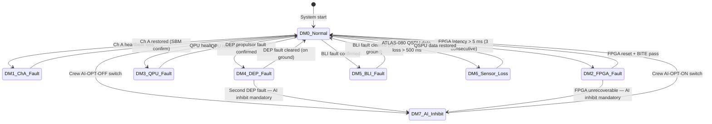

<!-- ──────────────────────────────────────────────────────────────────────────
     QATL-ATLAS-1000-ATLAS-080-089-08-089-060-FAULT-TOLERANCE-DEGRADED-MODES-AND-RECONFIGURATION-LOGIC
     ATLAS-089 (Propulsion AI Optimization Hooks) · Fault Tolerance, Degraded Modes and Reconfiguration Logic
     programme-defined aircraft type — ATLAS Register 1000
────────────────────────────────────────────────────────────────────────────── -->

# Fault Tolerance, Degraded Modes and Reconfiguration Logic

---

## §0 Hyperlink Policy

> All hyperlinks in this document are **relative** (five directory levels: `../../../../../`).
> Absolute URLs are forbidden.

---

## §1 Purpose

This document defines the agnostic ATLAS standard-level architecture context for `Fault Tolerance, Degraded Modes and Reconfiguration Logic`.

It describes the controlled scope, functions, interfaces, safety considerations, lifecycle traceability, and S1000D/CSDB mapping logic that programme implementations shall instantiate when this node is applicable.

This document is not a programme design baseline. Programme-specific capacities, locations, part numbers, effectivity, operating limits, maintenance references, and data module codes shall be defined only inside the applicable programme implementation branch.
## §2 AIOCU Dual-Channel Redundancy

### 2.1 Channel Architecture

| Channel | Function | Failure Mode | Switchover |
|---|---|---|---|
| Channel A (active) | Executes all optimization engines; outputs commands | Detected by heartbeat monitor on Ch B; confirmed by SBM | Hot standby switchover < 50 ms |
| Channel B (hot standby) | Shadow-executes optimization; crosschecks Ch A outputs | Detects Ch A divergence > ±10 % on thrust split | Activates as active channel; notifies crew via AWMS |

### 2.2 Channel Crosscheck Monitor

The AIOCU crosslink (5 ms update) continuously compares Channel A and Channel B optimization outputs:

| Monitored Parameter | Divergence Threshold | Action |
|---|---|---|
| DEP thrust-split commands | > ±10 % between channels | Log warning; if persists > 3 cycles → Ch A fault declared |
| BLI power setpoint | > ±15 kW | Log warning; > 3 cycles → fault |
| EMOM SoC trajectory | > ±5 % SoC deviation | Log warning; > 5 cycles → fault |
| Inference latency (PPOE) | Ch A latency > 5 ms | Immediate fault declaration — FPGA failure |

---

## §3 Degraded Mode Catalogue

| Mode ID | Trigger | PAIO State | Optimization Capability | Thrust Available |
|---|---|---|---|---|
| DM-0 (Normal) | All systems nominal | Full AI optimization | PPOE + EMOM + TLB + APCO + QAOA | 100 % |
| DM-1 (Ch A Fault) | AIOCU Ch A detected failed | Ch B active as primary | Full optimization on Ch B | 100 % |
| DM-2 (FPGA Fault) | FPGA inference failure | No PPOE/TLB inference | EMOM MPC only (deterministic) | 90–95 % (schedule limited) |
| DM-3 (QPU Fault) | QPU unavailable / cryocooler fault | QAOA disabled | PPOE + EMOM + TLB + APCO (no macro-opt) | 100 % (cruise sub-optimal ≈ −1.5 %) |
| DM-4 (Single DEP Fault) | DEP fan P1–P4 failure confirmed | TLB redistributes to remaining fans | PPOE recomputes 3-fan split | 75–85 % |
| DM-5 (BLI Fault) | BLI propulsor failed | APCO disables BLI setpoints | PPOE + EMOM without BLI | 92–95 % (drag +6 drag counts) |
| DM-6 (Sensor Loss) | ATLAS-080 QSPU data loss | PPOE input features reduced | Reduced-feature RL inference (fallback policy) | 95 % |
| DM-7 (AI Inhibit) | Crew AI-OPT-OFF | All AI optimization suspended | Fixed LUT dispatch tables | 100 % (sub-optimal) |

---

## §4 Reconfiguration Logic — State Machine

---

## §5 Fallback — Fixed Look-Up Tables (LUTs)

In DM-7 (AI Inhibit) and as a secondary fallback in DM-2 (FPGA Fault), the AIOCU reverts to fixed schedule LUTs stored in non-volatile EEPROM, independently of the AI computation partition:

| LUT | Flight Phase | DEP Thrust Split | BLI Power | ORCR Advisory |
|---|---|---|---|---|
| LUT-TOF | Takeoff (TOGA) | Equal split P1–P4 | 0 kW | Max thrust advisory |
| LUT-CLB | Climb | P1+P4 bias (outboard) 55 % | 40 kW | Climb schedule |
| LUT-CRZ | Cruise | Equal split | 80 kW | Cruise efficiency schedule |
| LUT-DSC | Descent | Minimum electric; PMSG regen | 0 kW | Idle advisory |
| LUT-LDG | Approach / Landing | P2+P3 bias (inboard) 60 % | 20 kW | Approach schedule |

---

## §6 Crew Notification

| Event | AWMS Message | ECAM/EICAS | CAS Level |
|---|---|---|---|
| Ch A switchover to Ch B | AI OPT CH A FAULT | AI OPT DEGRADED | CAUTION (amber) |
| DM-2 FPGA fault | AI OPT FPGA FAIL | AI OPT REDUCED | CAUTION (amber) |
| DM-3 QPU fault | AI OPT QPU INOP | AI MACRO OPT INOP | ADVISORY (white) |
| DM-4 DEP propulsor fault | DEP Px FAIL AI RECONFIG | AI OPT RECONFIG | CAUTION (amber) |
| DM-7 AI Inhibit | AI OPT INHIBITED | AI OPT OFF | STATUS (white) |

---

## §7 Open Issues

| ID | Description | Owner | Target |
|---|---|---|---|
| OI-089-060-001 | Switchover time < 50 ms Ch A→Ch B — verify on AIOCU hardware prototype | Q-HPC | CDR |
| OI-089-060-002 | Fallback LUT values — calibrate against PSim for all 5 flight phases and validate no SBM triggers | Q-HPC | PDR |
| OI-089-060-003 | DM-4 reconfiguration with 2 DEP faults — confirm minimum thrust margin meets CS-25.119 go-around requirement | Q-GREENTECH | CDR |
| OI-089-060-004 | EEPROM LUT CRC integrity check on power-up — include in AIOCU PUBT BITE test sequence | Q-HPC | PDR |
