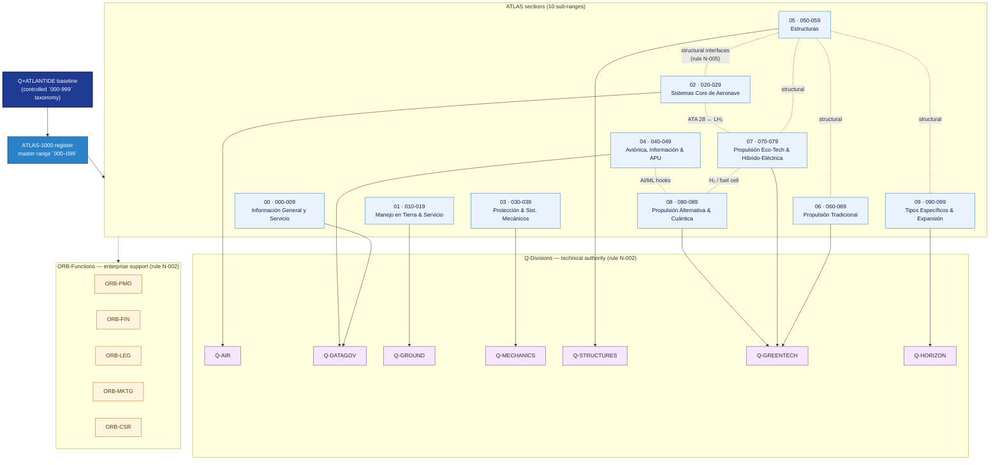

# 000–099 ATLAS — Aircraft Top Level Architecture Schema/System

## 1. Purpose

Aircraft top-level architecture band covering identification, ground handling, core aircraft systems, mechanical protection, avionics & APU, primary structures, traditional and alternative propulsion, and aircraft-type expansion.

This folder is part of the **ATLAS-1000** register, a subpart of the controlled **Q+ATLANTIDE** baseline[^baseline][^n001]. Bands classify technologies, Q-Divisions provide technical authority, and ORB-Functions provide enterprise support[^n002].

## 2. Glossary of Terms & Acronyms

| Term / Acronym | Expansion | Meaning in this band |
|---|---|---|
| ATLAS | Aircraft Top Level Architecture **Schema/System** (controlled term) | Aircraft architecture band `000-099`. *Schema* — taxonomy, data model, classification, or repository structure; *System* — operational architecture, governance, interfaces, and lifecycle control. |
| APU | Auxiliary Power Unit | Onboard auxiliary power generator. |
| BWB | Blended Wing Body | Aircraft configuration family. |
| CMS | Central Maintenance System | Onboard maintenance computing function. |
| ECS | Environmental Control System | Cabin air conditioning and pressurisation. |
| GSE | Ground Support Equipment | Ground operations and maintenance support. |
| HVDC | High Voltage Direct Current | Electrical distribution and propulsion systems. |
| IMA | Integrated Modular Avionics | Aircraft avionics architecture. |
| LH₂ | Liquid Hydrogen | Cryogenic hydrogen fuel / energy carrier. |
| WTW | Wide Tube and Wing | Aircraft configuration family. |
| Q+ATLANTIDE | Controlled baseline for the `000-999` architecture-band taxonomy. | Parent baseline of this register. |
| ATLAS-1000 | Umbrella register of the 10 architectures inside Q+ATLANTIDE. | Subpart of Q+ATLANTIDE; not a numeric band. |
| Q-Division | Technical authority unit (e.g. Q-AIR, Q-DATAGOV, Q-HPC). | Owns architecture decisions inside a band (rule N-002). |
| ORB | Organizational Resource Backbone — enterprise support functions. | Provides enterprise-side support to bands (rule N-002). |
| CSDB | Common Source DataBase | S1000D technical-publication data environment. |
| LC | Lifecycle phase / acceptance gate | Used across SSOT/LC01–LC14. |

Cross-reference the full Q+ATLANTIDE acronym set at [`organization/Q+ATLANTIDE.md` §2](../../organization/Q+ATLANTIDE.md#2-acronyms)[^glossary].

## 3. Architecture Table

Sub-ranges within this band, sourced from the Q+ATLANTIDE controlled baseline[^baseline] §3 *Consolidated Architecture Table*[^table].

| Code range | Section | Section title | Subject | Subject title | Primary focus | Primary Q-Division | Support Q-Divisions | ORB support |
|---:|---:|---|---:|---|---|---|---|---|
| 000–009 | 00 | Información General y Servicio | 00 | General Information | Identificación, configuración, documentación general, operaciones básicas | Q-DATAGOV | Q-GROUND, Q-AIR | ORB-PMO, ORB-LEG |
| 010–019 | 01 | Manejo en Tierra & Servicio | 00 | General Information | Ground handling, servicing, acceso, remolque, parking, GSE | Q-GROUND | Q-MECHANICS, Q-INDUSTRY | ORB-PMO, ORB-FIN |
| 020–029 | 02 | Sistemas Core de Aeronave | 00 | General Information | Aviónica base, eléctrica, hidráulica, ECS, fuel, flight control | Q-AIR | Q-MECHANICS, Q-DATAGOV, Q-GREENTECH | ORB-PMO, ORB-LEG |
| 030–039 | 03 | Protección & Sistemas Mecánicos | 00 | General Information | Ice/rain protection, fire protection, tren, actuadores | Q-MECHANICS | Q-AIR, Q-STRUCTURES | ORB-PMO, ORB-LEG |
| 040–049 | 04 | Aviónica, Información & APU | 00 | General Information | IMA, redes de datos, CMS, APU, onboard information systems | Q-DATAGOV | Q-AIR, Q-SPACE, Q-HPC | ORB-PMO, ORB-LEG |
| 050–059 | 05 | Estructuras | 00 | General Information | Compartimentos de carga, prácticas estándar estructurales, puertas, fuselaje, nacelles y pilones, estabilizadores, ventanas y alas | Q-STRUCTURES | Q-AIR, Q-INDUSTRY, Q-HPC | ORB-PMO, ORB-FIN, ORB-LEG |
| 060–069 | 06 | Propulsión Tradicional | 00 | General Information | Turbofan, nacelles, thrust reversers, engine installation, fire zones | Q-GREENTECH | Q-MECHANICS, Q-AIR, Q-INDUSTRY | ORB-PMO, ORB-FIN |
| 070–079 | 07 | Propulsión Eco-Tech e Híbrido-Eléctrica | 00 | General Information | Hybrid-electric propulsion, thermal management, power conversion, battery-assisted propulsion | Q-GREENTECH | Q-HPC, Q-MECHANICS, Q-AIR, Q-INDUSTRY | ORB-PMO, ORB-FIN, ORB-CSR |
| 080–089 | 08 | Propulsión Alternativa & Cuántica | 00 | General Information | LH₂, fuel cells, HVDC, superconductores, Q-sensing | Q-GREENTECH | Q-HORIZON, Q-HPC, Q-STRUCTURES | ORB-PMO, ORB-LEG, ORB-FIN |
| 090–099 | 09 | Tipos Específicos & Expansión | 00 | General Information | Variantes BWB/WTW, demostradores, clases especiales de aeronaves | Q-HORIZON | Q-AIR, Q-STRUCTURES, Q-GREENTECH | ORB-PMO, ORB-MKTG |

## 4. Interfaces Diagram

*Solid arrows denote primary Q-Division ownership (rule N-002); dotted arrows denote notable cross-section technical interfaces (e.g. structural interfaces from §05 per rule N-005, fuel/energy continuity from ATA 28 to H₂ storage in §07–§08, and AI/ML hooks from §04 to §08).*

## 5. Footprint

| Metric | Value |
|---|---|
| Master range | `000–099` |
| Sub-ranges | 10 |
| Architecture code | `ATLAS` |
| Governance class | `baseline` |
| Restricted band | No |
| Primary Q-Divisions | Q-AIR, Q-DATAGOV, Q-GREENTECH, Q-GROUND, Q-HORIZON, Q-MECHANICS, Q-STRUCTURES |
| Folder path | `Q+ATLANTIDE/000-099_ATLAS/` |
| Documents | `README.md` (this file) + 10 section `README.md` indexes (one per `0X0-0X9` sub-range) |
| Subsections | 86 populated under the 10 section indexes |
| Parent baseline | [`organization/Q+ATLANTIDE.md`](../../organization/Q+ATLANTIDE.md) |
| Register subpart | ATLAS-1000 |
| Structural-interface rule | Sub-range `050–059` covers structural elements of the aircraft (rule N-005[^n005]). |

## Governance

Governed by [`organization/Q+ATLANTIDE.md`](../../organization/Q+ATLANTIDE.md)[^baseline]. Templates declared in this band must populate `architecture_band`, `architecture_code = ATLAS`, `q_division_owner` and `orb_function_support` per the Templates System[^templates]. The No-AAA Rule[^n004] applies.

## 6. References & Citations

[^baseline]: **Q+ATLANTIDE controlled baseline (v1.0.0)** — [`organization/Q+ATLANTIDE.md`](../../organization/Q+ATLANTIDE.md). Defines the controlled `000-999` architecture-band taxonomy and the ATLAS-1000 register subpart.

[^table]: **§3 — Consolidated Architecture Table** — [`organization/Q+ATLANTIDE.md` §3](../../organization/Q+ATLANTIDE.md#3-consolidated-architecture-table).

[^glossary]: **§2 — Acronyms** — [`organization/Q+ATLANTIDE.md` §2](../../organization/Q+ATLANTIDE.md#2-acronyms).

[^templates]: **§5 — Templates System** — [`organization/Q+ATLANTIDE.md` §5](../../organization/Q+ATLANTIDE.md#5-templates-system). Mandatory template header fields, naming rules and lifecycle integration.

[^n001]: **Note N-001** — Q+ATLANTIDE (with its ATLAS-1000 register subpart) is a taxonomy and traceability ecosystem, not an organization chart. See [`organization/Q+ATLANTIDE.md` §4](../../organization/Q+ATLANTIDE.md#4-notes).

[^n002]: **Note N-002** — Architecture bands classify technologies; Q-Divisions provide technical authority; ORB-Functions provide enterprise support. See [`organization/Q+ATLANTIDE.md` §4](../../organization/Q+ATLANTIDE.md#4-notes).

[^n003]: **Note N-003** — The `000-999` range is controlled; `ATLAS-1000` is the umbrella name, not an additional numeric band. See [`organization/Q+ATLANTIDE.md` §4](../../organization/Q+ATLANTIDE.md#4-notes).

[^n004]: **Note N-004 (No-AAA Rule)** — "AAA" is not a valid domain, division, architecture, interface or function in this baseline. See [`organization/Q+ATLANTIDE.md` §4](../../organization/Q+ATLANTIDE.md#4-notes).

[^n005]: **Note N-005** — `ATLAS 050–059` covers structural elements (Estructuras). See [`organization/Q+ATLANTIDE.md` §4](../../organization/Q+ATLANTIDE.md#4-notes).

[^repo]: **Repository root README** — [`README.md`](../../README.md). Top-level entry point referencing the Q+ATLANTIDE baseline and the ATLAS-1000 register subpart.
