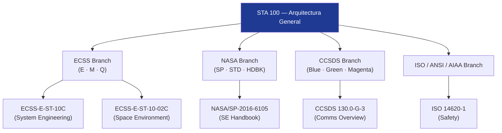

# STA 100-109 · Section 00 · Subsection 100 · Subsubject 007 — ECSS / NASA / CCSDS Standards Mapping

## 1. Purpose

Provides the **normative cross-reference** mapping ECSS, NASA, and CCSDS standards to the STA `100–199` band subsubjects, ensuring that each technical module in this subsection cites and complies with the applicable standard hierarchy.

## 2. Scope

- Covers the *ECSS / NASA / CCSDS Standards Mapping* subsubject (`007`) of subsection `100`.
- Inherits Q-Division authority and ORB support from the parent row in [`../../README.md` §3](../../README.md#3-architecture-table)[^archtable].
- Concepts in scope:
  - **ECSS mapping** — ECSS-E (Engineering), ECSS-M (Management), and ECSS-Q (Product Assurance) branches applicable to each STA subsection.
  - **NASA mapping** — NASA Technical Standards, NASA-STD-7009 models & simulations, NASA-STD-3001 human factors, and NASA Systems Engineering Handbook.
  - **CCSDS mapping** — applicable CCSDS Blue Books (normative), Green Books (informational), and Magenta Books (recommended practices) per band subsection.
  - **ISO / ANSI / AIAA mapping** — ISO 14620 (safety), ISO 24113 (debris mitigation), ANSI/AIAA standards for flight dynamics.
  - **Standards traceability matrix** — tabular cross-reference linking each STA subsection code to its primary and supporting standards, serving as the authoritative input to compliance verification in `008`.

| STA Subsection | Primary Standards | Supporting Standards |
|---|---|---|
| 100 Arquitectura General | ECSS-E-ST-10C, NASA/SP-2016-6105 | CCSDS 130.0-G-3, ISO 14620-1 |
| 101 Habitabilidad | NASA-STD-3001 Vol.1/2 | ECSS-E-HB-11A, ISO 11399 |
| 102 Soporte Vital ECLSS | ECSS-E-ST-34C, NASA JSC-65591 | ISO 14644, ANSI/ASHRAE 62.1 |
| 103 Seguridad de Misión | ISO 14620-1, ECSS-Q-ST-40C | MIL-STD-882E, NASA-STD-8739.8 |
| 110 Estructuras Orbitales | ECSS-E-ST-32C, NASA-STD-5001 | AIAA S-110, ISO 19683 |
| 120 Propulsión Química | ECSS-E-ST-35C, NASA-STD-5012 | MIL-SPEC-PRF-27372, AIAA S-080 |
| 130 Energía Solar | ECSS-E-ST-20C, NASA-HDBK-4001 | MIL-STD-1553, IEC 62133 |
| 140 GNC | ECSS-E-ST-60C, NASA-STD-7009 | CCSDS 500.0-G, ADS-B standards |
| 150 SATCOM | CCSDS 401.0-B, ITU-R S.580 | ECSS-E-ST-50C, DVB-S2 |
| 160 Cargas Útiles | ECSS-E-ST-32C, NASA-HDBK-8739.19 | CCSDS 120.0-G, ISO 19115 |

## 3. Diagram — Standards Mapping Flow

## 4. Footprint

| Metric | Value |
|---|---|
| Architecture | `STA` — Space Technology Architecture |
| Master range | `100–199` |
| Code range | `100-109` |
| Section | `00` — Sistemas Generales y Soporte Vital Espacial |
| Subsection | `100` — Arquitectura General Espacial |
| Subsubject | `007` — ECSS / NASA / CCSDS Standards Mapping |
| Primary Q-Division | Q-SPACE[^qdiv] |
| Support Q-Divisions | Q-DATAGOV, Q-HORIZON, Q-HPC |
| ORB support | ORB-PMO, ORB-LEG |
| Governance class | `baseline`[^gov] |
| Folder path | `Q+ATLANTIDE/100-199_STA/100-109_Sistemas-Generales-y-Soporte-Vital-Espacial/100_Arquitectura-General-Espacial/` |
| Document | `007_ECSS-NASA-CCSDS-Standards-Mapping.md` (this file) |
| Parent subsection | [`README.md`](./README.md) · [`000_Overview.md`](./000_Overview.md) |
| Parent architecture | [`../../README.md`](../../README.md) |
| Parent baseline | [`organization/Q+ATLANTIDE.md`](../../../../organization/Q+ATLANTIDE.md) |

## 5. References & Citations

[^baseline]: **Q+ATLANTIDE controlled baseline (v1.0.0)** — [`organization/Q+ATLANTIDE.md`](../../../../organization/Q+ATLANTIDE.md). Defines the controlled `000-999` architecture-band taxonomy and the ATLAS-1000 register subpart.

[^archtable]: **STA §3 Architecture Table** — [`../../README.md` §3](../../README.md#3-architecture-table). Authoritative source for the `100-109` row (Section `00` — Sistemas Generales y Soporte Vital Espacial, Primary Q-Division Q-SPACE).

[^qdiv]: **Q-Division authority** — Q-Divisions provide technical authority over an architecture row (Q+ATLANTIDE Note N-002). See [`organization/Q+ATLANTIDE.md` §4](../../../../organization/Q+ATLANTIDE.md#4-notes).

[^gov]: **Governance class** — `baseline` denotes documents under controlled change management within the Q+ATLANTIDE baseline.

[^ecss10]: **ECSS-E-ST-10C Rev.1 — Space Engineering: System Engineering General Requirements** — European standard governing space-system architecture decomposition, requirement flow-down, and V&V planning.

[^ecss10_02]: **ECSS-E-ST-10-02C — Space Environment** — Defines the space-environment models (radiation belts, solar protons, thermal environment) that bound all STA architecture designs.

[^nasase]: **NASA/SP-2016-6105 Rev.2 — NASA Systems Engineering Handbook** — Authoritative SE reference used for mission-class taxonomy, segment decomposition, and lifecycle governance across NASA programmes.

[^ccsds]: **CCSDS 130.0-G-3 — Overview of Space Communications Protocols** — CCSDS Green Book that frames ground-to-space communication architecture at the mission-control interface layer.

[^iso14620]: **ISO 14620-1:2018 — Space Systems: Safety Requirements** — International standard for top-level safety and risk requirements applicable to all space mission classes.

[^ansiaiaa]: **ANSI/AIAA S-102A-2004 — Performance-Based Fault Management Handbook** — Fault management design framework guiding safety and assurance boundaries in the STA band.

### Applicable industry standards

- ECSS-E-ST-10C Rev.1 — Space Engineering: System Engineering General Requirements[^ecss10]
- ECSS-E-ST-10-02C — Space Environment[^ecss10_02]
- NASA/SP-2016-6105 Rev.2 — NASA Systems Engineering Handbook[^nasase]
- CCSDS 130.0-G-3 — Overview of Space Communications Protocols[^ccsds]
- ISO 14620-1:2018 — Space Systems: Safety Requirements[^iso14620]
- ANSI/AIAA S-102A-2004 — Performance-Based Fault Management Handbook[^ansiaiaa]
