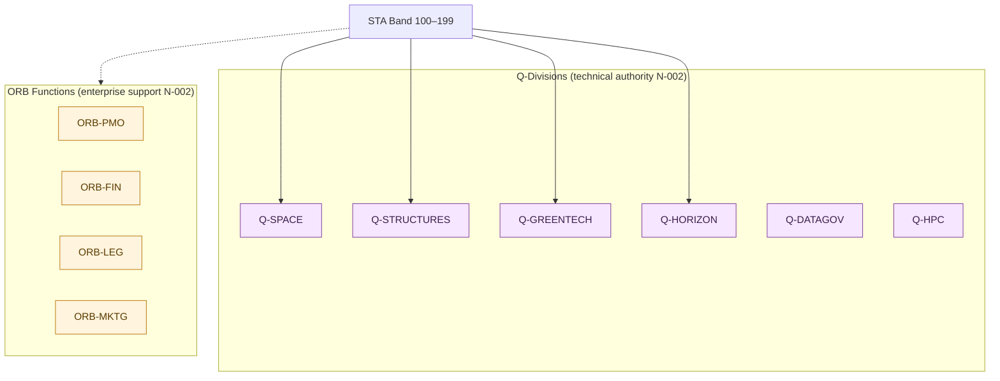

# STA 100-109 · Section 00 · Subsection 100 · Subsubject 009 — Q-Division and ORB Function Traceability

## 1. Purpose

Provides the **traceability matrix** linking Q-Division technical authority and ORB enterprise-support functions to the STA `100–199` band subsections, ensuring that Q+ATLANTIDE governance rules N-002 and N-004 are fully traceable from architecture rows to individual subsubjects.

## 2. Scope

- Covers the *Q-Division and ORB Function Traceability* subsubject (`009`) of subsection `100`.
- Inherits Q-Division authority and ORB support from the parent row in [`../../README.md` §3](../../README.md#3-architecture-table)[^archtable].
- Concepts in scope:
  - **Q-Division traceability matrix** — mapping each STA section (`100–199`) to its primary Q-Division (per rule N-002), support Q-Divisions, and the technical decisions each owns.
  - **ORB function traceability** — mapping each STA section to its ORB support functions (ORB-PMO, ORB-FIN, ORB-LEG, ORB-MKTG) and the enterprise deliverables each provides.
  - **No-AAA Rule compliance** — confirmation that no subsection uses "AAA" as a domain, division, architecture, interface or function code (rule N-004).
  - **Interface Authority Register** — list of formal interfaces between STA subsections and other bands, with the Q-Division authority responsible for each ICD.
  - **Change authority matrix** — who can change what, at what lifecycle phase, per Q-Division and ORB role.

| STA Section | Primary Q-Division | Support Q-Divisions | ORB Support | Technical Authority |
|---|---|---|---|---|
| 100–109 | Q-SPACE | Q-DATAGOV, Q-HORIZON, Q-HPC | ORB-PMO, ORB-LEG | Space systems, life support |
| 110–119 | Q-STRUCTURES | Q-SPACE, Q-HORIZON, Q-INDUSTRY | ORB-PMO, ORB-FIN | Orbital structures, materials |
| 120–129 | Q-GREENTECH | Q-SPACE, Q-HORIZON, Q-HPC | ORB-PMO, ORB-LEG | Space propulsion |
| 130–139 | Q-GREENTECH | Q-SPACE, Q-HPC | ORB-PMO, ORB-FIN | Space energy systems |
| 140–149 | Q-SPACE | Q-DATAGOV, Q-HPC, Q-HORIZON | ORB-PMO, ORB-LEG | Mission avionics & control |
| 150–159 | Q-SPACE | Q-DATAGOV, Q-HPC | ORB-PMO, ORB-LEG | Space communications |
| 160–169 | Q-SPACE | Q-HORIZON, Q-HPC, Q-DATAGOV | ORB-PMO, ORB-MKTG | Sensors & payloads |
| 170–179 | Q-SPACE | Q-GROUND, Q-HORIZON, Q-MECHANICS | ORB-PMO, ORB-LEG | On-orbit operations |
| 180–189 | Q-SPACE | Q-INDUSTRY, Q-GROUND, Q-HORIZON | ORB-PMO, ORB-FIN | Space infrastructure |
| 190–199 | Q-HORIZON | Q-SPACE, Q-HPC, Q-GREENTECH | ORB-PMO, ORB-MKTG | Advanced concepts |

## 3. Diagram — Q-Division and ORB Traceability

## 4. Footprint

| Metric | Value |
|---|---|
| Architecture | `STA` — Space Technology Architecture |
| Master range | `100–199` |
| Code range | `100-109` |
| Section | `00` — Sistemas Generales y Soporte Vital Espacial |
| Subsection | `100` — Arquitectura General Espacial |
| Subsubject | `009` — Q-Division and ORB Function Traceability |
| Primary Q-Division | Q-SPACE[^qdiv] |
| Support Q-Divisions | Q-DATAGOV, Q-HORIZON, Q-HPC |
| ORB support | ORB-PMO, ORB-LEG |
| Governance class | `baseline`[^gov] |
| Folder path | `Q+ATLANTIDE/100-199_STA/100-109_Sistemas-Generales-y-Soporte-Vital-Espacial/100_Arquitectura-General-Espacial/` |
| Document | `009_Q-Division-and-ORB-Function-Traceability.md` (this file) |
| Parent subsection | [`README.md`](./README.md) · [`000_Overview.md`](./000_Overview.md) |
| Parent architecture | [`../../README.md`](../../README.md) |
| Parent baseline | [`organization/Q+ATLANTIDE.md`](../../../../organization/Q+ATLANTIDE.md) |

## 5. References & Citations

[^baseline]: **Q+ATLANTIDE controlled baseline (v1.0.0)** — [`organization/Q+ATLANTIDE.md`](../../../../organization/Q+ATLANTIDE.md). Defines the controlled `000-999` architecture-band taxonomy and the ATLAS-1000 register subpart.

[^archtable]: **STA §3 Architecture Table** — [`../../README.md` §3](../../README.md#3-architecture-table). Authoritative source for the `100-109` row (Section `00` — Sistemas Generales y Soporte Vital Espacial, Primary Q-Division Q-SPACE).

[^qdiv]: **Q-Division authority** — Q-Divisions provide technical authority over an architecture row (Q+ATLANTIDE Note N-002). See [`organization/Q+ATLANTIDE.md` §4](../../../../organization/Q+ATLANTIDE.md#4-notes).

[^gov]: **Governance class** — `baseline` denotes documents under controlled change management within the Q+ATLANTIDE baseline.

[^ecss10]: **ECSS-E-ST-10C Rev.1 — Space Engineering: System Engineering General Requirements** — European standard governing space-system architecture decomposition, requirement flow-down, and V&V planning.

[^ecss10_02]: **ECSS-E-ST-10-02C — Space Environment** — Defines the space-environment models (radiation belts, solar protons, thermal environment) that bound all STA architecture designs.

[^nasase]: **NASA/SP-2016-6105 Rev.2 — NASA Systems Engineering Handbook** — Authoritative SE reference used for mission-class taxonomy, segment decomposition, and lifecycle governance across NASA programmes.

[^ccsds]: **CCSDS 130.0-G-3 — Overview of Space Communications Protocols** — CCSDS Green Book that frames ground-to-space communication architecture at the mission-control interface layer.

[^iso14620]: **ISO 14620-1:2018 — Space Systems: Safety Requirements** — International standard for top-level safety and risk requirements applicable to all space mission classes.

[^ansiaiaa]: **ANSI/AIAA S-102A-2004 — Performance-Based Fault Management Handbook** — Fault management design framework guiding safety and assurance boundaries in the STA band.

### Applicable industry standards

- ECSS-E-ST-10C Rev.1 — Space Engineering: System Engineering General Requirements[^ecss10]
- ECSS-E-ST-10-02C — Space Environment[^ecss10_02]
- NASA/SP-2016-6105 Rev.2 — NASA Systems Engineering Handbook[^nasase]
- CCSDS 130.0-G-3 — Overview of Space Communications Protocols[^ccsds]
- ISO 14620-1:2018 — Space Systems: Safety Requirements[^iso14620]
- ANSI/AIAA S-102A-2004 — Performance-Based Fault Management Handbook[^ansiaiaa]
