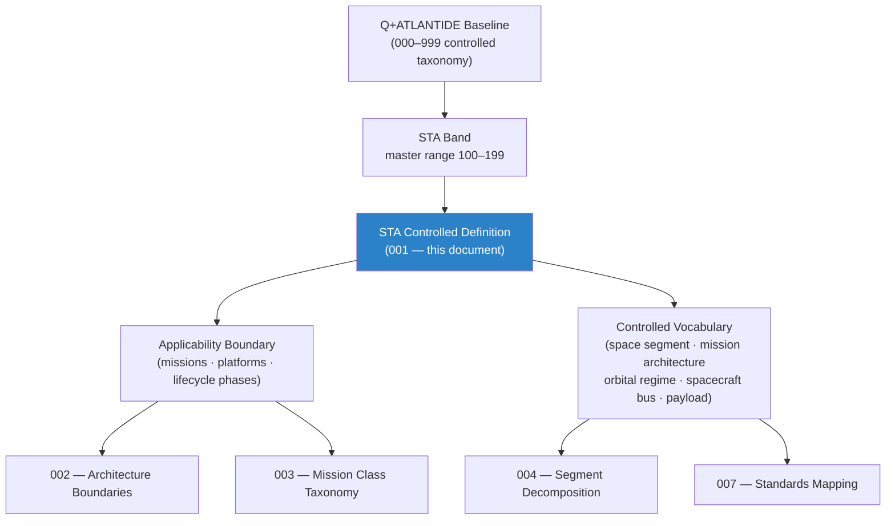

# STA 100-109 · 100-010 — Controlled Definition

## 1. Purpose

Establishes the **normative definition and controlled scope** of the Space Technology Architecture (STA) band within the Q+ATLANTIDE programme. Defines the applicability limits, key terms, and regulatory references that all downstream subsubjects, segments, and data modules in subsection `100` *Arquitectura General Espacial* depend upon, in conformance with ECSS-E-ST-10C[^ecss10].

## 2. Scope

- Covers the *STA General Architecture Controlled Definition* subsubject (`001`) of subsection `100` within section `00`.
- Inherits Q-Division authority and ORB support from the parent row in [`../../README.md` §3](../../README.md#3-architecture-table)[^archtable].
- Concepts in scope:
  - **Normative definition** — the controlled expansion of "STA" as *Space Technology Architecture*, its master range `100–199`, and its position within the Q+ATLANTIDE `000–999` taxonomy.
  - **Applicability boundary** — which space missions, platforms, and lifecycle phases fall under STA governance, and which are excluded (e.g., pure software defined in QCSAA `900–999`).
  - **Relationship to ATLAS** — interfaces and traceability links to the aircraft architecture band (`000–099`) for hybrid aerospace missions.
  - **Controlled vocabulary** — key terms: *space segment*, *mission architecture*, *orbital regime*, *spacecraft bus*, *payload*, *ground segment*, *cis-lunar*, *interplanetary* — used consistently across all `100` subsubjects.
  - **Regulatory anchors** — cross-map to ECSS, NASA, and CCSDS normative hierarchies per ECSS-E-ST-10C[^ecss10].
- Out of scope: orbital-regime taxonomy (`003`), segment decomposition (`004`), and specific standards mapping (`007`).

## 3. Diagram — STA Controlled Definition Flow

## 4. Footprint

| Metric | Value |
|---|---|
| Architecture | `STA` — Space Technology Architecture |
| Master range | `100–199` |
| Code range | `100-109` |
| Section | `00` — Sistemas Generales y Soporte Vital Espacial |
| Subsection | `100` — Arquitectura General Espacial |
| Subsubject | `001` — STA General Architecture Controlled Definition |
| Primary Q-Division | Q-SPACE[^qdiv] |
| Support Q-Divisions | Q-DATAGOV, Q-HORIZON, Q-HPC |
| ORB support | ORB-PMO, ORB-LEG |
| Governance class | `baseline`[^gov] |
| Folder path | `Q+ATLANTIDE/100-199_STA/100-109_Sistemas-Generales-y-Soporte-Vital-Espacial/100_Arquitectura-General-Espacial/` |
| Document | `100-010-Controlled-Definition.md` (this file) |
| Parent subsection | [`README.md`](./README.md) · [`100-000-General.md`](./100-000-General.md) |
| Parent architecture | [`../../README.md`](../../README.md) |
| Parent baseline | [`organization/Q+ATLANTIDE.md`](../../../../organization/Q+ATLANTIDE.md) |

## 5. References & Citations

[^baseline]: **Q+ATLANTIDE controlled baseline (v1.0.0)** — [`organization/Q+ATLANTIDE.md`](../../../../organization/Q+ATLANTIDE.md). Defines the controlled `000-999` architecture-band taxonomy and the ATLAS-1000 register subpart.

[^archtable]: **STA §3 Architecture Table** — [`../../README.md` §3](../../README.md#3-architecture-table). Authoritative source for the `100-109` row (Section `00` — Sistemas Generales y Soporte Vital Espacial, Primary Q-Division Q-SPACE).

[^qdiv]: **Q-Division authority** — Q-Divisions provide technical authority over an architecture row (Q+ATLANTIDE Note N-002). See [`organization/Q+ATLANTIDE.md` §4](../../../../organization/Q+ATLANTIDE.md#4-notes).

[^gov]: **Governance class** — `baseline` denotes documents under controlled change management within the Q+ATLANTIDE baseline.

[^ecss10]: **ECSS-E-ST-10C Rev.1 — Space Engineering: System Engineering General Requirements** — European standard governing space-system architecture decomposition, requirement flow-down, and V&V planning.

[^ecss10_02]: **ECSS-E-ST-10-02C — Space Environment** — Defines the space-environment models (radiation belts, solar protons, thermal environment) that bound all STA architecture designs.

[^nasase]: **NASA/SP-2016-6105 Rev.2 — NASA Systems Engineering Handbook** — Authoritative SE reference used for mission-class taxonomy, segment decomposition, and lifecycle governance across NASA programmes.

[^ccsds]: **CCSDS 130.0-G-3 — Overview of Space Communications Protocols** — CCSDS Green Book that frames ground-to-space communication architecture at the mission-control interface layer.

[^iso14620]: **ISO 14620-1:2018 — Space Systems: Safety Requirements** — International standard for top-level safety and risk requirements applicable to all space mission classes.

[^ansiaiaa]: **ANSI/AIAA S-102A-2004 — Performance-Based Fault Management Handbook** — Fault management design framework guiding safety and assurance boundaries in the STA band.

### Applicable industry standards

- ECSS-E-ST-10C Rev.1 — Space Engineering: System Engineering General Requirements[^ecss10]
- ECSS-E-ST-10-02C — Space Environment[^ecss10_02]
- NASA/SP-2016-6105 Rev.2 — NASA Systems Engineering Handbook[^nasase]
- CCSDS 130.0-G-3 — Overview of Space Communications Protocols[^ccsds]
- ISO 14620-1:2018 — Space Systems: Safety Requirements[^iso14620]
- ANSI/AIAA S-102A-2004 — Performance-Based Fault Management Handbook[^ansiaiaa]
