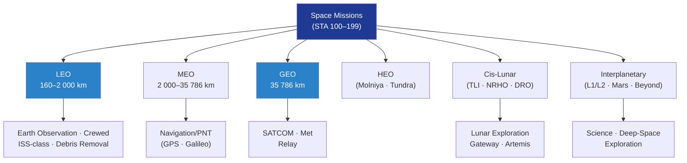

# STA 100-109 · 100-030 — Mission Class and Orbital Regime Taxonomy

## 1. Purpose

Establishes the **normative classification of space missions** by mission class and orbital regime used throughout the STA `100–199` band, providing the taxonomy that governs subsection assignment, Q-Division authority allocation, and applicable standards, per ECSS-E-ST-10-02C[^ecss10_02] and NASA/SP-2016-6105[^nasase].

## 2. Scope

- Covers the *Mission Class and Orbital Regime Taxonomy* subsubject (`003`) of subsection `100`.
- Inherits Q-Division authority and ORB support from the parent row in [`../../README.md` §3](../../README.md#3-architecture-table)[^archtable].
- Concepts in scope:
  - **Orbital regime definitions** — Low Earth Orbit (LEO: 160–2 000 km), Medium Earth Orbit (MEO: 2 000–35 786 km), Geostationary Orbit (GEO: 35 786 km), High Earth Orbit (HEO), cis-lunar (lunar transfer and NRHO), and interplanetary trajectories.
  - **Mission class taxonomy** — Earth observation, communications, navigation/PNT, science/exploration, technology demonstration, crewed, and commercial logistics.
  - **Classification criteria** — altitude, inclination, mission duration, crew/uncrewed designation, and criticality class (per ISO 14620-1[^iso14620]).
  - **Cross-band traceability** — mapping of mission class to the primary STA section governing that class (e.g., crewed missions → 101 Habitabilidad, interplanetary → 190 Arquitecturas Interplanetarias).
  - **Environment models** — radiation environment and thermal vacuum envelope per ECSS-E-ST-10-02C[^ecss10_02] for each orbital regime.

## 3. Diagram — Mission Class and Orbital Regime Taxonomy

## 4. Footprint

| Metric | Value |
|---|---|
| Architecture | `STA` — Space Technology Architecture |
| Master range | `100–199` |
| Code range | `100-109` |
| Section | `00` — Sistemas Generales y Soporte Vital Espacial |
| Subsection | `100` — Arquitectura General Espacial |
| Subsubject | `003` — Mission Class and Orbital Regime Taxonomy |
| Primary Q-Division | Q-SPACE[^qdiv] |
| Support Q-Divisions | Q-DATAGOV, Q-HORIZON, Q-HPC |
| ORB support | ORB-PMO, ORB-LEG |
| Governance class | `baseline`[^gov] |
| Folder path | `Q+ATLANTIDE/100-199_STA/100-109_Sistemas-Generales-y-Soporte-Vital-Espacial/100_Arquitectura-General-Espacial/` |
| Document | `100-030-Mission-Class-and-Orbital-Regime-Taxonomy.md` (this file) |
| Parent subsection | [`README.md`](./README.md) · [`100-000-General.md`](./100-000-General.md) |
| Parent architecture | [`../../README.md`](../../README.md) |
| Parent baseline | [`organization/Q+ATLANTIDE.md`](../../../../organization/Q+ATLANTIDE.md) |

## 5. References & Citations

[^baseline]: **Q+ATLANTIDE controlled baseline (v1.0.0)** — [`organization/Q+ATLANTIDE.md`](../../../../organization/Q+ATLANTIDE.md). Defines the controlled `000-999` architecture-band taxonomy and the ATLAS-1000 register subpart.

[^archtable]: **STA §3 Architecture Table** — [`../../README.md` §3](../../README.md#3-architecture-table). Authoritative source for the `100-109` row (Section `00` — Sistemas Generales y Soporte Vital Espacial, Primary Q-Division Q-SPACE).

[^qdiv]: **Q-Division authority** — Q-Divisions provide technical authority over an architecture row (Q+ATLANTIDE Note N-002). See [`organization/Q+ATLANTIDE.md` §4](../../../../organization/Q+ATLANTIDE.md#4-notes).

[^gov]: **Governance class** — `baseline` denotes documents under controlled change management within the Q+ATLANTIDE baseline.

[^ecss10]: **ECSS-E-ST-10C Rev.1 — Space Engineering: System Engineering General Requirements** — European standard governing space-system architecture decomposition, requirement flow-down, and V&V planning.

[^ecss10_02]: **ECSS-E-ST-10-02C — Space Environment** — Defines the space-environment models (radiation belts, solar protons, thermal environment) that bound all STA architecture designs.

[^nasase]: **NASA/SP-2016-6105 Rev.2 — NASA Systems Engineering Handbook** — Authoritative SE reference used for mission-class taxonomy, segment decomposition, and lifecycle governance across NASA programmes.

[^ccsds]: **CCSDS 130.0-G-3 — Overview of Space Communications Protocols** — CCSDS Green Book that frames ground-to-space communication architecture at the mission-control interface layer.

[^iso14620]: **ISO 14620-1:2018 — Space Systems: Safety Requirements** — International standard for top-level safety and risk requirements applicable to all space mission classes.

[^ansiaiaa]: **ANSI/AIAA S-102A-2004 — Performance-Based Fault Management Handbook** — Fault management design framework guiding safety and assurance boundaries in the STA band.

### Applicable industry standards

- ECSS-E-ST-10C Rev.1 — Space Engineering: System Engineering General Requirements[^ecss10]
- ECSS-E-ST-10-02C — Space Environment[^ecss10_02]
- NASA/SP-2016-6105 Rev.2 — NASA Systems Engineering Handbook[^nasase]
- CCSDS 130.0-G-3 — Overview of Space Communications Protocols[^ccsds]
- ISO 14620-1:2018 — Space Systems: Safety Requirements[^iso14620]
- ANSI/AIAA S-102A-2004 — Performance-Based Fault Management Handbook[^ansiaiaa]
