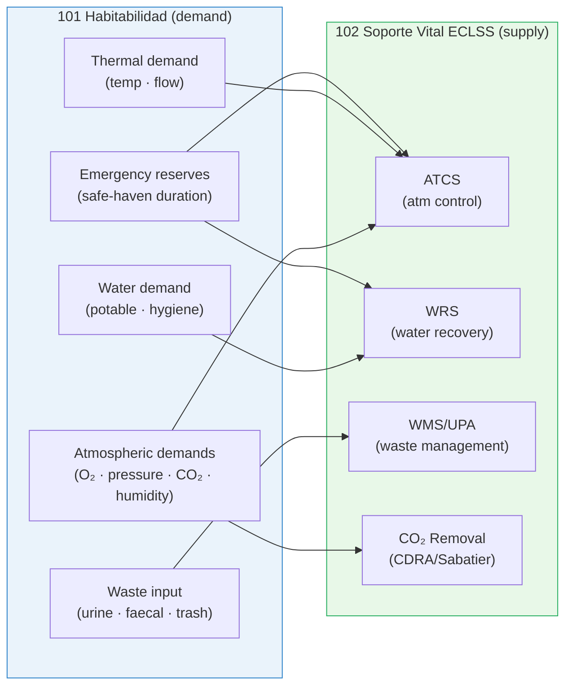

# STA 100-109 · Section 00 · Subsection 101 · Subsubject 008 — ECLSS Interfaces and Constraints

## 1. Purpose

Defines the **formal interfaces and design constraints** that the *Habitabilidad* subsection (`101`) places on the Environmental Control and Life Support System (ECLSS) subsection (`102 Soporte Vital ECLSS`), establishing the demand/supply boundary per ECSS-E-ST-34C[^ecsse34] and NASA-STD-3001 Vol.2[^nastd3001v2].

## 2. Scope

- Covers the *ECLSS Interfaces and Constraints* subsubject (`008`) of subsection `101`.
- Inherits Q-Division authority and ORB support from the parent row in [`../../README.md` §3](../../README.md#3-architecture-table)[^archtable].
- Concepts in scope:
  - **Atmospheric control demands** — O₂ partial pressure range (19.5–23.1 kPa), total pressure (50–103 kPa), CO₂ partial pressure (≤ 0.40 kPa), and humidity range demanded from ECLSS ATCS and CO₂ removal.
  - **Water supply demands** — potable water flow rates, quality specifications, and daily quantity demands (from subsubject `005`) supplied by ECLSS WRS.
  - **Thermal comfort demands** — cabin inlet air temperature and flow-rate requirements supplied by ECLSS ATCS, derived from subsubject `003`.
  - **Waste processing demands** — urine and faecal input rates, collection-system interface specifications, and return-mass constraints supplied by ECLSS WMS/UPA.
  - **Emergency life support margins** — consumable reserves and ECLSS redundancy requirements demanded by safe-haven design in subsubject `007`.
  - **ICD reference** — the formal Interface Control Document between 101 Habitabilidad and 102 Soporte Vital ECLSS is declared here and controlled under `100.006 Lifecycle Governance`.

## 3. Diagram — Habitabilidad → ECLSS Interface

## 4. Footprint

| Metric | Value |
|---|---|
| Architecture | `STA` — Space Technology Architecture |
| Master range | `100–199` |
| Code range | `100-109` |
| Section | `00` — Sistemas Generales y Soporte Vital Espacial |
| Subsection | `101` — Habitabilidad |
| Subsubject | `008` — ECLSS Interfaces and Constraints |
| Primary Q-Division | Q-SPACE[^qdiv] |
| Support Q-Divisions | Q-DATAGOV, Q-HORIZON, Q-HPC, Q-AIR |
| ORB support | ORB-PMO, ORB-LEG |
| Governance class | `baseline`[^gov] |
| Folder path | `Q+ATLANTIDE/100-199_STA/100-109_Sistemas-Generales-y-Soporte-Vital-Espacial/101_Habitabilidad/` |
| Document | `008_ECLSS-Interfaces-and-Constraints.md` (this file) |
| Parent subsection | [`README.md`](./README.md) · [`000_Overview.md`](./000_Overview.md) |
| Parent architecture | [`../../README.md`](../../README.md) |
| Parent baseline | [`organization/Q+ATLANTIDE.md`](../../../../organization/Q+ATLANTIDE.md) |

## 5. References & Citations

[^baseline]: **Q+ATLANTIDE controlled baseline (v1.0.0)** — [`organization/Q+ATLANTIDE.md`](../../../../organization/Q+ATLANTIDE.md). Defines the controlled `000-999` architecture-band taxonomy and the ATLAS-1000 register subpart.

[^archtable]: **STA §3 Architecture Table** — [`../../README.md` §3](../../README.md#3-architecture-table). Authoritative source for the `100-109` row.

[^qdiv]: **Q-Division authority** — Q-Divisions provide technical authority over an architecture row (Q+ATLANTIDE Note N-002). See [`organization/Q+ATLANTIDE.md` §4](../../../../organization/Q+ATLANTIDE.md#4-notes).

[^gov]: **Governance class** — `baseline` denotes documents under controlled change management within the Q+ATLANTIDE baseline.

[^nastd3001]: **NASA-STD-3001 Vol.1 — Space Human Factors Engineering** — Governs crew habitable volume, environmental parameters, human-factors requirements, and physiological constraints for crewed space missions.

[^nastd3001v2]: **NASA-STD-3001 Vol.2 — Human Factors, Habitability, and Environmental Health** — Detailed habitability design requirements covering comfort, sleep, hygiene, food, and emergency safe-haven provisions.

[^ecsse34]: **ECSS-E-ST-34C — Space Engineering: Environmental Control and Life Support** — European standard for ECLSS design, interface requirements, and subsystem test criteria.

[^iso11399]: **ISO 11399 — Ergonomics of the Thermal Environment** — Provides principles and application of relevant International Standards for ergonomic assessment of the thermal environment in enclosed spaces.

[^icesseh]: **ICES-HB-11A — ECSS Handbook: Spacecraft Crew Compartment Design** — Guidance document on crew-compartment layout, human-machine interface, and habitability assessment methods.

### Applicable industry standards

- NASA-STD-3001 Vol.1 — Space Human Factors Engineering[^nastd3001]
- NASA-STD-3001 Vol.2 — Human Factors, Habitability, and Environmental Health[^nastd3001v2]
- ECSS-E-ST-34C — Space Engineering: Environmental Control and Life Support[^ecsse34]
- ISO 11399 — Ergonomics of the Thermal Environment[^iso11399]
- ICES-HB-11A — Spacecraft Crew Compartment Design[^icesseh]
