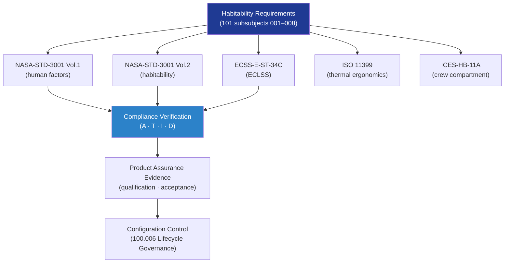

# STA 100-109 · Section 00 · Subsection 101 · Subsubject 009 — Standards Traceability and Assurance Boundaries

## 1. Purpose

Provides the **standards traceability matrix and product-assurance boundary declaration** for subsection `101` *Habitabilidad*, mapping each habitability subsubject to its governing standards and establishing the assurance evidence obligations within the Q+ATLANTIDE STA band.

## 2. Scope

- Covers the *Standards Traceability and Assurance Boundaries* subsubject (`009`) of subsection `101`.
- Inherits Q-Division authority and ORB support from the parent row in [`../../README.md` §3](../../README.md#3-architecture-table)[^archtable].
- Concepts in scope:
  - **Standards traceability matrix** — cross-reference of each `101` subsubject to its primary and supporting standards (NASA-STD-3001, ECSS-E-ST-34C, ISO 11399, ICES-HB-11A).
  - **Compliance verification methods** — analysis (A), test (T), inspection (I), and demonstration (D) methods applicable to each habitability requirement.
  - **Product assurance obligations** — design verification requirements, qualification test plans, and flight-acceptance evidence for habitability equipment.
  - **Interface assurance** — assurance requirements at the habitability/ECLSS interface boundary (subsubject `008`) and the habitability/safety interface (subsubject `007`).
  - **Linked nodes** — traceability to adjacent nodes: `100_Arquitectura-General-Espacial`, `102_Soporte-Vital-ECLSS`, and `103_Seguridad-de-Mision` per the governance graph.
  - **No-AAA Rule compliance** — confirmation that no habitability module uses "AAA" as an identifier per Q+ATLANTIDE Note N-004.

| Subsubject | Primary Standard | Supporting Standards | Verification Method |
|---|---|---|---|
| 001 Habitability Definition | NASA-STD-3001 Vol.1 | ECSS-E-ST-34C | Analysis/Inspection |
| 002 Habitable Volume | NASA-STD-3001 Vol.2 | ICES-HB-11A | Analysis/Test |
| 003 Environmental Comfort | NASA-STD-3001 Vol.2, ISO 11399 | ECSS-E-ST-34C | Test/Demonstration |
| 004 Radiation Shelter | NASA-STD-3001 Vol.1 | ECSS-E-ST-10-02C | Analysis/Test |
| 005 Food/Water/Hygiene | NASA-STD-3001 Vol.2 | ISO food standards | Test/Inspection |
| 006 Sleep/Work/Privacy | NASA-STD-3001 Vol.2 | ICES-HB-11A | Analysis/Demonstration |
| 007 Emergency Safe Haven | NASA-STD-3001 Vol.1 | ISO 14620-1 | Analysis/Test |
| 008 ECLSS Interfaces | ECSS-E-ST-34C | NASA-STD-3001 Vol.2 | Analysis/Inspection |

## 3. Diagram — Standards Traceability Flow

## 4. Footprint

| Metric | Value |
|---|---|
| Architecture | `STA` — Space Technology Architecture |
| Master range | `100–199` |
| Code range | `100-109` |
| Section | `00` — Sistemas Generales y Soporte Vital Espacial |
| Subsection | `101` — Habitabilidad |
| Subsubject | `009` — Standards Traceability and Assurance Boundaries |
| Primary Q-Division | Q-SPACE[^qdiv] |
| Support Q-Divisions | Q-DATAGOV, Q-HORIZON, Q-HPC, Q-AIR |
| ORB support | ORB-PMO, ORB-LEG |
| Governance class | `baseline`[^gov] |
| Folder path | `Q+ATLANTIDE/100-199_STA/100-109_Sistemas-Generales-y-Soporte-Vital-Espacial/101_Habitabilidad/` |
| Document | `009_Standards-Traceability-and-Assurance-Boundaries.md` (this file) |
| Parent subsection | [`README.md`](./README.md) · [`000_Overview.md`](./000_Overview.md) |
| Parent architecture | [`../../README.md`](../../README.md) |
| Parent baseline | [`organization/Q+ATLANTIDE.md`](../../../../organization/Q+ATLANTIDE.md) |

## 5. References & Citations

[^baseline]: **Q+ATLANTIDE controlled baseline (v1.0.0)** — [`organization/Q+ATLANTIDE.md`](../../../../organization/Q+ATLANTIDE.md). Defines the controlled `000-999` architecture-band taxonomy and the ATLAS-1000 register subpart.

[^archtable]: **STA §3 Architecture Table** — [`../../README.md` §3](../../README.md#3-architecture-table). Authoritative source for the `100-109` row.

[^qdiv]: **Q-Division authority** — Q-Divisions provide technical authority over an architecture row (Q+ATLANTIDE Note N-002). See [`organization/Q+ATLANTIDE.md` §4](../../../../organization/Q+ATLANTIDE.md#4-notes).

[^gov]: **Governance class** — `baseline` denotes documents under controlled change management within the Q+ATLANTIDE baseline.

[^nastd3001]: **NASA-STD-3001 Vol.1 — Space Human Factors Engineering** — Governs crew habitable volume, environmental parameters, human-factors requirements, and physiological constraints for crewed space missions.

[^nastd3001v2]: **NASA-STD-3001 Vol.2 — Human Factors, Habitability, and Environmental Health** — Detailed habitability design requirements covering comfort, sleep, hygiene, food, and emergency safe-haven provisions.

[^ecsse34]: **ECSS-E-ST-34C — Space Engineering: Environmental Control and Life Support** — European standard for ECLSS design, interface requirements, and subsystem test criteria.

[^iso11399]: **ISO 11399 — Ergonomics of the Thermal Environment** — Provides principles and application of relevant International Standards for ergonomic assessment of the thermal environment in enclosed spaces.

[^icesseh]: **ICES-HB-11A — ECSS Handbook: Spacecraft Crew Compartment Design** — Guidance document on crew-compartment layout, human-machine interface, and habitability assessment methods.

### Applicable industry standards

- NASA-STD-3001 Vol.1 — Space Human Factors Engineering[^nastd3001]
- NASA-STD-3001 Vol.2 — Human Factors, Habitability, and Environmental Health[^nastd3001v2]
- ECSS-E-ST-34C — Space Engineering: Environmental Control and Life Support[^ecsse34]
- ISO 11399 — Ergonomics of the Thermal Environment[^iso11399]
- ICES-HB-11A — Spacecraft Crew Compartment Design[^icesseh]
