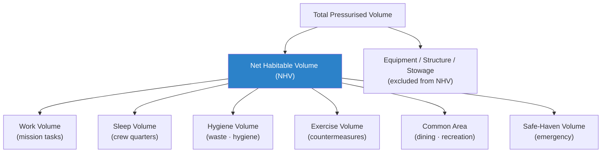

# STA 100-109 · 101-020 — Crew and Passenger Habitable Volume

## 1. Purpose

Defines the **net habitable volume (NHV) requirements and allocation methodology** for crewed space vehicles and habitats within the STA band, per NASA-STD-3001 Vol.2[^nastd3001v2] and ECSS-E-ST-34C[^ecsse34].

## 2. Scope

- Covers the *Crew and Passenger Habitable Volume* subsubject (`002`) of subsection `101`.
- Inherits Q-Division authority and ORB support from the parent row in [`../../README.md` §3](../../README.md#3-architecture-table)[^archtable].
- Concepts in scope:
  - **NHV definition** — net habitable volume as pressurised volume minus equipment, structure, and stowage volumes; minimum NHV thresholds per crew-size and mission duration per NASA-STD-3001 Vol.2[^nastd3001v2].
  - **Volume allocation categories** — work volume, sleep volume, hygiene volume, exercise volume, common/dining area, and emergency safe-haven volume.
  - **Mission duration scaling** — NHV per-crewmember requirements scaling from short-duration (≤30 days), medium (30–180 days), to long-duration (>180 days) crewed missions.
  - **Microgravity volumetric efficiency** — correction factors for usable volume in microgravity versus 1g environments.
  - **Volume heritage data** — reference NHV values from ISS, Orion, Gateway HALO, and commercial crew modules as baseline comparison data.

## 3. Diagram — Habitable Volume Allocation

## 4. Footprint

| Metric | Value |
|---|---|
| Architecture | `STA` — Space Technology Architecture |
| Master range | `100–199` |
| Code range | `100-109` |
| Section | `00` — Sistemas Generales y Soporte Vital Espacial |
| Subsection | `101` — Habitabilidad |
| Subsubject | `002` — Crew and Passenger Habitable Volume |
| Primary Q-Division | Q-SPACE[^qdiv] |
| Support Q-Divisions | Q-DATAGOV, Q-HORIZON, Q-HPC, Q-AIR |
| ORB support | ORB-PMO, ORB-LEG |
| Governance class | `baseline`[^gov] |
| Folder path | `Q+ATLANTIDE/100-199_STA/100-109_Sistemas-Generales-y-Soporte-Vital-Espacial/101_Habitabilidad/` |
| Document | `101-020-Crew-and-Passenger-Habitable-Volume.md` (this file) |
| Parent subsection | [`README.md`](./README.md) · [`101-000-General.md`](./101-000-General.md) |
| Parent architecture | [`../../README.md`](../../README.md) |
| Parent baseline | [`organization/Q+ATLANTIDE.md`](../../../../organization/Q+ATLANTIDE.md) |

## 5. References & Citations

[^baseline]: **Q+ATLANTIDE controlled baseline (v1.0.0)** — [`organization/Q+ATLANTIDE.md`](../../../../organization/Q+ATLANTIDE.md). Defines the controlled `000-999` architecture-band taxonomy and the ATLAS-1000 register subpart.

[^archtable]: **STA §3 Architecture Table** — [`../../README.md` §3](../../README.md#3-architecture-table). Authoritative source for the `100-109` row.

[^qdiv]: **Q-Division authority** — Q-Divisions provide technical authority over an architecture row (Q+ATLANTIDE Note N-002). See [`organization/Q+ATLANTIDE.md` §4](../../../../organization/Q+ATLANTIDE.md#4-notes).

[^gov]: **Governance class** — `baseline` denotes documents under controlled change management within the Q+ATLANTIDE baseline.

[^nastd3001]: **NASA-STD-3001 Vol.1 — Space Human Factors Engineering** — Governs crew habitable volume, environmental parameters, human-factors requirements, and physiological constraints for crewed space missions.

[^nastd3001v2]: **NASA-STD-3001 Vol.2 — Human Factors, Habitability, and Environmental Health** — Detailed habitability design requirements covering comfort, sleep, hygiene, food, and emergency safe-haven provisions.

[^ecsse34]: **ECSS-E-ST-34C — Space Engineering: Environmental Control and Life Support** — European standard for ECLSS design, interface requirements, and subsystem test criteria.

[^iso11399]: **ISO 11399 — Ergonomics of the Thermal Environment** — Provides principles and application of relevant International Standards for ergonomic assessment of the thermal environment in enclosed spaces.

[^icesseh]: **ICES-HB-11A — ECSS Handbook: Spacecraft Crew Compartment Design** — Guidance document on crew-compartment layout, human-machine interface, and habitability assessment methods.

### Applicable industry standards

- NASA-STD-3001 Vol.1 — Space Human Factors Engineering[^nastd3001]
- NASA-STD-3001 Vol.2 — Human Factors, Habitability, and Environmental Health[^nastd3001v2]
- ECSS-E-ST-34C — Space Engineering: Environmental Control and Life Support[^ecsse34]
- ISO 11399 — Ergonomics of the Thermal Environment[^iso11399]
- ICES-HB-11A — Spacecraft Crew Compartment Design[^icesseh]
