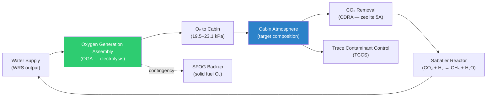

# STA 100-109 · Section 00 · Subsection 102 · Subsubject 002 — Atmosphere Generation and Revitalization

## 1. Purpose

Defines the **architecture and performance requirements** for the cabin atmosphere generation and revitalization function within ECLSS, covering oxygen generation, CO₂ removal, trace-contaminant control, and atmosphere quality maintenance, per ECSS-E-ST-34C[^ecsse34] and NASA/JSC-65591[^nasajsc].

## 2. Scope

- Covers the *Atmosphere Generation and Revitalization* subsubject (`002`) of subsection `102`.
- Inherits Q-Division authority and ORB support from the parent row in [`../../README.md` §3](../../README.md#3-architecture-table)[^archtable].
- Concepts in scope:
  - **Atmospheric composition** — target partial pressures: O₂ 19.5–23.1 kPa, total cabin pressure 50–103 kPa, CO₂ ≤ 0.40 kPa.
  - **Oxygen generation subsystems** — Oxygen Generation Assembly (OGA) via water electrolysis; Solid Fuel Oxygen Generator (SFOG) as contingency backup; design redundancy requirements.
  - **CO₂ removal** — Carbon Dioxide Removal Assembly (CDRA) using zeolite 5A sorbent beds (4-bed configuration); Sabatier CO₂ Reduction Assembly for CH₄/H₂O output; LiOH canister backup.
  - **Atmosphere revitalization** — regenerative atmosphere revitalization system (ARS) integrating O₂ generation, CO₂ removal, and humidity control.
  - **Trace-contaminant control** — Trace Contaminant Control System (TCCS) with activated charcoal and catalytic oxidiser; target cabin atmosphere quality per NASA-STD-3001 Vol.2[^nastd3001v2].
  - **Performance margins** — ECLSS atmosphere generation margins and redundancy levels for short-duration and long-duration missions.

## 3. Diagram — Atmosphere Generation and Revitalization

## 4. Footprint

| Metric | Value |
|---|---|
| Architecture | `STA` — Space Technology Architecture |
| Master range | `100–199` |
| Code range | `100-109` |
| Section | `00` — Sistemas Generales y Soporte Vital Espacial |
| Subsection | `102` — Soporte Vital ECLSS |
| Subsubject | `002` — Atmosphere Generation and Revitalization |
| Primary Q-Division | Q-SPACE[^qdiv] |
| Support Q-Divisions | Q-DATAGOV, Q-HORIZON, Q-HPC, Q-GREENTECH |
| ORB support | ORB-PMO, ORB-LEG |
| Governance class | `baseline`[^gov] |
| Folder path | `Q+ATLANTIDE/100-199_STA/100-109_Sistemas-Generales-y-Soporte-Vital-Espacial/102_Soporte-Vital-ECLSS/` |
| Document | `002_Atmosphere-Generation-and-Revitalization.md` (this file) |
| Parent subsection | [`README.md`](./README.md) · [`000_Overview.md`](./000_Overview.md) |
| Parent architecture | [`../../README.md`](../../README.md) |
| Parent baseline | [`organization/Q+ATLANTIDE.md`](../../../../organization/Q+ATLANTIDE.md) |

## 5. References & Citations

[^baseline]: **Q+ATLANTIDE controlled baseline (v1.0.0)** — [`organization/Q+ATLANTIDE.md`](../../../../organization/Q+ATLANTIDE.md). Defines the controlled `000-999` architecture-band taxonomy and the ATLAS-1000 register subpart.

[^archtable]: **STA §3 Architecture Table** — [`../../README.md` §3](../../README.md#3-architecture-table). Authoritative source for the `100-109` row.

[^qdiv]: **Q-Division authority** — Q-Divisions provide technical authority over an architecture row (Q+ATLANTIDE Note N-002). See [`organization/Q+ATLANTIDE.md` §4](../../../../organization/Q+ATLANTIDE.md#4-notes).

[^gov]: **Governance class** — `baseline` denotes documents under controlled change management within the Q+ATLANTIDE baseline.

[^ecsse34]: **ECSS-E-ST-34C Rev.1 — Space Engineering: Environmental Control and Life Support** — European standard for ECLSS design, subsystem interfaces, and test criteria.

[^nasajsc]: **NASA/JSC-65591 — ECLSS Design and Performance Requirements** — NASA design specification for ISS-class ECLSS subsystems, used as the baseline engineering reference.

[^nastd3001v2]: **NASA-STD-3001 Vol.2 — Human Factors, Habitability, and Environmental Health** — Atmosphere and water quality requirements that ECLSS must satisfy.

[^iso14644]: **ISO 14644-1:2015 — Cleanrooms and Associated Controlled Environments** — Applied to atmosphere quality monitoring and contamination control requirements.

[^nasacp]: **NASA/CP-2008-214304 — ECLSS Development and Testing** — ECLSS hardware development and qualification test reference covering all subsystems.

### Applicable industry standards

- ECSS-E-ST-34C Rev.1 — Space Engineering: Environmental Control and Life Support[^ecsse34]
- NASA/JSC-65591 — ECLSS Design and Performance Requirements[^nasajsc]
- NASA-STD-3001 Vol.2 — Human Factors, Habitability, and Environmental Health[^nastd3001v2]
- ISO 14644-1:2015 — Cleanrooms and Associated Controlled Environments[^iso14644]
- NASA/CP-2008-214304 — ECLSS Development and Testing[^nasacp]
