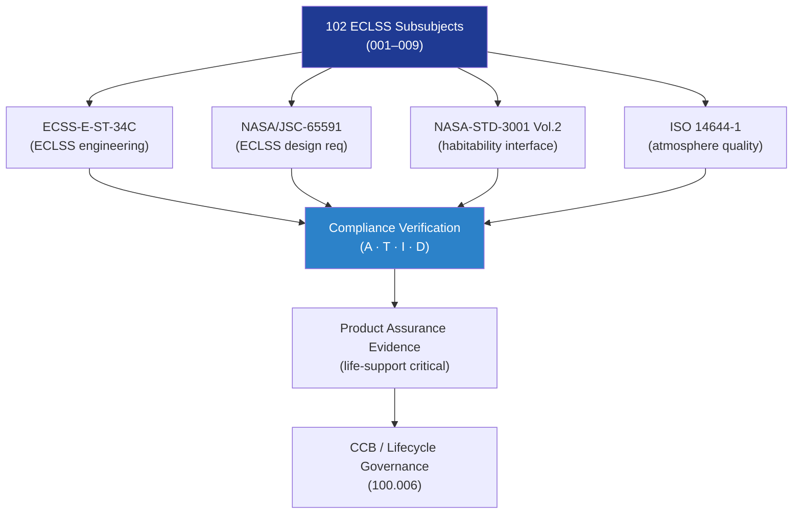

# STA 100-109 · Section 00 · Subsection 102 · Subsubject 010 — Standards Traceability and Assurance Boundaries

## 1. Purpose

Provides the **standards traceability matrix and product-assurance boundary declaration** for subsection `102` *Soporte Vital ECLSS*, mapping each ECLSS subsubject to its governing standards and establishing the assurance evidence obligations for this life-support critical subsystem.

## 2. Scope

- Covers the *Standards Traceability and Assurance Boundaries* subsubject (`010`) of subsection `102`.
- Inherits Q-Division authority and ORB support from the parent row in [`../../README.md` §3](../../README.md#3-architecture-table)[^archtable].
- Concepts in scope:
  - **Standards traceability matrix** — cross-reference of each `102` subsubject to its primary and supporting standards (ECSS-E-ST-34C, NASA/JSC-65591, NASA-STD-3001 Vol.2, ISO 14644).
  - **Life-support criticality** — ECLSS is designated life-support critical; all subsubjects carry a `safety_boundary` of *life-support critical; requires explicit assurance, redundancy, fault detection, contingency modes, and mission-risk governance*.
  - **Redundancy requirements** — all life-safety functions require ≥ Fail-Operational / Fail-Safe architecture; single-point failure assessment (FMEA/FMECA) required for all `102` hardware.
  - **Compliance verification methods** — analysis (A), test (T), inspection (I), and demonstration (D) methods per subsubject with completion evidence milestones.
  - **Product assurance obligations** — design verification, qualification test campaigns, acceptance test procedures, and in-service monitoring requirements.
  - **Linked nodes** — `100_Arquitectura-General-Espacial`, `101_Habitabilidad`, `103_Seguridad-de-Mision` per node YAML.

| Subsubject | Primary Standard | Supporting Standards | Safety Class | Verification |
|---|---|---|---|---|
| 001 ECLSS Definition | ECSS-E-ST-34C | NASA/JSC-65591 | Life-support critical | Inspection |
| 002 Atm Generation | ECSS-E-ST-34C | NASA/JSC-65591 | Life-support critical | Test/Analysis |
| 003 O₂/CO₂ | ECSS-E-ST-34C | NASA-STD-3001 Vol.2 | Life-support critical | Test/Analysis |
| 004 Pressure/Monitoring | ECSS-E-ST-34C | ISO 14644-1 | Life-support critical | Test/Demonstration |
| 005 Thermal/Humidity | ECSS-E-ST-34C | NASA-STD-3001 Vol.2 | Life-support critical | Test/Analysis |
| 006 Water Recovery | NASA/JSC-65591 | NASA-STD-3001 Vol.2 | Life-support critical | Test/Inspection |
| 007 Waste Management | ECSS-E-ST-34C | NASA-STD-3001 Vol.2 | Life-support critical | Inspection/Test |
| 008 Emergency LS | ECSS-E-ST-34C | NASA/JSC-65591 | Life-support critical | Test/Demonstration |
| 009 Sensors/FDIR | ECSS-E-ST-34C | ANSI/AIAA S-102A | Life-support critical | Test/Analysis |

## 3. Diagram — Standards Traceability Flow

## 4. Footprint

| Metric | Value |
|---|---|
| Architecture | `STA` — Space Technology Architecture |
| Master range | `100–199` |
| Code range | `100-109` |
| Section | `00` — Sistemas Generales y Soporte Vital Espacial |
| Subsection | `102` — Soporte Vital ECLSS |
| Subsubject | `010` — Standards Traceability and Assurance Boundaries |
| Primary Q-Division | Q-SPACE[^qdiv] |
| Support Q-Divisions | Q-DATAGOV, Q-HORIZON, Q-HPC, Q-GREENTECH |
| ORB support | ORB-PMO, ORB-LEG |
| Governance class | `baseline`[^gov] |
| Folder path | `Q+ATLANTIDE/100-199_STA/100-109_Sistemas-Generales-y-Soporte-Vital-Espacial/102_Soporte-Vital-ECLSS/` |
| Document | `010_Standards-Traceability-and-Assurance-Boundaries.md` (this file) |
| Parent subsection | [`README.md`](./README.md) · [`000_Overview.md`](./000_Overview.md) |
| Parent architecture | [`../../README.md`](../../README.md) |
| Parent baseline | [`organization/Q+ATLANTIDE.md`](../../../../organization/Q+ATLANTIDE.md) |

## 5. References & Citations

[^baseline]: **Q+ATLANTIDE controlled baseline (v1.0.0)** — [`organization/Q+ATLANTIDE.md`](../../../../organization/Q+ATLANTIDE.md). Defines the controlled `000-999` architecture-band taxonomy and the ATLAS-1000 register subpart.

[^archtable]: **STA §3 Architecture Table** — [`../../README.md` §3](../../README.md#3-architecture-table). Authoritative source for the `100-109` row.

[^qdiv]: **Q-Division authority** — Q-Divisions provide technical authority over an architecture row (Q+ATLANTIDE Note N-002). See [`organization/Q+ATLANTIDE.md` §4](../../../../organization/Q+ATLANTIDE.md#4-notes).

[^gov]: **Governance class** — `baseline` denotes documents under controlled change management within the Q+ATLANTIDE baseline.

[^ecsse34]: **ECSS-E-ST-34C Rev.1 — Space Engineering: Environmental Control and Life Support** — European standard for ECLSS design, subsystem interfaces, and test criteria.

[^nasajsc]: **NASA/JSC-65591 — ECLSS Design and Performance Requirements** — NASA design specification for ISS-class ECLSS subsystems, used as the baseline engineering reference.

[^nastd3001v2]: **NASA-STD-3001 Vol.2 — Human Factors, Habitability, and Environmental Health** — Atmosphere and water quality requirements that ECLSS must satisfy.

[^iso14644]: **ISO 14644-1:2015 — Cleanrooms and Associated Controlled Environments** — Applied to atmosphere quality monitoring and contamination control requirements.

[^nasacp]: **NASA/CP-2008-214304 — ECLSS Development and Testing** — ECLSS hardware development and qualification test reference covering all subsystems.

### Applicable industry standards

- ECSS-E-ST-34C Rev.1 — Space Engineering: Environmental Control and Life Support[^ecsse34]
- NASA/JSC-65591 — ECLSS Design and Performance Requirements[^nasajsc]
- NASA-STD-3001 Vol.2 — Human Factors, Habitability, and Environmental Health[^nastd3001v2]
- ISO 14644-1:2015 — Cleanrooms and Associated Controlled Environments[^iso14644]
- NASA/CP-2008-214304 — ECLSS Development and Testing[^nasacp]
