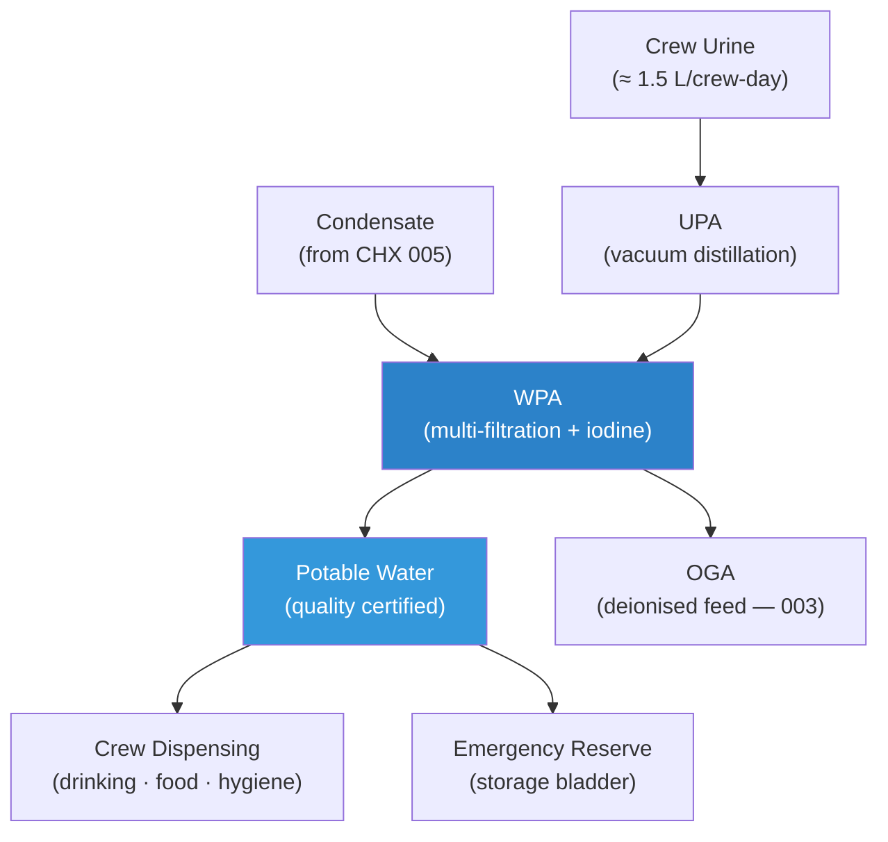

# STA 100-109 · 102-060 — Water Recovery and Management

## 1. Purpose

Defines the **water recovery system (WRS) architecture and performance requirements** — recovering potable water from crew urine and cabin humidity condensate to minimise resupply mass — per ECSS-E-ST-34C[^ecsse34] and NASA/JSC-65591[^nasajsc].

## 2. Scope

- Covers the *Water Recovery and Management* subsubject (`006`) of subsection `102`.
- Inherits Q-Division authority and ORB support from the parent row in [`../../README.md` §3](../../README.md#3-architecture-table)[^archtable].
- Concepts in scope:
  - **WRS architecture** — Urine Processor Assembly (UPA) using vacuum-distillation/vapour-compression distillation; Water Processor Assembly (WPA) multi-filtration beds + iodine biocide; condensate collection from ATCS CHX.
  - **Recovery efficiency** — target ≥ 90% water recovery from urine and condensate; mass balance between O₂ generation water input and WRS output.
  - **Water quality specification** — potable water pH 4.5–9.0, total organic carbon ≤ 0.5 mg/L, microbial count ≤ 50 CFU/mL; certification per NASA-STD-3001 Vol.2[^nastd3001v2].
  - **Storage and distribution** — water storage bladders, pressurised distribution lines, crew dispensing interfaces, and emergency reserve sizing.
  - **WRS-OGA interface** — deionised water supply from WPA to OGA for electrolysis; flow-rate matching and purity requirements.
  - **Maintenance and on-orbit servicing** — replaceable filter cartridge design, on-orbit water quality test capability, and resupply logistics interface (`181_Logistica-Cis-Lunar`).

## 3. Diagram — Water Recovery System (WRS)

## 4. Footprint

| Metric | Value |
|---|---|
| Architecture | `STA` — Space Technology Architecture |
| Master range | `100–199` |
| Code range | `100-109` |
| Section | `00` — Sistemas Generales y Soporte Vital Espacial |
| Subsection | `102` — Soporte Vital ECLSS |
| Subsubject | `006` — Water Recovery and Management |
| Primary Q-Division | Q-SPACE[^qdiv] |
| Support Q-Divisions | Q-DATAGOV, Q-HORIZON, Q-HPC, Q-GREENTECH |
| ORB support | ORB-PMO, ORB-LEG |
| Governance class | `baseline`[^gov] |
| Folder path | `Q+ATLANTIDE/100-199_STA/100-109_Sistemas-Generales-y-Soporte-Vital-Espacial/102_Soporte-Vital-ECLSS/` |
| Document | `102-060-Water-Recovery-and-Management.md` (this file) |
| Parent subsection | [`README.md`](./README.md) · [`102-000-General.md`](./102-000-General.md) |
| Parent architecture | [`../../README.md`](../../README.md) |
| Parent baseline | [`organization/Q+ATLANTIDE.md`](../../../../organization/Q+ATLANTIDE.md) |

## 5. References & Citations

[^baseline]: **Q+ATLANTIDE controlled baseline (v1.0.0)** — [`organization/Q+ATLANTIDE.md`](../../../../organization/Q+ATLANTIDE.md). Defines the controlled `000-999` architecture-band taxonomy and the ATLAS-1000 register subpart.

[^archtable]: **STA §3 Architecture Table** — [`../../README.md` §3](../../README.md#3-architecture-table). Authoritative source for the `100-109` row.

[^qdiv]: **Q-Division authority** — Q-Divisions provide technical authority over an architecture row (Q+ATLANTIDE Note N-002). See [`organization/Q+ATLANTIDE.md` §4](../../../../organization/Q+ATLANTIDE.md#4-notes).

[^gov]: **Governance class** — `baseline` denotes documents under controlled change management within the Q+ATLANTIDE baseline.

[^ecsse34]: **ECSS-E-ST-34C Rev.1 — Space Engineering: Environmental Control and Life Support** — European standard for ECLSS design, subsystem interfaces, and test criteria.

[^nasajsc]: **NASA/JSC-65591 — ECLSS Design and Performance Requirements** — NASA design specification for ISS-class ECLSS subsystems, used as the baseline engineering reference.

[^nastd3001v2]: **NASA-STD-3001 Vol.2 — Human Factors, Habitability, and Environmental Health** — Atmosphere and water quality requirements that ECLSS must satisfy.

[^iso14644]: **ISO 14644-1:2015 — Cleanrooms and Associated Controlled Environments** — Applied to atmosphere quality monitoring and contamination control requirements.

[^nasacp]: **NASA/CP-2008-214304 — ECLSS Development and Testing** — ECLSS hardware development and qualification test reference covering all subsystems.

### Applicable industry standards

- ECSS-E-ST-34C Rev.1 — Space Engineering: Environmental Control and Life Support[^ecsse34]
- NASA/JSC-65591 — ECLSS Design and Performance Requirements[^nasajsc]
- NASA-STD-3001 Vol.2 — Human Factors, Habitability, and Environmental Health[^nastd3001v2]
- ISO 14644-1:2015 — Cleanrooms and Associated Controlled Environments[^iso14644]
- NASA/CP-2008-214304 — ECLSS Development and Testing[^nasacp]
