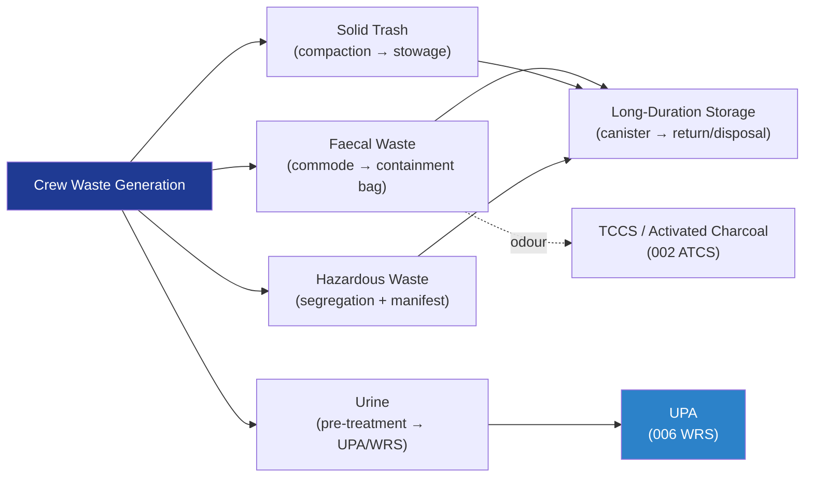

# STA 100-109 · 102-070 — Waste Management and Containment

## 1. Purpose

Defines the **waste management and containment architecture** for crewed space habitats — covering faecal waste, solid waste, hazardous waste, and trash — ensuring hygienic containment, crew health protection, and safe long-term storage or disposal, per ECSS-E-ST-34C[^ecsse34] and NASA-STD-3001 Vol.2[^nastd3001v2].

## 2. Scope

- Covers the *Waste Management and Containment* subsubject (`007`) of subsection `102`.
- Inherits Q-Division authority and ORB support from the parent row in [`../../README.md` §3](../../README.md#3-architecture-table)[^archtable].
- Concepts in scope:
  - **Faecal waste** — microgravity-compatible commode design (air-flow directed containment, 0.08 m/s minimum air velocity), faecal containment bags, biocide treatment, and storage canister sizing per crew × mission duration.
  - **Urine waste** — crew urine pre-treatment (oxalic acid / chromium trioxide), routing to UPA (WRS), and overflow contingency.
  - **Solid/trash management** — compaction factors, dry-mass trash volume accumulation rate (≈ 1.0–1.5 kg/crew-day dry), stowage bag design, and return-to-Earth or disposal policy.
  - **Hazardous waste** — chemical waste segregation (batteries, expired medications, solvents), secondary containment, and manifest tracking.
  - **Biological waste containment** — biobarrier requirements for medical waste, glove-bag procedures, and cross-contamination prevention.
  - **Odour control** — activated-charcoal filter integration with cabin ventilation to suppress odour; interface with ATCS/TCCS.

## 3. Diagram — Waste Management Flow

## 4. Footprint

| Metric | Value |
|---|---|
| Architecture | `STA` — Space Technology Architecture |
| Master range | `100–199` |
| Code range | `100-109` |
| Section | `00` — Sistemas Generales y Soporte Vital Espacial |
| Subsection | `102` — Soporte Vital ECLSS |
| Subsubject | `007` — Waste Management and Containment |
| Primary Q-Division | Q-SPACE[^qdiv] |
| Support Q-Divisions | Q-DATAGOV, Q-HORIZON, Q-HPC, Q-GREENTECH |
| ORB support | ORB-PMO, ORB-LEG |
| Governance class | `baseline`[^gov] |
| Folder path | `Q+ATLANTIDE/100-199_STA/100-109_Sistemas-Generales-y-Soporte-Vital-Espacial/102_Soporte-Vital-ECLSS/` |
| Document | `102-070-Waste-Management-and-Containment.md` (this file) |
| Parent subsection | [`README.md`](./README.md) · [`102-000-General.md`](./102-000-General.md) |
| Parent architecture | [`../../README.md`](../../README.md) |
| Parent baseline | [`organization/Q+ATLANTIDE.md`](../../../../organization/Q+ATLANTIDE.md) |

## 5. References & Citations

[^baseline]: **Q+ATLANTIDE controlled baseline (v1.0.0)** — [`organization/Q+ATLANTIDE.md`](../../../../organization/Q+ATLANTIDE.md). Defines the controlled `000-999` architecture-band taxonomy and the ATLAS-1000 register subpart.

[^archtable]: **STA §3 Architecture Table** — [`../../README.md` §3](../../README.md#3-architecture-table). Authoritative source for the `100-109` row.

[^qdiv]: **Q-Division authority** — Q-Divisions provide technical authority over an architecture row (Q+ATLANTIDE Note N-002). See [`organization/Q+ATLANTIDE.md` §4](../../../../organization/Q+ATLANTIDE.md#4-notes).

[^gov]: **Governance class** — `baseline` denotes documents under controlled change management within the Q+ATLANTIDE baseline.

[^ecsse34]: **ECSS-E-ST-34C Rev.1 — Space Engineering: Environmental Control and Life Support** — European standard for ECLSS design, subsystem interfaces, and test criteria.

[^nasajsc]: **NASA/JSC-65591 — ECLSS Design and Performance Requirements** — NASA design specification for ISS-class ECLSS subsystems, used as the baseline engineering reference.

[^nastd3001v2]: **NASA-STD-3001 Vol.2 — Human Factors, Habitability, and Environmental Health** — Atmosphere and water quality requirements that ECLSS must satisfy.

[^iso14644]: **ISO 14644-1:2015 — Cleanrooms and Associated Controlled Environments** — Applied to atmosphere quality monitoring and contamination control requirements.

[^nasacp]: **NASA/CP-2008-214304 — ECLSS Development and Testing** — ECLSS hardware development and qualification test reference covering all subsystems.

### Applicable industry standards

- ECSS-E-ST-34C Rev.1 — Space Engineering: Environmental Control and Life Support[^ecsse34]
- NASA/JSC-65591 — ECLSS Design and Performance Requirements[^nasajsc]
- NASA-STD-3001 Vol.2 — Human Factors, Habitability, and Environmental Health[^nastd3001v2]
- ISO 14644-1:2015 — Cleanrooms and Associated Controlled Environments[^iso14644]
- NASA/CP-2008-214304 — ECLSS Development and Testing[^nasacp]
