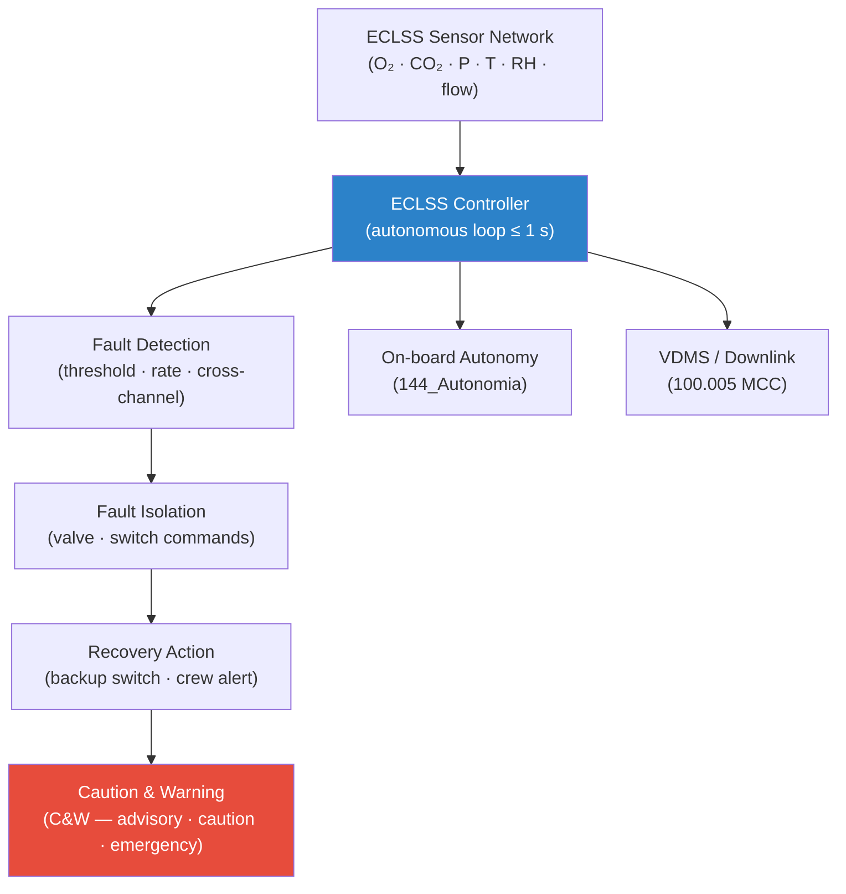

# STA 100-109 · 102-090 — ECLSS Sensors Automation and Fault Detection

## 1. Purpose

Defines the **ECLSS sensor network, automation architecture, and fault detection, isolation and recovery (FDIR)** logic for the life support subsystems, ensuring that anomalies are detected and responded to within crew-safety time constraints, per ECSS-E-ST-34C[^ecsse34] and ANSI/AIAA S-102A.

## 2. Scope

- Covers the *ECLSS Sensors, Automation and Fault Detection* subsubject (`009`) of subsection `102`.
- Inherits Q-Division authority and ORB support from the parent row in [`../../README.md` §3](../../README.md#3-architecture-table)[^archtable].
- Concepts in scope:
  - **Sensor network** — distributed sensors for O₂/CO₂ partial pressure, cabin total pressure, temperature, humidity, flow rates (OGA, WPA, CDRA), and subsystem health indicators; minimum redundancy (2-of-3 voting for life-safety parameters).
  - **Automation architecture** — ECLSS controller (autonomous loop rate ≤ 1 s for critical parameters, ≤ 10 s for non-critical); software state machine per subsystem; interface with on-board autonomy (`144_Autonomia`).
  - **FDIR logic** — fault detection (threshold exceedance, rate-of-change, cross-channel comparison), isolation (subsystem valve/switch commands), and recovery (switch-to-backup, crew alert, ground notification).
  - **Crew alert system** — caution and warning (C&W) interface: advisory, caution, and emergency levels with audible and visual annunciators.
  - **Data bus interface** — ECLSS controller to Vehicle Data Management System (VDMS) via MIL-STD-1553B or SpaceWire; downlink to Mission Control via `100.005`.
  - **Testing and verification** — hardware-in-the-loop (HIL) test requirements, fault injection test campaigns, and on-orbit functional verification.

## 3. Diagram — ECLSS FDIR Architecture

## 4. Footprint

| Metric | Value |
|---|---|
| Architecture | `STA` — Space Technology Architecture |
| Master range | `100–199` |
| Code range | `100-109` |
| Section | `00` — Sistemas Generales y Soporte Vital Espacial |
| Subsection | `102` — Soporte Vital ECLSS |
| Subsubject | `009` — ECLSS Sensors Automation and Fault Detection |
| Primary Q-Division | Q-SPACE[^qdiv] |
| Support Q-Divisions | Q-DATAGOV, Q-HORIZON, Q-HPC, Q-GREENTECH |
| ORB support | ORB-PMO, ORB-LEG |
| Governance class | `baseline`[^gov] |
| Folder path | `Q+ATLANTIDE/100-199_STA/100-109_Sistemas-Generales-y-Soporte-Vital-Espacial/102_Soporte-Vital-ECLSS/` |
| Document | `102-090-ECLSS-Sensors-Automation-and-Fault-Detection.md` (this file) |
| Parent subsection | [`README.md`](./README.md) · [`102-000-General.md`](./102-000-General.md) |
| Parent architecture | [`../../README.md`](../../README.md) |
| Parent baseline | [`organization/Q+ATLANTIDE.md`](../../../../organization/Q+ATLANTIDE.md) |

## 5. References & Citations

[^baseline]: **Q+ATLANTIDE controlled baseline (v1.0.0)** — [`organization/Q+ATLANTIDE.md`](../../../../organization/Q+ATLANTIDE.md). Defines the controlled `000-999` architecture-band taxonomy and the ATLAS-1000 register subpart.

[^archtable]: **STA §3 Architecture Table** — [`../../README.md` §3](../../README.md#3-architecture-table). Authoritative source for the `100-109` row.

[^qdiv]: **Q-Division authority** — Q-Divisions provide technical authority over an architecture row (Q+ATLANTIDE Note N-002). See [`organization/Q+ATLANTIDE.md` §4](../../../../organization/Q+ATLANTIDE.md#4-notes).

[^gov]: **Governance class** — `baseline` denotes documents under controlled change management within the Q+ATLANTIDE baseline.

[^ecsse34]: **ECSS-E-ST-34C Rev.1 — Space Engineering: Environmental Control and Life Support** — European standard for ECLSS design, subsystem interfaces, and test criteria.

[^nasajsc]: **NASA/JSC-65591 — ECLSS Design and Performance Requirements** — NASA design specification for ISS-class ECLSS subsystems, used as the baseline engineering reference.

[^nastd3001v2]: **NASA-STD-3001 Vol.2 — Human Factors, Habitability, and Environmental Health** — Atmosphere and water quality requirements that ECLSS must satisfy.

[^iso14644]: **ISO 14644-1:2015 — Cleanrooms and Associated Controlled Environments** — Applied to atmosphere quality monitoring and contamination control requirements.

[^nasacp]: **NASA/CP-2008-214304 — ECLSS Development and Testing** — ECLSS hardware development and qualification test reference covering all subsystems.

### Applicable industry standards

- ECSS-E-ST-34C Rev.1 — Space Engineering: Environmental Control and Life Support[^ecsse34]
- NASA/JSC-65591 — ECLSS Design and Performance Requirements[^nasajsc]
- NASA-STD-3001 Vol.2 — Human Factors, Habitability, and Environmental Health[^nastd3001v2]
- ISO 14644-1:2015 — Cleanrooms and Associated Controlled Environments[^iso14644]
- NASA/CP-2008-214304 — ECLSS Development and Testing[^nasacp]
