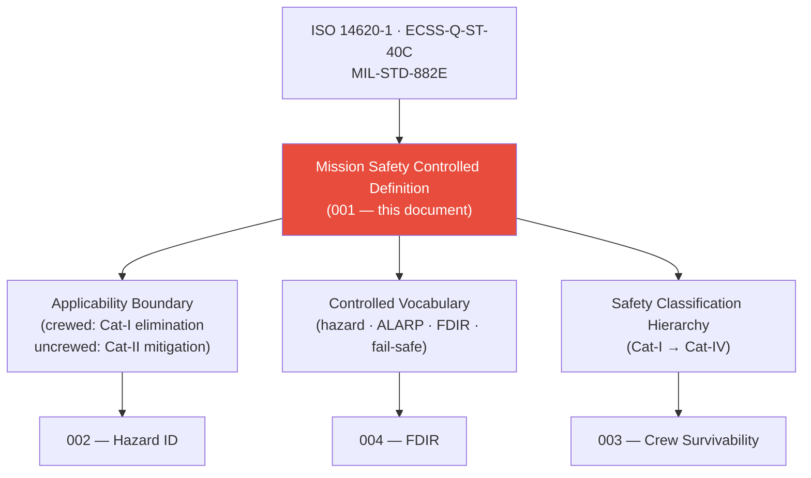

# STA 100-109 · Section 00 · Subsection 103 · Subsubject 001 — Mission Safety Controlled Definition

## 1. Purpose

Establishes the **normative definition and controlled scope of mission safety** for crewed and uncrewed space systems within the Q+ATLANTIDE STA band, defining key terms, applicability limits, and regulatory references per ISO 14620-1[^iso14620] and ECSS-Q-ST-40C[^ecssq40].

## 2. Scope

- Covers the *Mission Safety Controlled Definition* subsubject (`001`) of subsection `103`.
- Inherits Q-Division authority and ORB support from the parent row in [`../../README.md` §3](../../README.md#3-architecture-table)[^archtable].
- Concepts in scope:
  - **Controlled definition** — Mission Safety as the aggregate of design, operational, and organisational measures that ensure the probability of mission-critical hazardous events remains within the accepted risk envelope throughout all lifecycle phases.
  - **Applicability** — all space systems under STA `100–199` authority; crewed missions carry mandatory Catastrophic hazard elimination requirements; uncrewed missions carry Critical hazard mitigation requirements.
  - **Controlled vocabulary** — *hazard*, *mishap*, *risk*, *severity class (Cat-I → Cat-IV)*, *ALARP*, *fail-operational*, *fail-safe*, *FDIR*, *mission assurance*.
  - **Safety classification hierarchy** — Catastrophic (Cat-I, crew fatality), Critical (Cat-II, mission loss), Marginal (Cat-III, partial mission impact), Negligible (Cat-IV) per ISO 14620-1[^iso14620].
  - **Relationship to ECLSS and Habitabilidad** — mission safety provides the top-level safety envelope; `102` (ECLSS) and `101` (Habitabilidad) are demand-side subsystems that must conform to `103` safety boundaries.
  - **Regulatory anchors** — ISO 14620-1[^iso14620], ECSS-Q-ST-40C[^ecssq40], MIL-STD-882E[^milstd882].

## 3. Diagram — Mission Safety Definition Framework

## 4. Footprint

| Metric | Value |
|---|---|
| Architecture | `STA` — Space Technology Architecture |
| Master range | `100–199` |
| Code range | `100-109` |
| Section | `00` — Sistemas Generales y Soporte Vital Espacial |
| Subsection | `103` — Seguridad de Misión |
| Subsubject | `001` — Mission Safety Controlled Definition |
| Primary Q-Division | Q-SPACE[^qdiv] |
| Support Q-Divisions | Q-DATAGOV, Q-HORIZON, Q-HPC, Q-GREENTECH, Q-AIR |
| ORB support | ORB-PMO, ORB-LEG |
| Governance class | `baseline`[^gov] |
| Folder path | `Q+ATLANTIDE/100-199_STA/100-109_Sistemas-Generales-y-Soporte-Vital-Espacial/103_Seguridad-de-Mision/` |
| Document | `001_Mission-Safety-Controlled-Definition.md` (this file) |
| Parent subsection | [`README.md`](./README.md) · [`000_Overview.md`](./000_Overview.md) |
| Parent architecture | [`../../README.md`](../../README.md) |
| Parent baseline | [`organization/Q+ATLANTIDE.md`](../../../../organization/Q+ATLANTIDE.md) |

## 5. References & Citations

[^baseline]: **Q+ATLANTIDE controlled baseline (v1.0.0)** — [`organization/Q+ATLANTIDE.md`](../../../../organization/Q+ATLANTIDE.md). Defines the controlled `000-999` architecture-band taxonomy and the ATLAS-1000 register subpart.

[^archtable]: **STA §3 Architecture Table** — [`../../README.md` §3](../../README.md#3-architecture-table). Authoritative source for the `100-109` row.

[^qdiv]: **Q-Division authority** — Q-Divisions provide technical authority over an architecture row (Q+ATLANTIDE Note N-002). See [`organization/Q+ATLANTIDE.md` §4](../../../../organization/Q+ATLANTIDE.md#4-notes).

[^gov]: **Governance class** — `baseline` denotes documents under controlled change management within the Q+ATLANTIDE baseline.

[^iso14620]: **ISO 14620-1:2018 — Space Systems: Safety Requirements** — International standard for top-level safety requirements and hazard classification for all space missions.

[^ecssq40]: **ECSS-Q-ST-40C — Space Product Assurance: Safety** — European standard governing space-system safety analysis, hazard classification, and product assurance for mission-critical systems.

[^milstd882]: **MIL-STD-882E — System Safety** — US DoD standard providing the system safety programme requirements including hazard identification, risk classification, and FMEA methodology.

[^nastd8739]: **NASA-STD-8739.8 — Software Assurance Standard** — NASA software assurance requirements applicable to FDIR software and mission-safety critical software elements.

[^nasase]: **NASA/SP-2016-6105 Rev.2 — NASA Systems Engineering Handbook** — SE lifecycle and design-review gate criteria applicable to mission safety reviews.

### Applicable industry standards

- ISO 14620-1:2018 — Space Systems: Safety Requirements[^iso14620]
- ECSS-Q-ST-40C — Space Product Assurance: Safety[^ecssq40]
- MIL-STD-882E — System Safety[^milstd882]
- NASA-STD-8739.8 — Software Assurance Standard[^nastd8739]
- NASA/SP-2016-6105 Rev.2 — NASA Systems Engineering Handbook[^nasase]
