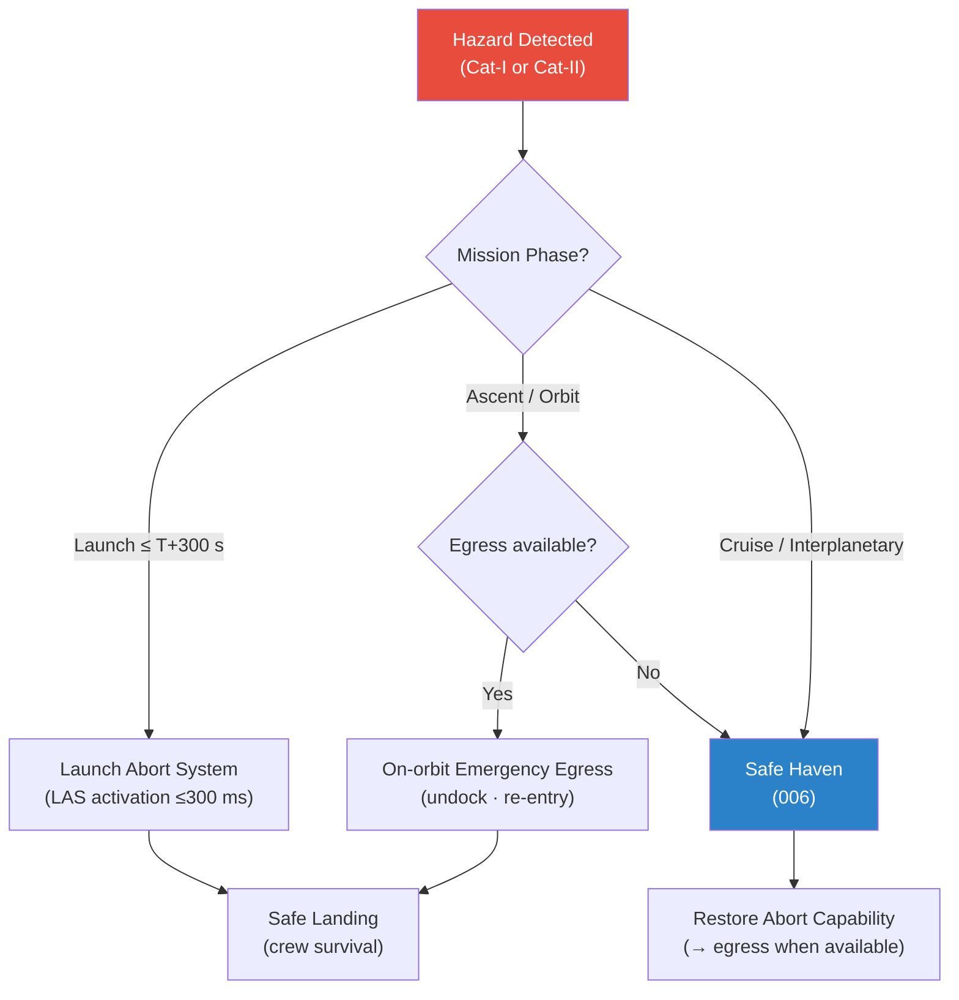

# STA 100-109 · Section 00 · Subsection 103 · Subsubject 005 — Abort, Escape and Contingency Modes

## 1. Purpose

Defines the **abort, escape and contingency operational modes** for STA missions — specifying the design requirements for launch abort systems, on-orbit emergency egress, and contingency mission sequences that protect the crew when primary mission continuation is no longer safe, per ISO 14620-1[^iso14620].

## 2. Scope

- Covers the *Abort, Escape and Contingency Modes* subsubject (`005`) of subsection `103`.
- Inherits Q-Division authority and ORB support from the parent row in [`../../README.md` §3](../../README.md#3-architecture-table)[^archtable].
- Concepts in scope:
  - **Launch abort modes** — Launch Abort System (LAS) design requirements: pad abort, low-altitude abort, high-altitude abort, and nominal jettison; activation time ≤ 300 ms from abort command.
  - **On-orbit emergency egress** — crew-vehicle separation (escape pod or emergency undocking), re-entry vehicle return capability, emergency re-entry trajectory constraints.
  - **Mission abort modes** — Return-to-Earth (RTE) profile, orbit-lowering contingency sequences, emergency power-only configuration.
  - **Abort mode decision logic** — crew authority vs. ground authority vs. autonomous abort; abort-mode selection criteria (altitude, velocity, energy) per mission phase.
  - **Contingency timeline** — time-from-detection-to-crew-safety requirements: launch abort ≤ 5 min from pad, on-orbit egress ≤ 60 min from abort command.
  - **Abort interface with safe haven** — when abort is not immediately available, crew falls back to safe-haven mode (`006`) until abort capability is restored.

## 3. Diagram — Abort and Contingency Mode Decision

## 4. Footprint

| Metric | Value |
|---|---|
| Architecture | `STA` — Space Technology Architecture |
| Master range | `100–199` |
| Code range | `100-109` |
| Section | `00` — Sistemas Generales y Soporte Vital Espacial |
| Subsection | `103` — Seguridad de Misión |
| Subsubject | `005` — Abort Escape and Contingency Modes |
| Primary Q-Division | Q-SPACE[^qdiv] |
| Support Q-Divisions | Q-DATAGOV, Q-HORIZON, Q-HPC, Q-GREENTECH, Q-AIR |
| ORB support | ORB-PMO, ORB-LEG |
| Governance class | `baseline`[^gov] |
| Folder path | `Q+ATLANTIDE/100-199_STA/100-109_Sistemas-Generales-y-Soporte-Vital-Espacial/103_Seguridad-de-Mision/` |
| Document | `005_Abort-Escape-and-Contingency-Modes.md` (this file) |
| Parent subsection | [`README.md`](./README.md) · [`000_Overview.md`](./000_Overview.md) |
| Parent architecture | [`../../README.md`](../../README.md) |
| Parent baseline | [`organization/Q+ATLANTIDE.md`](../../../../organization/Q+ATLANTIDE.md) |

## 5. References & Citations

[^baseline]: **Q+ATLANTIDE controlled baseline (v1.0.0)** — [`organization/Q+ATLANTIDE.md`](../../../../organization/Q+ATLANTIDE.md). Defines the controlled `000-999` architecture-band taxonomy and the ATLAS-1000 register subpart.

[^archtable]: **STA §3 Architecture Table** — [`../../README.md` §3](../../README.md#3-architecture-table). Authoritative source for the `100-109` row.

[^qdiv]: **Q-Division authority** — Q-Divisions provide technical authority over an architecture row (Q+ATLANTIDE Note N-002). See [`organization/Q+ATLANTIDE.md` §4](../../../../organization/Q+ATLANTIDE.md#4-notes).

[^gov]: **Governance class** — `baseline` denotes documents under controlled change management within the Q+ATLANTIDE baseline.

[^iso14620]: **ISO 14620-1:2018 — Space Systems: Safety Requirements** — International standard for top-level safety requirements and hazard classification for all space missions.

[^ecssq40]: **ECSS-Q-ST-40C — Space Product Assurance: Safety** — European standard governing space-system safety analysis, hazard classification, and product assurance for mission-critical systems.

[^milstd882]: **MIL-STD-882E — System Safety** — US DoD standard providing the system safety programme requirements including hazard identification, risk classification, and FMEA methodology.

[^nastd8739]: **NASA-STD-8739.8 — Software Assurance Standard** — NASA software assurance requirements applicable to FDIR software and mission-safety critical software elements.

[^nasase]: **NASA/SP-2016-6105 Rev.2 — NASA Systems Engineering Handbook** — SE lifecycle and design-review gate criteria applicable to mission safety reviews.

### Applicable industry standards

- ISO 14620-1:2018 — Space Systems: Safety Requirements[^iso14620]
- ECSS-Q-ST-40C — Space Product Assurance: Safety[^ecssq40]
- MIL-STD-882E — System Safety[^milstd882]
- NASA-STD-8739.8 — Software Assurance Standard[^nastd8739]
- NASA/SP-2016-6105 Rev.2 — NASA Systems Engineering Handbook[^nasase]
