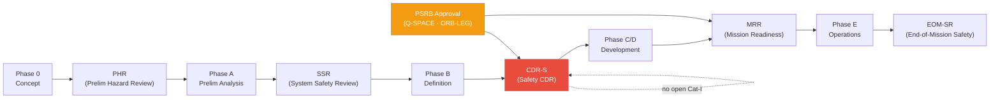

# STA 100-109 · Section 00 · Subsection 103 · Subsubject 008 — Mission Assurance Reviews and Gate Criteria

## 1. Purpose

Defines the **mission assurance review sequence and safety gate entry/exit criteria** for STA missions — mapping safety reviews to lifecycle phases and establishing the evidence obligations that must be satisfied before advancing past each gate, per NASA/SP-2016-6105[^nasase] and ECSS-Q-ST-40C[^ecssq40].

## 2. Scope

- Covers the *Mission Assurance Reviews and Gate Criteria* subsubject (`008`) of subsection `103`.
- Inherits Q-Division authority and ORB support from the parent row in [`../../README.md` §3](../../README.md#3-architecture-table)[^archtable].
- Concepts in scope:
  - **Review sequence** — Preliminary Hazard Review (PHR) at Phase A, System Safety Review (SSR) at Phase B, Safety Critical Design Review (CDR-S) at Phase C, Mission Readiness Review (MRR) at Phase E, End-of-Mission Safety Review (EOM-SR) at Phase F.
  - **Entry criteria** — minimum documentation set, open-hazard log status, FMEA completion threshold, and pending Cat-I risk waivers (none permitted at CDR-S entry).
  - **Exit criteria** — closure of all Cat-I/II action items, signed safety assessments, FMEA completion certificate, and PSRB approval.
  - **Review authority** — PSRB (Programme Safety Review Board) chaired by Q-SPACE; ORB-LEG reviews legal compliance for Cat-I residual risk acceptance; Q-DATAGOV reviews data-assurance evidence.
  - **Evidence package requirements** — hazard log, FMEA/FMECA report, FTA report, FDIR verification report, redundancy assessment, and safety assessment report per ECSS-Q-ST-40C[^ecssq40].
  - **Safety gate interface with lifecycle governance** — safety gates are subsets of the full lifecycle review gates defined in `100.006`; safety gate closure is a mandatory input to lifecycle gate exit.

## 3. Diagram — Safety Review Gate Sequence

## 4. Footprint

| Metric | Value |
|---|---|
| Architecture | `STA` — Space Technology Architecture |
| Master range | `100–199` |
| Code range | `100-109` |
| Section | `00` — Sistemas Generales y Soporte Vital Espacial |
| Subsection | `103` — Seguridad de Misión |
| Subsubject | `008` — Mission Assurance Reviews and Gate Criteria |
| Primary Q-Division | Q-SPACE[^qdiv] |
| Support Q-Divisions | Q-DATAGOV, Q-HORIZON, Q-HPC, Q-GREENTECH, Q-AIR |
| ORB support | ORB-PMO, ORB-LEG |
| Governance class | `baseline`[^gov] |
| Folder path | `Q+ATLANTIDE/100-199_STA/100-109_Sistemas-Generales-y-Soporte-Vital-Espacial/103_Seguridad-de-Mision/` |
| Document | `008_Mission-Assurance-Reviews-and-Gate-Criteria.md` (this file) |
| Parent subsection | [`README.md`](./README.md) · [`000_Overview.md`](./000_Overview.md) |
| Parent architecture | [`../../README.md`](../../README.md) |
| Parent baseline | [`organization/Q+ATLANTIDE.md`](../../../../organization/Q+ATLANTIDE.md) |

## 5. References & Citations

[^baseline]: **Q+ATLANTIDE controlled baseline (v1.0.0)** — [`organization/Q+ATLANTIDE.md`](../../../../organization/Q+ATLANTIDE.md). Defines the controlled `000-999` architecture-band taxonomy and the ATLAS-1000 register subpart.

[^archtable]: **STA §3 Architecture Table** — [`../../README.md` §3](../../README.md#3-architecture-table). Authoritative source for the `100-109` row.

[^qdiv]: **Q-Division authority** — Q-Divisions provide technical authority over an architecture row (Q+ATLANTIDE Note N-002). See [`organization/Q+ATLANTIDE.md` §4](../../../../organization/Q+ATLANTIDE.md#4-notes).

[^gov]: **Governance class** — `baseline` denotes documents under controlled change management within the Q+ATLANTIDE baseline.

[^iso14620]: **ISO 14620-1:2018 — Space Systems: Safety Requirements** — International standard for top-level safety requirements and hazard classification for all space missions.

[^ecssq40]: **ECSS-Q-ST-40C — Space Product Assurance: Safety** — European standard governing space-system safety analysis, hazard classification, and product assurance for mission-critical systems.

[^milstd882]: **MIL-STD-882E — System Safety** — US DoD standard providing the system safety programme requirements including hazard identification, risk classification, and FMEA methodology.

[^nastd8739]: **NASA-STD-8739.8 — Software Assurance Standard** — NASA software assurance requirements applicable to FDIR software and mission-safety critical software elements.

[^nasase]: **NASA/SP-2016-6105 Rev.2 — NASA Systems Engineering Handbook** — SE lifecycle and design-review gate criteria applicable to mission safety reviews.

### Applicable industry standards

- ISO 14620-1:2018 — Space Systems: Safety Requirements[^iso14620]
- ECSS-Q-ST-40C — Space Product Assurance: Safety[^ecssq40]
- MIL-STD-882E — System Safety[^milstd882]
- NASA-STD-8739.8 — Software Assurance Standard[^nastd8739]
- NASA/SP-2016-6105 Rev.2 — NASA Systems Engineering Handbook[^nasase]
