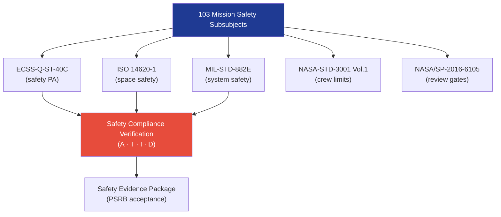

# STA 100-109 · Section 00 · Subsection 103 · Subsubject 009 — ECSS / NASA / CCSDS Safety Standards Mapping

## 1. Purpose

Provides the **safety-specific standards cross-reference** mapping ECSS, NASA, MIL-STD, ISO, and CCSDS safety standards to the STA `103` mission-safety subsubjects, ensuring each safety module cites the correct normative hierarchy.

## 2. Scope

- Covers the *ECSS / NASA / CCSDS Safety Standards Mapping* subsubject (`009`) of subsection `103`.
- Inherits Q-Division authority and ORB support from the parent row in [`../../README.md` §3](../../README.md#3-architecture-table)[^archtable].
- Concepts in scope:
  - **ECSS safety mapping** — ECSS-Q-ST-40C (Product Assurance Safety), ECSS-E-ST-10-12C (Methods for Product Assurance), ECSS-M-ST-10C (Risk Assessment).
  - **NASA safety mapping** — NASA-STD-8719.13 (Software Safety), NASA-STD-8739.8 (Software Assurance), NASA/SP-2016-6105 (SE Handbook, safety gates), NASA-STD-3001 (crew safety limits).
  - **MIL-STD mapping** — MIL-STD-882E (System Safety), MIL-STD-1629A (FMEA), MIL-HDBK-338B (Electronic Reliability Design Handbook).
  - **ISO mapping** — ISO 14620-1 (Space Systems Safety), ISO 24113 (Space Debris), ISO 31000 (Risk Management).
  - **Standards traceability matrix** — tabular cross-reference of each `103` subsubject to primary and supporting standards, used as input to safety evidence package.

| Subsubject | Primary Standards | Supporting Standards |
|---|---|---|
| 001 Safety Definition | ISO 14620-1, ECSS-Q-ST-40C | MIL-STD-882E |
| 002 Hazard ID / Risk | ISO 14620-1, MIL-STD-882E | ECSS-M-ST-10C |
| 003 Crew Survivability | NASA-STD-3001 Vol.1 | ISO 14620-1 |
| 004 FDIR | ECSS-Q-ST-40C | ANSI/AIAA S-102A, MIL-STD-882E |
| 005 Abort/Escape | ISO 14620-1, NASA-STD-8719.13 | MIL-STD-882E |
| 006 Safe Haven | ISO 14620-1 | ECSS-Q-ST-40C |
| 007 Redundancy | ECSS-Q-ST-40C, MIL-STD-882E | MIL-STD-1629A |
| 008 Assurance Reviews | NASA/SP-2016-6105, ECSS-Q-ST-40C | ECSS-M-ST-10C |
| 010 Traceability | ECSS-Q-ST-40C | NASA-STD-8739.8 |

## 3. Diagram — Safety Standards Hierarchy

## 4. Footprint

| Metric | Value |
|---|---|
| Architecture | `STA` — Space Technology Architecture |
| Master range | `100–199` |
| Code range | `100-109` |
| Section | `00` — Sistemas Generales y Soporte Vital Espacial |
| Subsection | `103` — Seguridad de Misión |
| Subsubject | `009` — ECSS NASA CCSDS Safety Standards Mapping |
| Primary Q-Division | Q-SPACE[^qdiv] |
| Support Q-Divisions | Q-DATAGOV, Q-HORIZON, Q-HPC, Q-GREENTECH, Q-AIR |
| ORB support | ORB-PMO, ORB-LEG |
| Governance class | `baseline`[^gov] |
| Folder path | `Q+ATLANTIDE/100-199_STA/100-109_Sistemas-Generales-y-Soporte-Vital-Espacial/103_Seguridad-de-Mision/` |
| Document | `009_ECSS-NASA-CCSDS-Safety-Standards-Mapping.md` (this file) |
| Parent subsection | [`README.md`](./README.md) · [`000_Overview.md`](./000_Overview.md) |
| Parent architecture | [`../../README.md`](../../README.md) |
| Parent baseline | [`organization/Q+ATLANTIDE.md`](../../../../organization/Q+ATLANTIDE.md) |

## 5. References & Citations

[^baseline]: **Q+ATLANTIDE controlled baseline (v1.0.0)** — [`organization/Q+ATLANTIDE.md`](../../../../organization/Q+ATLANTIDE.md). Defines the controlled `000-999` architecture-band taxonomy and the ATLAS-1000 register subpart.

[^archtable]: **STA §3 Architecture Table** — [`../../README.md` §3](../../README.md#3-architecture-table). Authoritative source for the `100-109` row.

[^qdiv]: **Q-Division authority** — Q-Divisions provide technical authority over an architecture row (Q+ATLANTIDE Note N-002). See [`organization/Q+ATLANTIDE.md` §4](../../../../organization/Q+ATLANTIDE.md#4-notes).

[^gov]: **Governance class** — `baseline` denotes documents under controlled change management within the Q+ATLANTIDE baseline.

[^iso14620]: **ISO 14620-1:2018 — Space Systems: Safety Requirements** — International standard for top-level safety requirements and hazard classification for all space missions.

[^ecssq40]: **ECSS-Q-ST-40C — Space Product Assurance: Safety** — European standard governing space-system safety analysis, hazard classification, and product assurance for mission-critical systems.

[^milstd882]: **MIL-STD-882E — System Safety** — US DoD standard providing the system safety programme requirements including hazard identification, risk classification, and FMEA methodology.

[^nastd8739]: **NASA-STD-8739.8 — Software Assurance Standard** — NASA software assurance requirements applicable to FDIR software and mission-safety critical software elements.

[^nasase]: **NASA/SP-2016-6105 Rev.2 — NASA Systems Engineering Handbook** — SE lifecycle and design-review gate criteria applicable to mission safety reviews.

### Applicable industry standards

- ISO 14620-1:2018 — Space Systems: Safety Requirements[^iso14620]
- ECSS-Q-ST-40C — Space Product Assurance: Safety[^ecssq40]
- MIL-STD-882E — System Safety[^milstd882]
- NASA-STD-8739.8 — Software Assurance Standard[^nastd8739]
- NASA/SP-2016-6105 Rev.2 — NASA Systems Engineering Handbook[^nasase]
