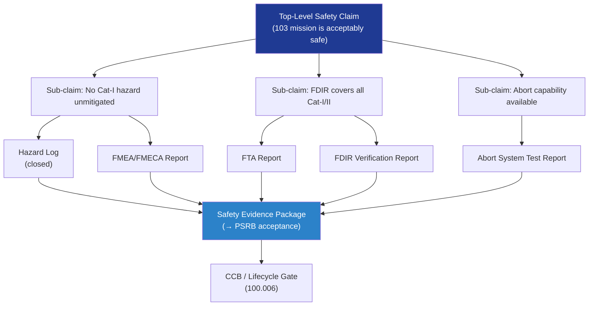

# STA 100-109 · Section 00 · Subsection 103 · Subsubject 010 — Traceability, Evidence and Lifecycle Governance

## 1. Purpose

Provides the **safety-case traceability, evidence-package structure, and lifecycle governance rules** for subsection `103` *Seguridad de Misión*, declaring the controlled document hierarchy, change authority, and assurance evidence requirements for this mission-safety-critical subsystem.

## 2. Scope

- Covers the *Traceability, Evidence and Lifecycle Governance* subsubject (`010`) of subsection `103`.
- Inherits Q-Division authority and ORB support from the parent row in [`../../README.md` §3](../../README.md#3-architecture-table)[^archtable].
- Concepts in scope:
  - **Safety case structure** — argument-evidence framework (Goal Structuring Notation — GSN or assurance case per ECSS-Q-ST-40C[^ecssq40]) with top-level safety claim, sub-claims, argument, and evidence nodes.
  - **Evidence package** — minimum evidence set: hazard log (closed), FMEA/FMECA report, FTA report, FDIR verification report, redundancy assessment, independent safety review minutes, and signed safety assessment report.
  - **Change authority matrix** — Cat-I safety-relevant changes require PSRB + Q-SPACE + ORB-LEG sign-off; Cat-II changes require Q-SPACE sign-off; all changes controlled through `100.006` lifecycle governance.
  - **Safety traceability to requirements** — every safety requirement in `103` traced to source standard (ISO 14620-1, ECSS-Q-ST-40C, NASA-STD-3001) and to the verification record in the evidence package.
  - **Linked nodes** — `100_Arquitectura-General-Espacial`, `101_Habitabilidad`, `102_Soporte-Vital-ECLSS` per node YAML.
  - **No-AAA Rule compliance** — confirmation that no safety-critical module uses "AAA" as an identifier per Q+ATLANTIDE Note N-004.
  - **Lifecycle governance interface** — `103` safety gates are integrated into the STA lifecycle gate sequence (`100.006`); a safety-gate-open state blocks lifecycle gate advancement.

## 3. Diagram — Safety Case and Evidence Flow

## 4. Footprint

| Metric | Value |
|---|---|
| Architecture | `STA` — Space Technology Architecture |
| Master range | `100–199` |
| Code range | `100-109` |
| Section | `00` — Sistemas Generales y Soporte Vital Espacial |
| Subsection | `103` — Seguridad de Misión |
| Subsubject | `010` — Traceability Evidence and Lifecycle Governance |
| Primary Q-Division | Q-SPACE[^qdiv] |
| Support Q-Divisions | Q-DATAGOV, Q-HORIZON, Q-HPC, Q-GREENTECH, Q-AIR |
| ORB support | ORB-PMO, ORB-LEG |
| Governance class | `baseline`[^gov] |
| Folder path | `Q+ATLANTIDE/100-199_STA/100-109_Sistemas-Generales-y-Soporte-Vital-Espacial/103_Seguridad-de-Mision/` |
| Document | `010_Traceability-Evidence-and-Lifecycle-Governance.md` (this file) |
| Parent subsection | [`README.md`](./README.md) · [`000_Overview.md`](./000_Overview.md) |
| Parent architecture | [`../../README.md`](../../README.md) |
| Parent baseline | [`organization/Q+ATLANTIDE.md`](../../../../organization/Q+ATLANTIDE.md) |

## 5. References & Citations

[^baseline]: **Q+ATLANTIDE controlled baseline (v1.0.0)** — [`organization/Q+ATLANTIDE.md`](../../../../organization/Q+ATLANTIDE.md). Defines the controlled `000-999` architecture-band taxonomy and the ATLAS-1000 register subpart.

[^archtable]: **STA §3 Architecture Table** — [`../../README.md` §3](../../README.md#3-architecture-table). Authoritative source for the `100-109` row.

[^qdiv]: **Q-Division authority** — Q-Divisions provide technical authority over an architecture row (Q+ATLANTIDE Note N-002). See [`organization/Q+ATLANTIDE.md` §4](../../../../organization/Q+ATLANTIDE.md#4-notes).

[^gov]: **Governance class** — `baseline` denotes documents under controlled change management within the Q+ATLANTIDE baseline.

[^iso14620]: **ISO 14620-1:2018 — Space Systems: Safety Requirements** — International standard for top-level safety requirements and hazard classification for all space missions.

[^ecssq40]: **ECSS-Q-ST-40C — Space Product Assurance: Safety** — European standard governing space-system safety analysis, hazard classification, and product assurance for mission-critical systems.

[^milstd882]: **MIL-STD-882E — System Safety** — US DoD standard providing the system safety programme requirements including hazard identification, risk classification, and FMEA methodology.

[^nastd8739]: **NASA-STD-8739.8 — Software Assurance Standard** — NASA software assurance requirements applicable to FDIR software and mission-safety critical software elements.

[^nasase]: **NASA/SP-2016-6105 Rev.2 — NASA Systems Engineering Handbook** — SE lifecycle and design-review gate criteria applicable to mission safety reviews.

### Applicable industry standards

- ISO 14620-1:2018 — Space Systems: Safety Requirements[^iso14620]
- ECSS-Q-ST-40C — Space Product Assurance: Safety[^ecssq40]
- MIL-STD-882E — System Safety[^milstd882]
- NASA-STD-8739.8 — Software Assurance Standard[^nastd8739]
- NASA/SP-2016-6105 Rev.2 — NASA Systems Engineering Handbook[^nasase]
