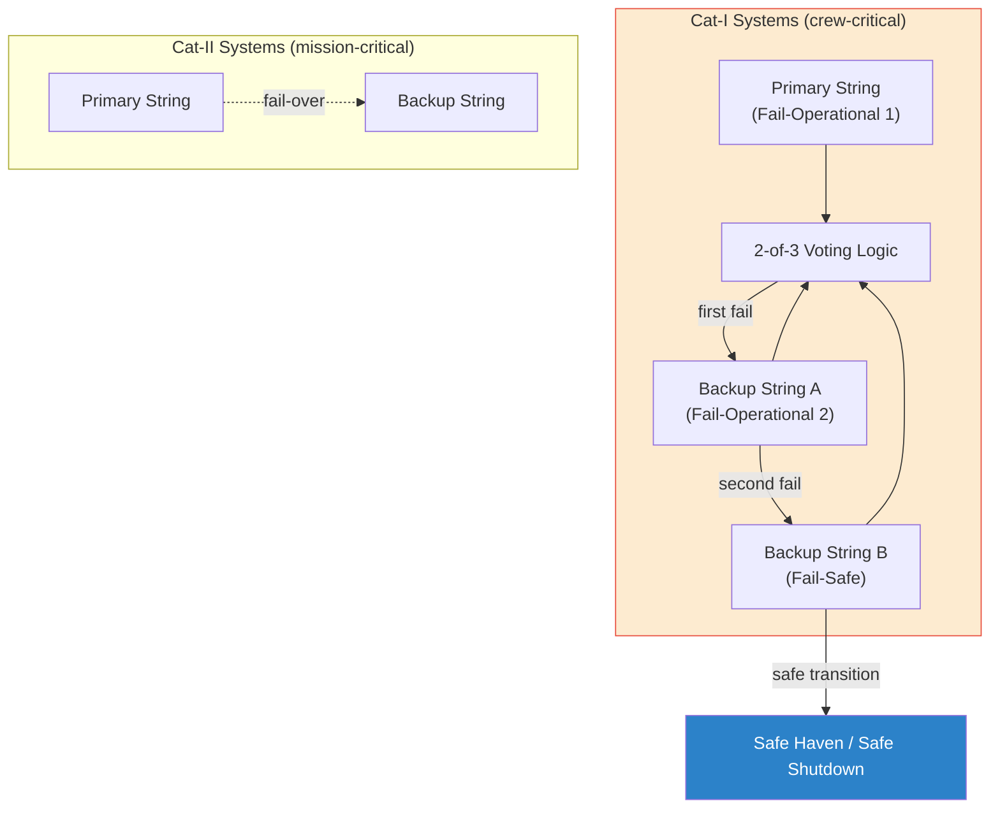

# STA 100-109 · 103-070 — Redundancy Fail Operational and Fail Safe Architecture

## 1. Purpose

Defines the **redundancy design philosophy and fail-operational/fail-safe architecture requirements** for mission-safety-critical systems within the STA band, establishing the minimum redundancy levels, single-point failure elimination rules, and cross-strapping requirements, per ECSS-Q-ST-40C[^ecssq40] and MIL-STD-882E[^milstd882].

## 2. Scope

- Covers the *Redundancy, Fail-Operational and Fail-Safe Architecture* subsubject (`007`) of subsection `103`.
- Inherits Q-Division authority and ORB support from the parent row in [`../../README.md` §3](../../README.md#3-architecture-table)[^archtable].
- Concepts in scope:
  - **Fail-operational / fail-safe definitions** — Fail-Operational (FO): after first failure, full mission continuation possible; Fail-Safe (FS): after first failure, safe shutdown or safe-haven transition; FO/FO/FS for Cat-I crewed systems.
  - **Single-point failure elimination** — no Cat-I hazardous condition may result from a single failure; Single Point of Failure (SPOF) register maintained per subsystem.
  - **Redundancy levels** — Cat-I systems require ≥ 2x physical redundancy with independent actuation; Cat-II systems require ≥ 2x logical redundancy; Cat-III systems require 2-fault tolerance at minimum.
  - **Cross-strapping** — cross-strapping between primary and backup subsystem chains for power, data, and functional paths; voting logic requirements (2-of-3 for life-safety parameters).
  - **Redundancy management** — automatic vs. crew-commanded switchover; switchover time requirements (≤ 1 s for Cat-I autonomous; ≤ 30 s for crew-commanded).
  - **Design verification** — FMEA/FMECA methodology per MIL-STD-882E[^milstd882]; fault-tree analysis (FTA) for Cat-I hazards; reliability allocation to system level.

## 3. Diagram — Fail-Operational / Fail-Safe Hierarchy

## 4. Footprint

| Metric | Value |
|---|---|
| Architecture | `STA` — Space Technology Architecture |
| Master range | `100–199` |
| Code range | `100-109` |
| Section | `00` — Sistemas Generales y Soporte Vital Espacial |
| Subsection | `103` — Seguridad de Misión |
| Subsubject | `007` — Redundancy Fail-Operational and Fail-Safe Architecture |
| Primary Q-Division | Q-SPACE[^qdiv] |
| Support Q-Divisions | Q-DATAGOV, Q-HORIZON, Q-HPC, Q-GREENTECH, Q-AIR |
| ORB support | ORB-PMO, ORB-LEG |
| Governance class | `baseline`[^gov] |
| Folder path | `Q+ATLANTIDE/100-199_STA/100-109_Sistemas-Generales-y-Soporte-Vital-Espacial/103_Seguridad-de-Mision/` |
| Document | `103-070-Redundancy-Fail-Operational-and-Fail-Safe-Architecture.md` (this file) |
| Parent subsection | [`README.md`](./README.md) · [`103-000-General.md`](./103-000-General.md) |
| Parent architecture | [`../../README.md`](../../README.md) |
| Parent baseline | [`organization/Q+ATLANTIDE.md`](../../../../organization/Q+ATLANTIDE.md) |

## 5. References & Citations

[^baseline]: **Q+ATLANTIDE controlled baseline (v1.0.0)** — [`organization/Q+ATLANTIDE.md`](../../../../organization/Q+ATLANTIDE.md). Defines the controlled `000-999` architecture-band taxonomy and the ATLAS-1000 register subpart.

[^archtable]: **STA §3 Architecture Table** — [`../../README.md` §3](../../README.md#3-architecture-table). Authoritative source for the `100-109` row.

[^qdiv]: **Q-Division authority** — Q-Divisions provide technical authority over an architecture row (Q+ATLANTIDE Note N-002). See [`organization/Q+ATLANTIDE.md` §4](../../../../organization/Q+ATLANTIDE.md#4-notes).

[^gov]: **Governance class** — `baseline` denotes documents under controlled change management within the Q+ATLANTIDE baseline.

[^iso14620]: **ISO 14620-1:2018 — Space Systems: Safety Requirements** — International standard for top-level safety requirements and hazard classification for all space missions.

[^ecssq40]: **ECSS-Q-ST-40C — Space Product Assurance: Safety** — European standard governing space-system safety analysis, hazard classification, and product assurance for mission-critical systems.

[^milstd882]: **MIL-STD-882E — System Safety** — US DoD standard providing the system safety programme requirements including hazard identification, risk classification, and FMEA methodology.

[^nastd8739]: **NASA-STD-8739.8 — Software Assurance Standard** — NASA software assurance requirements applicable to FDIR software and mission-safety critical software elements.

[^nasase]: **NASA/SP-2016-6105 Rev.2 — NASA Systems Engineering Handbook** — SE lifecycle and design-review gate criteria applicable to mission safety reviews.

### Applicable industry standards

- ISO 14620-1:2018 — Space Systems: Safety Requirements[^iso14620]
- ECSS-Q-ST-40C — Space Product Assurance: Safety[^ecssq40]
- MIL-STD-882E — System Safety[^milstd882]
- NASA-STD-8739.8 — Software Assurance Standard[^nastd8739]
- NASA/SP-2016-6105 Rev.2 — NASA Systems Engineering Handbook[^nasase]
