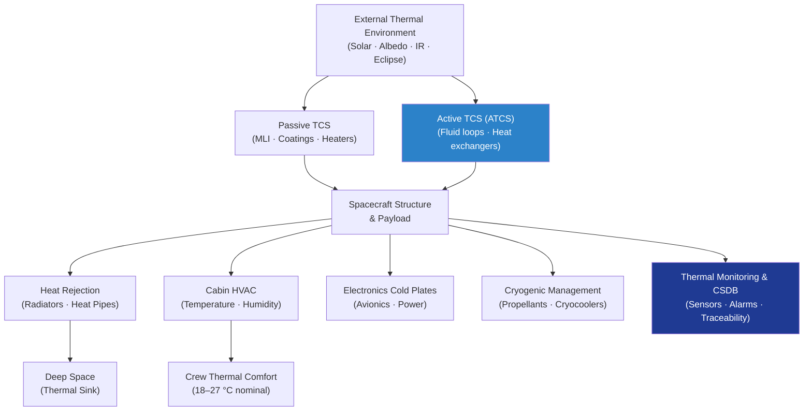

# STA 100-109 · 104-000 — General

## 1. Purpose

Overview entry-point for the *Gestión Térmica y Control Ambiental* subsection within the `100-109` code range (Section `00` — *Sistemas Generales y Soporte Vital Espacial*) of the **STA** architecture band (*Space Technology Architecture*, master range `100–199`).

This subsubject (`000 Overview`) introduces the STA 100-109.104 slice and links it to the controlled Q+ATLANTIDE baseline[^baseline]. Thermal control is a mission-critical spacecraft function: the space environment imposes extreme thermal loads on all exposed surfaces (solar flux up to 1414 W/m² in LEO, near-zero Kelvin deep-space sink), and the spacecraft must maintain all hardware and crew within operational temperature bounds throughout the mission lifecycle.

The framework establishes the Thermal Control Subsystem (TCS) — controlled definition, external environment characterisation, passive control (MLI, coatings), active thermal control loops (ATCS), heat rejection radiators and heat pipes, cabin HVAC, electronics cold-plate dissipation, cryogenic management, and thermal monitoring/traceability — governing all thermal design activities within the Q+ATLANTIDE crewed-space programme[^ecsse31].

## 2. Scope

- Covers the *Gestión Térmica y Control Ambiental* slice of the parent code range `100-109`.
- Inherits Q-Division authority and ORB support from the parent row in [`../../README.md` §3](../../README.md#3-architecture-table)[^archtable].
- Subsubjects `010`–`090` extend this Overview; all are indexed in [`README.md`](./README.md).
- Concepts in scope across the subsection:
  - **Thermal Control Controlled Definition** (`010`) — normative TCS scope, acronyms, and controlled vocabulary per ECSS-E-ST-31C[^ecsse31].
  - **External Thermal Environment and Solar Flux** (`020`) — solar constant, albedo, planetary IR, eclipse modelling, and worst-case hot/cold environment definition.
  - **Passive Thermal Control — MLI and Surface Coatings** (`030`) — multi-layer insulation design, optical surface properties (α/ε), and degradation modelling.
  - **Active Thermal Control — ATCS Loops** (`040`) — single-phase and two-phase fluid loops, pumped coolant loop design, and interface heat exchangers.
  - **Heat Rejection — Radiators and Heat Pipes** (`050`) — deployed and body-mounted radiators, variable conductance heat pipes (VCHP), and loop heat pipes (LHP).
  - **Cabin HVAC and Temperature Distribution** (`060`) — air temperature regulation, humidity control, and cabin thermal comfort per NASA-STD-3001[^nastd3001].
  - **Electronics Thermal Dissipation and Cold Plates** (`070`) — avionics cold-plate design, junction-to-coolant thermal resistance, and electronics thermal margin management.
  - **Cryogenic and Low Temperature Thermal Management** (`080`) — propellant storage insulation, cryocooler integration, and boil-off management.
  - **Thermal Monitoring, Alarms and CSDB Traceability** (`090`) — sensor network, thermal alarm thresholds, and S1000D/CSDB evidence traceability.

## 3. Diagram — TCS Subsystem Architecture Overview

## 4. Footprint

| Metric | Value |
|---|---|
| Architecture | `STA` — Space Technology Architecture |
| Master range | `100–199` |
| Code range | `100-109` |
| Section | `00` — Sistemas Generales y Soporte Vital Espacial |
| Subsection | `104` — Gestión Térmica y Control Ambiental |
| Subsubject | `000` — General |
| Primary Q-Division | Q-SPACE[^qdiv] |
| Support Q-Divisions | Q-DATAGOV, Q-HORIZON, Q-HPC, Q-GREENTECH |
| ORB support | ORB-PMO, ORB-LEG |
| Governance class | `baseline`[^gov] |
| Folder path | `Q+ATLANTIDE/100-199_STA/100-109_Sistemas-Generales-y-Soporte-Vital-Espacial/104_Gestion-Termica-y-Control-Ambiental/` |
| Document | `104-000-General.md` (this file) |
| Parent subsection | [`README.md`](./README.md) |
| Parent architecture | [`../../README.md`](../../README.md) |
| Parent baseline | [`organization/Q+ATLANTIDE.md`](../../../../organization/Q+ATLANTIDE.md) |

## 5. References & Citations

[^baseline]: **Q+ATLANTIDE controlled baseline (v1.0.0)** — [`organization/Q+ATLANTIDE.md`](../../../../organization/Q+ATLANTIDE.md).

[^archtable]: **STA §3 Architecture Table** — [`../../README.md` §3](../../README.md#3-architecture-table).

[^qdiv]: **Q-Division authority** — See [`organization/Q+ATLANTIDE.md` §4](../../../../organization/Q+ATLANTIDE.md#4-notes).

[^gov]: **Governance class** — `baseline` denotes documents under controlled change management.

[^ecsse31]: **ECSS-E-ST-31C — Space Engineering: Thermal Control** — European standard governing spacecraft TCS design, analysis methods, and verification requirements.

[^nastd3001]: **NASA-STD-3001 Vol.2 — Human Factors, Habitability, and Environmental Health** — Crew thermal comfort and cabin temperature requirements.

[^nasatm]: **NASA/TM-2015-218830 — Thermal Control Technology Roadmap** — NASA technology roadmap for spacecraft thermal control systems, including passive and active technologies.

[^aiaa]: **AIAA S-117-2010 — Space Systems Thermal Control** — AIAA standard covering thermal analysis methods and design requirements for space systems.

### Applicable industry standards

- ECSS-E-ST-31C — Space Engineering: Thermal Control[^ecsse31]
- NASA-STD-3001 Vol.2 — Human Factors, Habitability, and Environmental Health[^nastd3001]
- NASA/TM-2015-218830 — Thermal Control Technology Roadmap[^nasatm]
- AIAA S-117-2010 — Space Systems Thermal Control[^aiaa]
