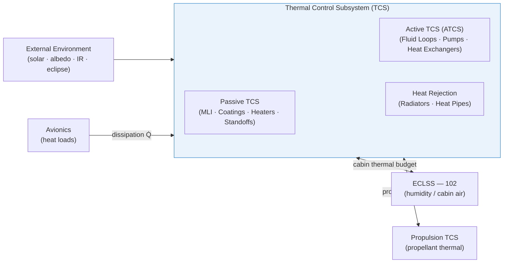

# STA 100-109 · 104-010 — Thermal Control Controlled Definition

## 1. Purpose

Establishes the **controlled normative definition** of the Thermal Control Subsystem (TCS) for all spacecraft and crewed modules within the Q+ATLANTIDE programme, fixing the controlled vocabulary, acronym registry, and scope boundaries for subsection `104` per ECSS-E-ST-31C[^ecsse31].

The TCS is defined as the ensemble of passive and active mechanisms that maintain all spacecraft components, propellants, and crew habitats within their specified survival and operational temperature limits across the full mission lifecycle — from launch to end-of-mission — in the face of time-varying internal dissipation loads and external environmental fluxes (solar, albedo, planetary infrared, and deep-space sink).

## 2. Scope

- Provides the authoritative controlled definition and acronym table for subsection `104`.
- Scope boundary: TCS encompasses all hardware, software, and analysis products whose primary function is temperature regulation. Adjacent subsystems (ECLSS humidity control in `102`, propulsion thermal management in dedicated STA bands) interface via defined thermal budgets.
- Key controlled terms:
  - **TCS** — Thermal Control Subsystem.
  - **ATCS** — Active Thermal Control System (pumped-fluid loops).
  - **MLI** — Multi-Layer Insulation.
  - **VCHP** — Variable Conductance Heat Pipe.
  - **LHP** — Loop Heat Pipe.
  - **α/ε** — solar absorptance-to-infrared emittance ratio (surface optical property).
  - **Thermal budget** — allocated temperature margin (hot case, cold case) for each component.
  - **Worst-case hot/cold** — bounding thermal environments for design verification.

## 3. Diagram — TCS Controlled Definition Boundary

## 4. Footprint

| Metric | Value |
|---|---|
| Architecture | `STA` — Space Technology Architecture |
| Master range | `100–199` |
| Code range | `100-109` |
| Section | `00` — Sistemas Generales y Soporte Vital Espacial |
| Subsection | `104` — Gestión Térmica y Control Ambiental |
| Subsubject | `010` — Thermal Control Controlled Definition |
| Primary Q-Division | Q-SPACE[^qdiv] |
| Support Q-Divisions | Q-DATAGOV, Q-HORIZON, Q-HPC, Q-GREENTECH |
| ORB support | ORB-PMO, ORB-LEG |
| Governance class | `baseline`[^gov] |
| Folder path | `Q+ATLANTIDE/100-199_STA/100-109_Sistemas-Generales-y-Soporte-Vital-Espacial/104_Gestion-Termica-y-Control-Ambiental/` |
| Document | `104-010-Thermal-Control-Controlled-Definition.md` (this file) |
| Parent subsection | [`README.md`](./README.md) · [`104-000-General.md`](./104-000-General.md) |
| Parent architecture | [`../../README.md`](../../README.md) |
| Parent baseline | [`organization/Q+ATLANTIDE.md`](../../../../organization/Q+ATLANTIDE.md) |

## 5. References & Citations

[^baseline]: **Q+ATLANTIDE controlled baseline (v1.0.0)** — [`organization/Q+ATLANTIDE.md`](../../../../organization/Q+ATLANTIDE.md).

[^archtable]: **STA §3 Architecture Table** — [`../../README.md` §3](../../README.md#3-architecture-table).

[^qdiv]: **Q-Division authority** — See [`organization/Q+ATLANTIDE.md` §4](../../../../organization/Q+ATLANTIDE.md#4-notes).

[^gov]: **Governance class** — `baseline` denotes documents under controlled change management.

[^ecsse31]: **ECSS-E-ST-31C — Space Engineering: Thermal Control** — Primary standard for TCS scope definition, controlled vocabulary, and verification.

[^ecsse10]: **ECSS-E-ST-10-02C — Space Engineering: Verification** — Verification planning requirements that govern TCS qualification and acceptance tests.

[^nasagsfc]: **NASA-GSFC-STD-7000B — General Environmental Verification Standard (GEVS)** — Environmental test requirements including thermal vacuum and thermal cycling for flight hardware.

[^aiaa]: **AIAA S-117-2010 — Space Systems Thermal Control** — AIAA standard for thermal analysis methodology and design margins.

### Applicable industry standards

- ECSS-E-ST-31C — Space Engineering: Thermal Control[^ecsse31]
- ECSS-E-ST-10-02C — Space Engineering: Verification[^ecsse10]
- NASA-GSFC-STD-7000B — General Environmental Verification Standard[^nasagsfc]
- AIAA S-117-2010 — Space Systems Thermal Control[^aiaa]
