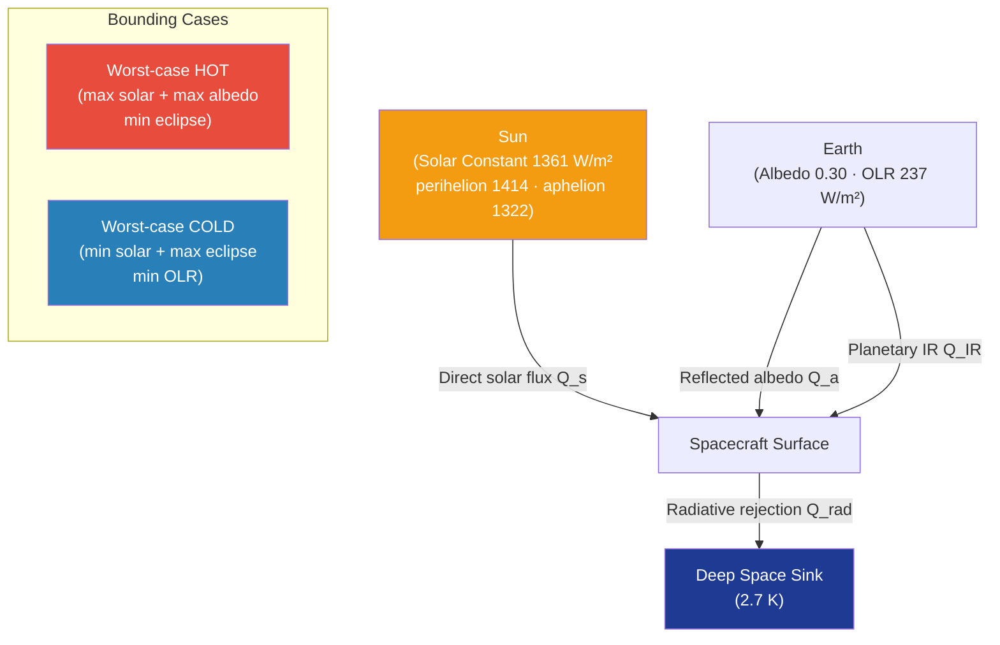

# STA 100-109 · 104-020 — External Thermal Environment and Solar Flux

## 1. Purpose

Defines the **external thermal environment model** used for all Q+ATLANTIDE spacecraft thermal analyses, specifying the solar flux constants, Earth/planetary albedo and infrared emission values, eclipse modelling methodology, and worst-case (hot/cold) environment definitions that bound all TCS design cases per ECSS-E-ST-31C[^ecsse31] and NASA-TM-2010-216291[^nasatm].

The spacecraft external thermal environment is the primary boundary condition for TCS sizing. The solar electromagnetic spectrum deposits energy proportional to the solar constant (≈ 1361 W/m² at 1 AU); reflected Earth albedo contributes 0–400 W/m² depending on orbit altitude, inclination, and ground albedo; Earth's outgoing long-wave radiation (OLR) adds ≈ 237 W/m²; and deep-space background sink is effectively 2.7 K (≈ 0 W/m² for radiation heat rejection). These four inputs drive both worst-case hot (maximum solar + maximum albedo, no eclipse) and worst-case cold (minimum solar, maximum eclipse, minimum OLR) design cases.

## 2. Scope

- Covers the thermal environment characterisation for LEO (200–2000 km), HEO, GEO, and trans-lunar injection (TLI) trajectories relevant to Q+ATLANTIDE missions.
- Concepts in scope:
  - **Solar constant** — mean value 1361 ± 5 W/m²; perihelion +3.5 % (1414 W/m²), aphelion −3.5 % (1322 W/m²).
  - **Earth albedo** — albedo factor 0.30 ± 0.06; peak surface reflectance from cloud cover; orbital-average factor as a function of beta angle.
  - **Earth OLR (IR)** — 237 W/m² mean; variation ±5 % with latitude and season.
  - **Eclipse modelling** — umbra/penumbra geometry; eclipse fraction as a function of orbit altitude and inclination; maximum eclipse duration for power and thermal worst-case cold.
  - **Beta angle** — solar beta angle (β) determines solar illumination geometry; β = 90° = maximum solar exposure, β = 0° = maximum eclipse.
  - **Worst-case hot** — maximum solar + maximum albedo + minimum eclipse; used for radiator sizing.
  - **Worst-case cold** — minimum solar + maximum eclipse + minimum OLR; used for heater sizing.
  - **Deep-space and planetary environments** — Mars (520 W/m² solar), Moon (same as Earth orbit but different albedo), and interplanetary cruise environments.

## 3. Diagram — External Thermal Environment Components

## 4. Footprint

| Metric | Value |
|---|---|
| Architecture | `STA` — Space Technology Architecture |
| Master range | `100–199` |
| Code range | `100-109` |
| Section | `00` — Sistemas Generales y Soporte Vital Espacial |
| Subsection | `104` — Gestión Térmica y Control Ambiental |
| Subsubject | `020` — External Thermal Environment and Solar Flux |
| Primary Q-Division | Q-SPACE[^qdiv] |
| Support Q-Divisions | Q-DATAGOV, Q-HORIZON, Q-HPC, Q-GREENTECH |
| ORB support | ORB-PMO, ORB-LEG |
| Governance class | `baseline`[^gov] |
| Folder path | `Q+ATLANTIDE/100-199_STA/100-109_Sistemas-Generales-y-Soporte-Vital-Espacial/104_Gestion-Termica-y-Control-Ambiental/` |
| Document | `104-020-External-Thermal-Environment-and-Solar-Flux.md` (this file) |
| Parent subsection | [`README.md`](./README.md) · [`104-000-General.md`](./104-000-General.md) |
| Parent architecture | [`../../README.md`](../../README.md) |
| Parent baseline | [`organization/Q+ATLANTIDE.md`](../../../../organization/Q+ATLANTIDE.md) |

## 5. References & Citations

[^baseline]: **Q+ATLANTIDE controlled baseline (v1.0.0)** — [`organization/Q+ATLANTIDE.md`](../../../../organization/Q+ATLANTIDE.md).

[^archtable]: **STA §3 Architecture Table** — [`../../README.md` §3](../../README.md#3-architecture-table).

[^qdiv]: **Q-Division authority** — See [`organization/Q+ATLANTIDE.md` §4](../../../../organization/Q+ATLANTIDE.md#4-notes).

[^gov]: **Governance class** — `baseline` denotes documents under controlled change management.

[^ecsse31]: **ECSS-E-ST-31C — Space Engineering: Thermal Control** — Section 5 specifies thermal environment definitions and solar constant values.

[^nasatm]: **NASA/TM-2010-216291 — Spacecraft Thermal Environments** — Detailed orbital thermal environment data for LEO, GEO, and planetary missions.

[^iso11221]: **ISO 11221:2011 — Space Systems: Space Solar Panels** — Solar constant and spectral irradiance standard applicable to TCS boundary condition definition.

[^esasp]: **ESA SP-1291 — Spacecraft Thermal Analysis** — ESA handbook defining thermal flux models, eclipse geometry, and environment uncertainty factors.

### Applicable industry standards

- ECSS-E-ST-31C — Space Engineering: Thermal Control[^ecsse31]
- NASA/TM-2010-216291 — Spacecraft Thermal Environments[^nasatm]
- ISO 11221:2011 — Space Systems: Space Solar Panels[^iso11221]
- ESA SP-1291 — Spacecraft Thermal Analysis[^esasp]
