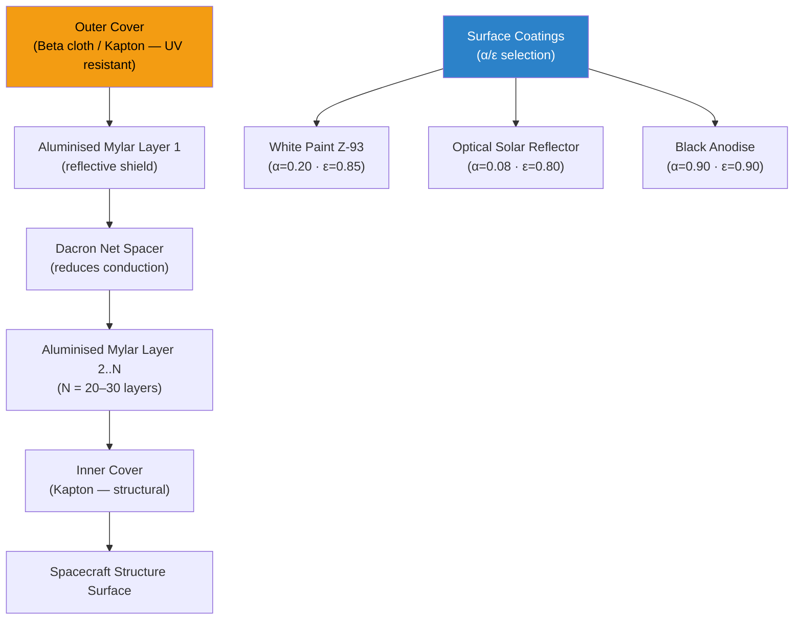

# STA 100-109 · 104-030 — Passive Thermal Control MLI and Surface Coatings

## 1. Purpose

Defines the **passive thermal control design** for Q+ATLANTIDE spacecraft, covering Multi-Layer Insulation (MLI) blanket specifications, surface optical-property coatings, radiative paint systems, and thermal standoffs — the zero-power thermal management elements that form the first line of defence against external thermal environments per ECSS-E-ST-31C[^ecsse31].

Passive thermal control exploits radiative and conductive physics without powered components, providing inherently reliable temperature regulation. MLI blankets (typically 20–30 alternating layers of aluminised Mylar/Kapton and Dacron mesh spacers) achieve effective emittances of 0.003–0.01, dramatically reducing radiative heat exchange with the environment. Surface coatings control the α/ε ratio: white paints (α ≈ 0.20, ε ≈ 0.85) favour cold environments; second-surface mirrors (α ≈ 0.08, ε ≈ 0.80) favour radiator surfaces; black anodise (α ≈ 0.90, ε ≈ 0.90) is used for selective emitters.

## 2. Scope

- Covers MLI design, manufacturing, installation, and end-of-life degradation modelling.
- Surface coatings: white paint (Z-93, SG121FD), optical solar reflectors (OSR), second-surface mirrors, black anodise, and vapour-deposited coatings.
- Thermal standoffs and isolators: PEEK/GFRP standoffs, titanium fasteners, and teflon washers for conductive decoupling.
- On-orbit degradation: UV and atomic-oxygen exposure effects on α/ε values; margin policy for end-of-life predictions.
- Heaters (passive-equivalent): thermostatically controlled patch heaters as supplementary passive elements.

## 3. Diagram — MLI Blanket Cross-Section and Coating Stack

## 4. Footprint

| Metric | Value |
|---|---|
| Architecture | `STA` — Space Technology Architecture |
| Master range | `100–199` |
| Code range | `100-109` |
| Section | `00` — Sistemas Generales y Soporte Vital Espacial |
| Subsection | `104` — Gestión Térmica y Control Ambiental |
| Subsubject | `030` — Passive Thermal Control MLI and Surface Coatings |
| Primary Q-Division | Q-SPACE[^qdiv] |
| Support Q-Divisions | Q-DATAGOV, Q-HORIZON, Q-HPC, Q-GREENTECH |
| ORB support | ORB-PMO, ORB-LEG |
| Governance class | `baseline`[^gov] |
| Folder path | `Q+ATLANTIDE/100-199_STA/100-109_Sistemas-Generales-y-Soporte-Vital-Espacial/104_Gestion-Termica-y-Control-Ambiental/` |
| Document | `104-030-Passive-Thermal-Control-MLI-and-Surface-Coatings.md` (this file) |
| Parent subsection | [`README.md`](./README.md) · [`104-000-General.md`](./104-000-General.md) |
| Parent architecture | [`../../README.md`](../../README.md) |
| Parent baseline | [`organization/Q+ATLANTIDE.md`](../../../../organization/Q+ATLANTIDE.md) |

## 5. References & Citations

[^baseline]: **Q+ATLANTIDE controlled baseline (v1.0.0)** — [`organization/Q+ATLANTIDE.md`](../../../../organization/Q+ATLANTIDE.md).

[^archtable]: **STA §3 Architecture Table** — [`../../README.md` §3](../../README.md#3-architecture-table).

[^qdiv]: **Q-Division authority** — See [`organization/Q+ATLANTIDE.md` §4](../../../../organization/Q+ATLANTIDE.md#4-notes).

[^gov]: **Governance class** — `baseline` denotes documents under controlled change management.

[^ecsse31]: **ECSS-E-ST-31C — Space Engineering: Thermal Control** — MLI design requirements, surface coating specifications, and end-of-life margin policy.

[^nasaref]: **NASA-RP-1124 — Spacecraft Thermal Control Design Data** — Surface property data for spacecraft coatings and MLI effective emittance values.

[^milstd]: **MIL-STD-810H — Environmental Engineering Considerations** — Environmental test method standards applicable to thermal cycle qualification of MLI blankets.

[^astm]: **ASTM E903 — Standard Test Method for Solar Absorptance, Reflectance, and Transmittance** — Measurement standard for optical property characterisation of thermal control coatings.

### Applicable industry standards

- ECSS-E-ST-31C — Space Engineering: Thermal Control[^ecsse31]
- NASA-RP-1124 — Spacecraft Thermal Control Design Data[^nasaref]
- MIL-STD-810H — Environmental Engineering Considerations[^milstd]
- ASTM E903 — Standard Test Method for Solar Absorptance[^astm]
