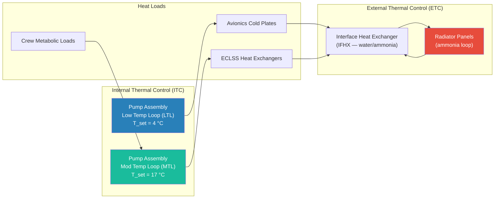

# STA 100-109 · 104-040 — Active Thermal Control ATCS Loops

## 1. Purpose

Defines the **Active Thermal Control System (ATCS)** fluid loop architecture for Q+ATLANTIDE crewed modules, specifying the single-phase and two-phase coolant loop designs, pump sizing, heat exchanger interfaces, flow control, and redundancy requirements per ECSS-E-ST-31C[^ecsse31] and NASA/JSC-65591[^nasajsc].

The ATCS is the primary mechanism for collecting waste heat from electronics, ECLSS equipment, and crew metabolic loads, and transporting it to the heat rejection subsystem (radiators, heat pipes). The ISS-heritage Internal Thermal Control System (ITCS) architecture provides the design baseline: two independent loops (Low Temperature Loop — LTL at 4 °C; Moderate Temperature Loop — MTL at 17 °C) using water as the single-phase coolant, with inter-loop heat exchangers (IFHX) and interface heat exchangers (IHX) coupling to external fluid loops (EFL) carrying ammonia to radiators.

## 2. Scope

- Single-phase coolant loops: water (internal), ammonia (external), HFE-7200 (alternative).
- Two-phase loops: mechanically pumped two-phase (MPTL) with flow boiling and condensation.
- Pump assemblies: centrifugal pumps with bypass valves, check valves, and accumulator.
- Heat exchangers: IFHX (internal-to-external interface), cold plates, sublimator, and payload heat exchangers.
- Flow control: proportional flow control valves (PFCV), temperature-modulated mixing valves (TMMV).
- Redundancy: dual-redundant pump modules; cross-connect isolation valves.
- Contamination control: inline particulate filters, molecular sieve beds, and iodine biocide for water loops.

## 3. Diagram — ATCS Loop Architecture

## 4. Footprint

| Metric | Value |
|---|---|
| Architecture | `STA` — Space Technology Architecture |
| Master range | `100–199` |
| Code range | `100-109` |
| Section | `00` — Sistemas Generales y Soporte Vital Espacial |
| Subsection | `104` — Gestión Térmica y Control Ambiental |
| Subsubject | `040` — Active Thermal Control ATCS Loops |
| Primary Q-Division | Q-SPACE[^qdiv] |
| Support Q-Divisions | Q-DATAGOV, Q-HORIZON, Q-HPC, Q-GREENTECH |
| ORB support | ORB-PMO, ORB-LEG |
| Governance class | `baseline`[^gov] |
| Folder path | `Q+ATLANTIDE/100-199_STA/100-109_Sistemas-Generales-y-Soporte-Vital-Espacial/104_Gestion-Termica-y-Control-Ambiental/` |
| Document | `104-040-Active-Thermal-Control-ATCS-Loops.md` (this file) |
| Parent subsection | [`README.md`](./README.md) · [`104-000-General.md`](./104-000-General.md) |
| Parent architecture | [`../../README.md`](../../README.md) |
| Parent baseline | [`organization/Q+ATLANTIDE.md`](../../../../organization/Q+ATLANTIDE.md) |

## 5. References & Citations

[^baseline]: **Q+ATLANTIDE controlled baseline (v1.0.0)** — [`organization/Q+ATLANTIDE.md`](../../../../organization/Q+ATLANTIDE.md).

[^archtable]: **STA §3 Architecture Table** — [`../../README.md` §3](../../README.md#3-architecture-table).

[^qdiv]: **Q-Division authority** — See [`organization/Q+ATLANTIDE.md` §4](../../../../organization/Q+ATLANTIDE.md#4-notes).

[^gov]: **Governance class** — `baseline` denotes documents under controlled change management.

[^ecsse31]: **ECSS-E-ST-31C — Space Engineering: Thermal Control** — ATCS design and verification requirements.

[^nasajsc]: **NASA/JSC-65591 — ECLSS Design and Performance Requirements** — ITCS architecture reference for crewed module thermal control.

[^nasatp]: **NASA/TP-2003-210460 — ATCS Design Handbook** — NASA internal technical publication covering ATCS loop design, fluid selection, and heat exchanger sizing.

[^aiaa]: **AIAA-2010-6128 — Two-Phase Thermal Control for Spacecraft** — Two-phase ATCS design and performance characterisation.

### Applicable industry standards

- ECSS-E-ST-31C — Space Engineering: Thermal Control[^ecsse31]
- NASA/JSC-65591 — ECLSS Design and Performance Requirements[^nasajsc]
- NASA/TP-2003-210460 — ATCS Design Handbook[^nasatp]
- AIAA-2010-6128 — Two-Phase Thermal Control for Spacecraft[^aiaa]
