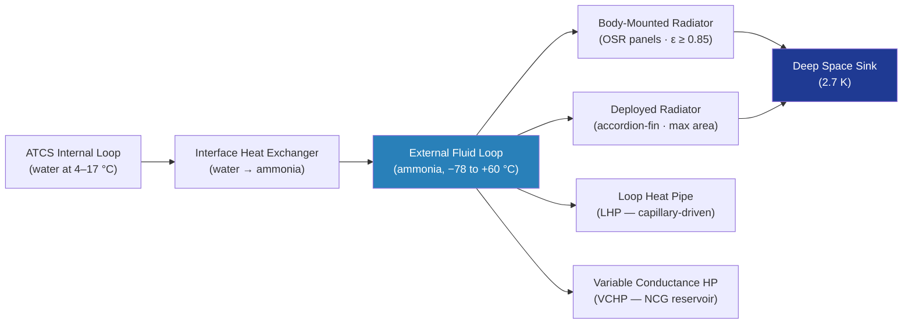

# STA 100-109 · 104-050 — Heat Rejection Radiators and Heat Pipes

## 1. Purpose

Defines the **heat rejection subsystem** architecture for Q+ATLANTIDE spacecraft, covering deployed and body-mounted radiator panels, variable conductance heat pipes (VCHPs), loop heat pipes (LHPs), and deployable radiator mechanisms — the thermal elements responsible for rejecting all spacecraft waste heat to deep space.

Radiators are the sole heat rejection pathway in a spacecraft; no convective or conductive path to a thermal sink is available in orbit. The radiator must be sized for worst-case hot environment (maximum solar flux, maximum albedo, maximum eclipse fraction) while maintaining fluid temperatures above the freezing point of the working fluid (ammonia freezes at −78 °C) in worst-case cold. Heat pipes are used for isothermal heat spreading on instrument panels, solar array thermal management, and decoupled two-fluid interfaces.

## 2. Scope

- Body-mounted radiators: aluminium honeycomb panels with embedded flow tubes, OSR tile coverage, effective emittance ε ≥ 0.85.
- Deployable radiators: folded-fin or accordion-type; deployment mechanism with re-stow capability.
- External fluid loop (EFL): ammonia as working fluid; freeze/thaw cycle tolerance analysis required.
- VCHP: non-condensable gas reservoir modulates effective conductance; used for electronics panels.
- LHP: capillary-driven, used where no pump power is available; compensation chamber design.
- Radiator sizing: Q_rad = ε·σ·A·(T_rad⁴ − T_env⁴); design-to with 20 % area margin.
- Degradation: micrometeoroid and orbital debris (MMOD) impact damage assessment; OSR contamination model.

## 3. Diagram — Heat Rejection Architecture

## 4. Footprint

| Metric | Value |
|---|---|
| Architecture | `STA` — Space Technology Architecture |
| Master range | `100–199` |
| Code range | `100-109` |
| Section | `00` — Sistemas Generales y Soporte Vital Espacial |
| Subsection | `104` — Gestión Térmica y Control Ambiental |
| Subsubject | `050` — Heat Rejection Radiators and Heat Pipes |
| Primary Q-Division | Q-SPACE[^qdiv] |
| Support Q-Divisions | Q-DATAGOV, Q-HORIZON, Q-HPC, Q-GREENTECH |
| ORB support | ORB-PMO, ORB-LEG |
| Governance class | `baseline`[^gov] |
| Folder path | `Q+ATLANTIDE/100-199_STA/100-109_Sistemas-Generales-y-Soporte-Vital-Espacial/104_Gestion-Termica-y-Control-Ambiental/` |
| Document | `104-050-Heat-Rejection-Radiators-and-Heat-Pipes.md` (this file) |
| Parent subsection | [`README.md`](./README.md) · [`104-000-General.md`](./104-000-General.md) |
| Parent architecture | [`../../README.md`](../../README.md) |
| Parent baseline | [`organization/Q+ATLANTIDE.md`](../../../../organization/Q+ATLANTIDE.md) |

## 5. References & Citations

[^baseline]: **Q+ATLANTIDE controlled baseline (v1.0.0)** — [`organization/Q+ATLANTIDE.md`](../../../../organization/Q+ATLANTIDE.md).

[^archtable]: **STA §3 Architecture Table** — [`../../README.md` §3](../../README.md#3-architecture-table).

[^qdiv]: **Q-Division authority** — See [`organization/Q+ATLANTIDE.md` §4](../../../../organization/Q+ATLANTIDE.md#4-notes).

[^gov]: **Governance class** — `baseline` denotes documents under controlled change management.

[^ecsse31]: **ECSS-E-ST-31C — Space Engineering: Thermal Control** — Radiator and heat pipe design requirements and margin policy.

[^nasatm]: **NASA/TM-2013-217506 — Advanced Heat Rejection Systems for Spacecraft** — Heat pipe and deployable radiator technology survey.

[^chi]: **Chi, S.W. — Heat Pipe Theory and Practice (1976)** — Foundational reference for heat pipe capillary limit, sonic limit, and VCHP design.

[^aiaa]: **AIAA-2015-3564 — Loop Heat Pipe Design and Testing** — LHP characterisation for spacecraft thermal management.

### Applicable industry standards

- ECSS-E-ST-31C — Space Engineering: Thermal Control[^ecsse31]
- NASA/TM-2013-217506 — Advanced Heat Rejection Systems[^nasatm]
- Chi, S.W. — Heat Pipe Theory and Practice[^chi]
- AIAA-2015-3564 — Loop Heat Pipe Design and Testing[^aiaa]
