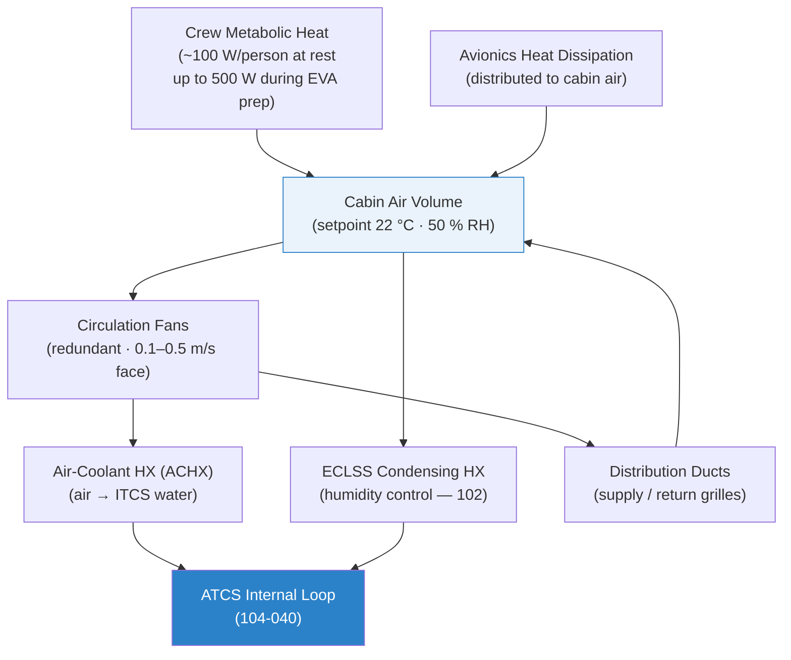

# STA 100-109 · 104-060 — Cabin HVAC and Temperature Distribution

## 1. Purpose

Defines the **cabin HVAC (Heating, Ventilation, and Air Conditioning)** system and temperature distribution architecture for Q+ATLANTIDE crewed modules, specifying thermal comfort requirements, air distribution design, temperature uniformity limits, and interfaces with both the ATCS (104-040) and the ECLSS atmosphere management system (102), per NASA-STD-3001[^nastd3001] and ECSS-E-ST-34C[^ecsse34].

In a crewed spacecraft, the HVAC system must maintain cabin air temperature between 18 °C and 27 °C with no more than 8 °C spatial variation and < 4 °C temporal variation over any 1-hour period, as specified in NASA-STD-3001 Vol. 2. The absence of natural convection in microgravity means forced ventilation is mandatory: air must be actively circulated to prevent CO₂ pocket formation near the crew face (minimum 0.1 m/s at face level) and to maintain thermal uniformity throughout the pressurised volume.

## 2. Scope

- Cabin air temperature setpoint: 18–27 °C nominal, with 22 °C preferred crew operating point.
- Spatial uniformity: ΔT ≤ 8 °C between any two measurement points; temporal: ΔT ≤ 4 °C/hour.
- Air circulation fans: redundant centrifugal fans; minimum face velocity 0.1 m/s; maximum 0.5 m/s.
- Air-to-water heat exchangers (ACHX): transfers cabin heat load to ITCS water loop.
- Temperature distribution ducts: supply and return grilles sized for uniform air distribution.
- Microgravity HVAC considerations: no buoyancy-driven flow; all air movement powered; condensate management critical.
- Interface with ECLSS: HVAC shares duct network with ECLSS ventilation for CO₂ removal and O₂ distribution.
- Humidity: 25–75 % RH maintained by ECLSS condensing heat exchanger (CHX) with HVAC thermal coupling.

## 3. Diagram — Cabin HVAC Thermal Flow

## 4. Footprint

| Metric | Value |
|---|---|
| Architecture | `STA` — Space Technology Architecture |
| Master range | `100–199` |
| Code range | `100-109` |
| Section | `00` — Sistemas Generales y Soporte Vital Espacial |
| Subsection | `104` — Gestión Térmica y Control Ambiental |
| Subsubject | `060` — Cabin HVAC and Temperature Distribution |
| Primary Q-Division | Q-SPACE[^qdiv] |
| Support Q-Divisions | Q-DATAGOV, Q-HORIZON, Q-HPC, Q-GREENTECH |
| ORB support | ORB-PMO, ORB-LEG |
| Governance class | `baseline`[^gov] |
| Folder path | `Q+ATLANTIDE/100-199_STA/100-109_Sistemas-Generales-y-Soporte-Vital-Espacial/104_Gestion-Termica-y-Control-Ambiental/` |
| Document | `104-060-Cabin-HVAC-and-Temperature-Distribution.md` (this file) |
| Parent subsection | [`README.md`](./README.md) · [`104-000-General.md`](./104-000-General.md) |
| Parent architecture | [`../../README.md`](../../README.md) |
| Parent baseline | [`organization/Q+ATLANTIDE.md`](../../../../organization/Q+ATLANTIDE.md) |

## 5. References & Citations

[^baseline]: **Q+ATLANTIDE controlled baseline (v1.0.0)** — [`organization/Q+ATLANTIDE.md`](../../../../organization/Q+ATLANTIDE.md).

[^archtable]: **STA §3 Architecture Table** — [`../../README.md` §3](../../README.md#3-architecture-table).

[^qdiv]: **Q-Division authority** — See [`organization/Q+ATLANTIDE.md` §4](../../../../organization/Q+ATLANTIDE.md#4-notes).

[^gov]: **Governance class** — `baseline` denotes documents under controlled change management.

[^nastd3001]: **NASA-STD-3001 Vol.2 — Human Factors, Habitability, and Environmental Health** — Crew thermal comfort requirements: temperature range, spatial/temporal uniformity, and air velocity limits.

[^ecsse34]: **ECSS-E-ST-34C Rev.1 — Space Engineering: Environmental Control and Life Support** — ECLSS-HVAC integration and cabin atmosphere requirements.

[^ashrae]: **ASHRAE 55-2020 — Thermal Environmental Conditions for Human Occupancy** — Baseline thermal comfort standard adapted for microgravity environments.

[^nasajsc]: **NASA/JSC-20584 — Crew Systems Design Requirements** — Cabin thermal environment design requirements for crewed spacecraft.

### Applicable industry standards

- NASA-STD-3001 Vol.2 — Human Factors, Habitability, and Environmental Health[^nastd3001]
- ECSS-E-ST-34C Rev.1 — Environmental Control and Life Support[^ecsse34]
- ASHRAE 55-2020 — Thermal Environmental Conditions for Human Occupancy[^ashrae]
- NASA/JSC-20584 — Crew Systems Design Requirements[^nasajsc]
