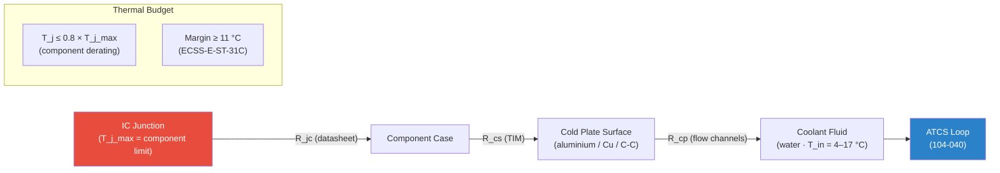

# STA 100-109 · 104-070 — Electronics Thermal Dissipation and Cold Plates

## 1. Purpose

Defines the **electronics thermal dissipation architecture** and cold-plate design standards for all avionics, power conditioning, and payload electronics within Q+ATLANTIDE spacecraft, ensuring junction temperatures remain within component derating limits and thermal margins ≥ 11 °C are maintained per ECSS-E-ST-31C[^ecsse31] and MIL-STD-1540D[^milstd].

Avionics boxes dissipate power through the card cage to a cold plate mounted against the ATCS internal fluid loop tubing. The thermal resistance chain (junction → case → cold plate → coolant) must be characterised for each electronics box, and the cold-plate-to-coolant thermal conductance must be sized to keep case temperatures within the component qualification range (typically −55 to +85 °C for space-grade parts) under worst-case power dissipation and coolant temperature scenarios.

## 2. Scope

- Cold plate design: machined aluminium, copper, or carbon-carbon composite; integral flow channels; thermal interface material (TIM) selection.
- Thermal resistance budget: R_jc (junction-to-case, from part datasheet), R_cs (case-to-cold plate via TIM), R_cp (cold plate-to-coolant, calculated from flow rate and geometry).
- Component derating: junction temperature ≤ 0.8 × T_max per MIL-HDBK-217F[^milhdbk]; margin ≥ 11 °C.
- Thermal interface materials: indium foil (0.5 W/m·K), phase-change material (PCM) pads, thermal grease (5–10 W/m·K).
- Electronics packaging: conduction-cooled card assemblies; wedge-lock card retainers; chassis-level thermal mass.
- Power dissipation modes: nominal, single-fault, and safe-mode dissipation cases.
- On-orbit thermal cycling: components must survive ≥ 20,000 thermal cycles (LEO orbit period ≈ 92 min).

## 3. Diagram — Electronics Thermal Resistance Chain

## 4. Footprint

| Metric | Value |
|---|---|
| Architecture | `STA` — Space Technology Architecture |
| Master range | `100–199` |
| Code range | `100-109` |
| Section | `00` — Sistemas Generales y Soporte Vital Espacial |
| Subsection | `104` — Gestión Térmica y Control Ambiental |
| Subsubject | `070` — Electronics Thermal Dissipation and Cold Plates |
| Primary Q-Division | Q-SPACE[^qdiv] |
| Support Q-Divisions | Q-DATAGOV, Q-HORIZON, Q-HPC, Q-GREENTECH |
| ORB support | ORB-PMO, ORB-LEG |
| Governance class | `baseline`[^gov] |
| Folder path | `Q+ATLANTIDE/100-199_STA/100-109_Sistemas-Generales-y-Soporte-Vital-Espacial/104_Gestion-Termica-y-Control-Ambiental/` |
| Document | `104-070-Electronics-Thermal-Dissipation-and-Cold-Plates.md` (this file) |
| Parent subsection | [`README.md`](./README.md) · [`104-000-General.md`](./104-000-General.md) |
| Parent architecture | [`../../README.md`](../../README.md) |
| Parent baseline | [`organization/Q+ATLANTIDE.md`](../../../../organization/Q+ATLANTIDE.md) |

## 5. References & Citations

[^baseline]: **Q+ATLANTIDE controlled baseline (v1.0.0)** — [`organization/Q+ATLANTIDE.md`](../../../../organization/Q+ATLANTIDE.md).

[^archtable]: **STA §3 Architecture Table** — [`../../README.md` §3](../../README.md#3-architecture-table).

[^qdiv]: **Q-Division authority** — See [`organization/Q+ATLANTIDE.md` §4](../../../../organization/Q+ATLANTIDE.md#4-notes).

[^gov]: **Governance class** — `baseline` denotes documents under controlled change management.

[^ecsse31]: **ECSS-E-ST-31C — Space Engineering: Thermal Control** — Electronics thermal margin requirements (≥ 11 °C) and cold-plate design standards.

[^milstd]: **MIL-STD-1540D — Product Verification Requirements for Launch, Upper Stage, and Space Vehicles** — Thermal qualification and acceptance test requirements for electronics assemblies.

[^milhdbk]: **MIL-HDBK-217F — Reliability Prediction of Electronic Equipment** — Component derating guidelines and thermal failure rate models.

[^ecssq30]: **ECSS-Q-ST-30-11C — Space Product Assurance: Derating and End-of-Life Parameter Drift** — Derating rules for electronic components in space applications.

### Applicable industry standards

- ECSS-E-ST-31C — Space Engineering: Thermal Control[^ecsse31]
- MIL-STD-1540D — Product Verification Requirements[^milstd]
- MIL-HDBK-217F — Reliability Prediction of Electronic Equipment[^milhdbk]
- ECSS-Q-ST-30-11C — Space Product Assurance: Derating[^ecssq30]
