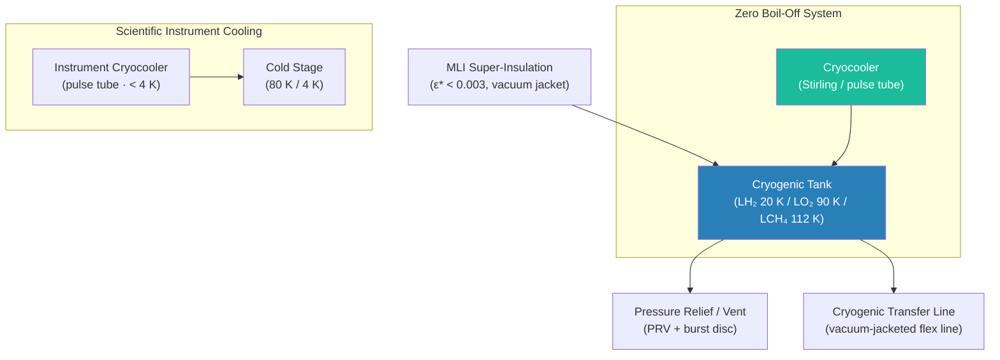

# STA 100-109 · 104-080 — Cryogenic and Low Temperature Thermal Management

## 1. Purpose

Defines the **cryogenic and low-temperature thermal management** architecture for Q+ATLANTIDE propellant storage, scientific instrument cooling, and cryocooler integration, specifying insulation requirements, boil-off budgets, cryocooler interfaces, and safety protocols for cryogenic fluid handling per ECSS-E-ST-31C[^ecsse31] and NASA-STD-5017[^nasastd5017].

Cryogenic propellants (LH₂ at 20 K, LO₂ at 90 K, LCH₄ at 112 K) require specialised thermal management to minimise boil-off losses over mission duration. Cryogenic insulation systems (vacuum-jacketed lines, super-insulation, foam insulation) must achieve heat leak rates < 0.5 W/m² for long-duration deep-space missions. Cryocoolers (Stirling, pulse tube, Gifford-McMahon) are used for scientific instruments (infrared detectors, superconducting electronics) requiring temperatures < 80 K. Safety protocols govern pressure relief, venting, and detection of cryogenic leaks.

## 2. Scope

- Cryogenic propellant types: LH₂ (20 K), LO₂ (90 K), LCH₄ (112 K), LN₂ (77 K, pressurant).
- Insulation systems: vacuum-jacketed tanks with MLI (effective emittance ε* < 0.003), foam insulation for ascent phase, perlite powder.
- Boil-off budget: maximum allowable boil-off rate as a function of mission duration and propellant mass; chill-down losses included.
- Cryocoolers: Stirling (30–80 K), pulse tube (< 4 K), Gifford-McMahon (10–80 K); interfaces to instrument cold-stage.
- Cryogenic fluid transfer lines: vacuum-jacketed flex lines; bayonet connectors; thermal conditioning before transfer.
- Safety: pressure relief valves (PRV) sized for maximum heat input; burst disc; cryogenic-rated leak detection sensors; personnel safety exclusion zones.
- Long-duration storage: zero boil-off (ZBO) technology using cryocoolers for Mars-class missions.

## 3. Diagram — Cryogenic Thermal Management Architecture

## 4. Footprint

| Metric | Value |
|---|---|
| Architecture | `STA` — Space Technology Architecture |
| Master range | `100–199` |
| Code range | `100-109` |
| Section | `00` — Sistemas Generales y Soporte Vital Espacial |
| Subsection | `104` — Gestión Térmica y Control Ambiental |
| Subsubject | `080` — Cryogenic and Low Temperature Thermal Management |
| Primary Q-Division | Q-SPACE[^qdiv] |
| Support Q-Divisions | Q-DATAGOV, Q-HORIZON, Q-HPC, Q-GREENTECH |
| ORB support | ORB-PMO, ORB-LEG |
| Governance class | `baseline`[^gov] |
| Folder path | `Q+ATLANTIDE/100-199_STA/100-109_Sistemas-Generales-y-Soporte-Vital-Espacial/104_Gestion-Termica-y-Control-Ambiental/` |
| Document | `104-080-Cryogenic-and-Low-Temperature-Thermal-Management.md` (this file) |
| Parent subsection | [`README.md`](./README.md) · [`104-000-General.md`](./104-000-General.md) |
| Parent architecture | [`../../README.md`](../../README.md) |
| Parent baseline | [`organization/Q+ATLANTIDE.md`](../../../../organization/Q+ATLANTIDE.md) |

## 5. References & Citations

[^baseline]: **Q+ATLANTIDE controlled baseline (v1.0.0)** — [`organization/Q+ATLANTIDE.md`](../../../../organization/Q+ATLANTIDE.md).

[^archtable]: **STA §3 Architecture Table** — [`../../README.md` §3](../../README.md#3-architecture-table).

[^qdiv]: **Q-Division authority** — See [`organization/Q+ATLANTIDE.md` §4](../../../../organization/Q+ATLANTIDE.md#4-notes).

[^gov]: **Governance class** — `baseline` denotes documents under controlled change management.

[^ecsse31]: **ECSS-E-ST-31C — Space Engineering: Thermal Control** — Cryogenic insulation design requirements and boil-off margin policy.

[^nasastd5017]: **NASA-STD-5017 — Design Requirements for Physical Properties of Metallic Materials** — Mechanical and thermal property standards applicable to cryogenic structures.

[^nasacryotm]: **NASA/TM-2016-219267 — Cryogenic Fluid Management Technology** — ZBO cryocooler integration, cryogenic insulation performance, and boil-off modelling.

[^astme1559]: **ASTM E1559 — Standard Test Method for Contamination Outgassing Characteristics** — Applied to cryogenic MLI material qualification.

### Applicable industry standards

- ECSS-E-ST-31C — Space Engineering: Thermal Control[^ecsse31]
- NASA-STD-5017 — Design Requirements for Physical Properties of Metallic Materials[^nasastd5017]
- NASA/TM-2016-219267 — Cryogenic Fluid Management Technology[^nasacryotm]
- ASTM E1559 — Standard Test Method for Contamination Outgassing[^astme1559]
