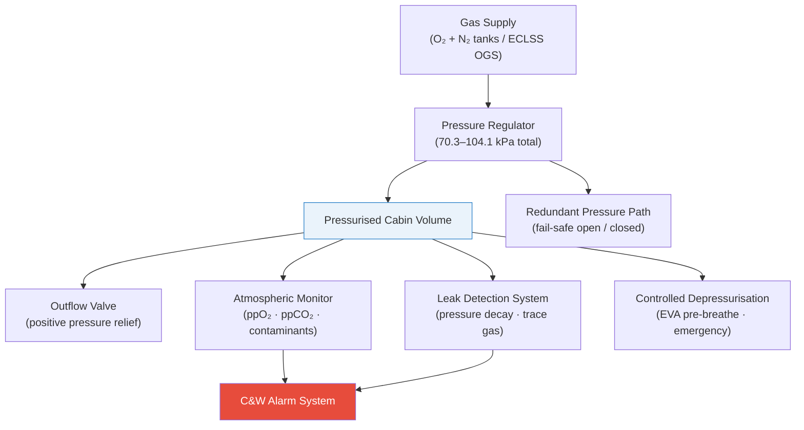

# STA 100-109 · 105-000 — General

## 1. Purpose

Overview entry-point for the *Presurización y Atmósfera Interna* subsection within STA `100-109`, introducing the pressurization system framework for Q+ATLANTIDE crewed modules[^baseline].

The cabin pressurization system maintains the internal atmospheric pressure within human survivability bounds (total pressure 70.3–104.1 kPa; ppO₂ 19.5–23.1 kPa) throughout all mission phases — launch, ascent, on-orbit operations, re-entry, and landing — while providing controlled atmospheric composition, leak detection, depressurization management, and atmospheric monitoring per ECSS-E-ST-34C[^ecsse34] and NASA-STD-3001[^nastd3001].

The subsection covers: controlled vocabulary and normative scope definition, cabin pressure regulation and flight altitude pressure profile, atmospheric gas composition and partial-pressure management, pressurization valve and outflow control hardware, structural leak detection and seal integrity, controlled depressurization and emergency procedures, atmospheric contaminant monitoring, redundancy and fail-safe architecture, and CSDB evidence traceability.

## 2. Scope

- Covers the *Presurización y Atmósfera Interna* slice of code range `100-109`.
- Subsubjects `010`–`090` all indexed in [`README.md`](./README.md).
- Concepts in scope:
  - **Pressurization Controlled Definition** (`010`) — normative scope and acronym registry.
  - **Cabin Pressure Regulation and Altitude Profile** (`020`) — pressure setpoints, altitude equivalent, and transition profiles.
  - **Atmospheric Composition and Partial Pressures** (`030`) — N₂/O₂ mix, ppO₂ and ppCO₂ limits, inert gas rationale.
  - **Pressurization Valves and Outflow Control** (`040`) — safety relief valves, outflow valves, and differential pressure limits.
  - **Leak Detection and Seal Integrity** (`050`) — micro-leak monitoring, pressure decay testing, and hatch seal inspection.
  - **Depressurization Control and Emergency Procedures** (`060`) — EVA pre-breathe, emergency depressurization, and rapid-decompression response.
  - **Atmospheric Monitoring and Contaminant Detection** (`070`) — trace contaminant sensors, CO₂ monitoring, and air quality alarms.
  - **Redundancy and Fail-Safe Architecture** (`080`) — dual-redundant control paths and fail-safe valve states.
  - **Standards Traceability and CSDB Evidence** (`090`) — evidence package and S1000D/CSDB traceability closure.

## 3. Diagram — Pressurization System Overview

## 4. Footprint

| Metric | Value |
|---|---|
| Architecture | `STA` — Space Technology Architecture |
| Master range | `100–199` |
| Code range | `100-109` |
| Section | `00` — Sistemas Generales y Soporte Vital Espacial |
| Subsection | `105` — Presurización y Atmósfera Interna |
| Subsubject | `000` — General |
| Primary Q-Division | Q-SPACE[^qdiv] |
| Support Q-Divisions | Q-DATAGOV, Q-HORIZON, Q-HPC, Q-GREENTECH |
| ORB support | ORB-PMO, ORB-LEG |
| Governance class | `baseline`[^gov] |
| Folder path | `Q+ATLANTIDE/100-199_STA/100-109_Sistemas-Generales-y-Soporte-Vital-Espacial/105_Presurizacion-y-Atmosfera-Interna/` |
| Document | `105-000-General.md` (this file) |
| Parent subsection | [`README.md`](./README.md) |
| Parent architecture | [`../../README.md`](../../README.md) |
| Parent baseline | [`organization/Q+ATLANTIDE.md`](../../../../organization/Q+ATLANTIDE.md) |

## 5. References & Citations

[^baseline]: **Q+ATLANTIDE controlled baseline (v1.0.0)** — [`organization/Q+ATLANTIDE.md`](../../../../organization/Q+ATLANTIDE.md).

[^archtable]: **STA §3 Architecture Table** — [`../../README.md` §3](../../README.md#3-architecture-table).

[^qdiv]: **Q-Division authority** — See [`organization/Q+ATLANTIDE.md` §4](../../../../organization/Q+ATLANTIDE.md#4-notes).

[^gov]: **Governance class** — `baseline` denotes documents under controlled change management.

[^ecsse34]: **ECSS-E-ST-34C Rev.1 — Space Engineering: Environmental Control and Life Support** — Primary standard for pressurization design, cabin atmosphere, and leak detection requirements.

[^nastd3001]: **NASA-STD-3001 Vol.2 — Human Factors, Habitability, and Environmental Health** — Cabin pressure and atmospheric composition requirements for crew health.

[^nasajsc]: **NASA/JSC-65591 — ECLSS Design and Performance Requirements** — Pressurization system design reference for ISS-class crewed modules.

[^iso20521]: **ISO 20521 — Space Systems: Human Spaceflight** — Crew habitability and pressurization requirements for crewed spacecraft.

### Applicable industry standards

- ECSS-E-ST-34C Rev.1 — Space Engineering: Environmental Control and Life Support[^ecsse34]
- NASA-STD-3001 Vol.2 — Human Factors, Habitability, and Environmental Health[^nastd3001]
- NASA/JSC-65591 — ECLSS Design and Performance Requirements[^nasajsc]
- ISO 20521 — Space Systems: Human Spaceflight[^iso20521]
