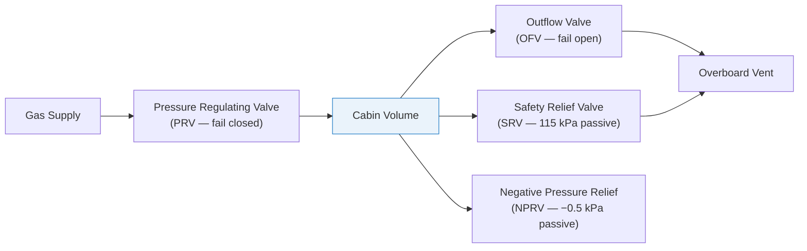

# STA 100-109 · 105-040 — Pressurization Valves and Outflow Control

## 1. Purpose

Defines the **pressurization valve hardware and outflow control architecture** for Q+ATLANTIDE crewed modules, specifying valve types, actuation logic, differential pressure limits, and failure modes per ECSS-E-ST-34C[^ecsse34].

The pressurization valve assembly comprises: (1) pressure regulating valve (PRV) for supply gas metering, (2) outflow valve (OFV) for automatic cabin pressure relief and rate control, (3) safety relief valve (SRV) as passive overpressure protection (set at 115 kPa), (4) negative pressure relief valve (NPRV) to prevent structure damage from external overpressure (set at −0.5 kPa differential). Each valve has a defined fail-safe state: PRV fails closed (no uncontrolled pressurization), OFV fails open (prevents structural overpressure), SRV passive (spring-loaded). All valves are dual-redundant for pressurization-critical functions.

## 2. Scope

- Covers the *Pressurization Valves and Outflow Control* subsubject (`040`) of subsection `105`.
- Inherits Q-Division authority and ORB support from the parent row in [`../../README.md` §3](../../README.md#3-architecture-table)[^archtable].
- All design decisions traceable to source standards and CSDB evidence per subsection `109`.

## 3. Diagram — Pressurization Valves and Outflow Control

## 4. Footprint

| Metric | Value |
|---|---|
| Architecture | `STA` — Space Technology Architecture |
| Master range | `100–199` |
| Code range | `100-109` |
| Section | `00` — Sistemas Generales y Soporte Vital Espacial |
| Subsection | `105` — Presurización y Atmósfera Interna |
| Subsubject | `040` — Pressurization Valves and Outflow Control |
| Primary Q-Division | Q-SPACE[^qdiv] |
| Support Q-Divisions | Q-DATAGOV, Q-HORIZON, Q-HPC, Q-GREENTECH |
| ORB support | ORB-PMO, ORB-LEG |
| Governance class | `baseline`[^gov] |
| Folder path | `Q+ATLANTIDE/100-199_STA/100-109_Sistemas-Generales-y-Soporte-Vital-Espacial/105_Presurizacion-y-Atmosfera-Interna/` |
| Document | `105-040-Pressurization-Valves-and-Outflow-Control.md` (this file) |
| Parent subsection | [`README.md`](./README.md) · [`105-000-General.md`](./105-000-General.md) |
| Parent architecture | [`../../README.md`](../../README.md) |
| Parent baseline | [`organization/Q+ATLANTIDE.md`](../../../../organization/Q+ATLANTIDE.md) |

## 5. References & Citations

[^baseline]: **Q+ATLANTIDE controlled baseline (v1.0.0)** — [`organization/Q+ATLANTIDE.md`](../../../../organization/Q+ATLANTIDE.md).

[^archtable]: **STA §3 Architecture Table** — [`../../README.md` §3](../../README.md#3-architecture-table).

[^qdiv]: **Q-Division authority** — See [`organization/Q+ATLANTIDE.md` §4](../../../../organization/Q+ATLANTIDE.md#4-notes).

[^gov]: **Governance class** — `baseline` denotes documents under controlled change management.

[^ecsse34]: **ECSS-E-ST-34C Rev.1 — Space Engineering: Environmental Control and Life Support** — Primary standard for pressurization design, cabin atmosphere, and leak detection requirements.

[^nastd3001]: **NASA-STD-3001 Vol.2 — Human Factors, Habitability, and Environmental Health** — Cabin pressure and atmospheric composition requirements for crew health.

[^nasajsc]: **NASA/JSC-65591 — ECLSS Design and Performance Requirements** — Pressurization system design reference for ISS-class crewed modules.

[^iso20521]: **ISO 20521 — Space Systems: Human Spaceflight** — Crew habitability and pressurization requirements for crewed spacecraft.

### Applicable industry standards

- ECSS-E-ST-34C Rev.1 — Space Engineering: Environmental Control and Life Support[^ecsse34]
- NASA-STD-3001 Vol.2 — Human Factors, Habitability, and Environmental Health[^nastd3001]
- NASA/JSC-65591 — ECLSS Design and Performance Requirements[^nasajsc]
- ISO 20521 — Space Systems: Human Spaceflight[^iso20521]
